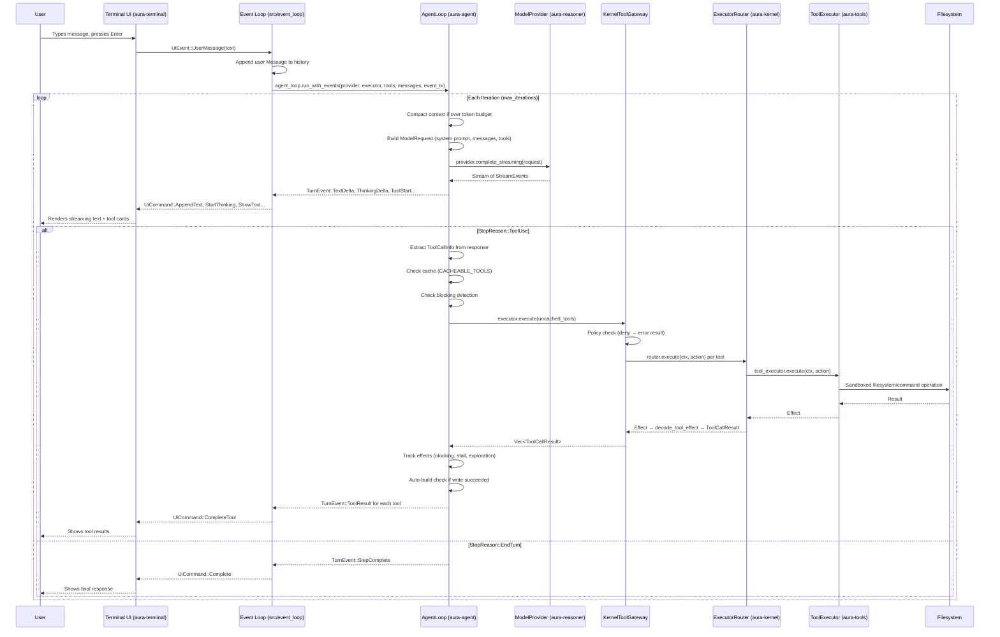
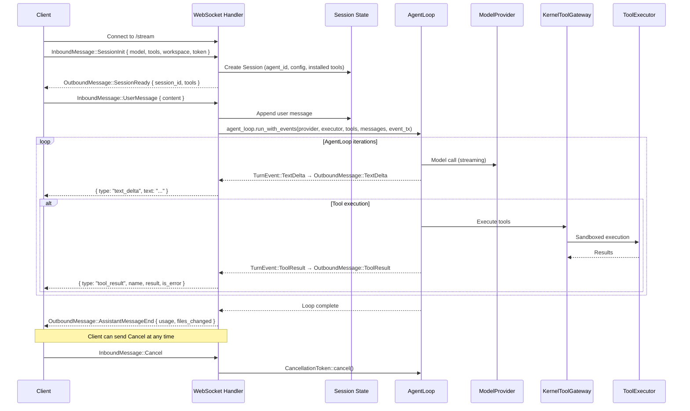
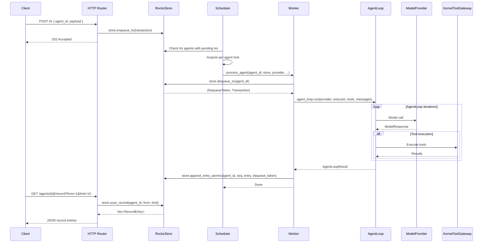
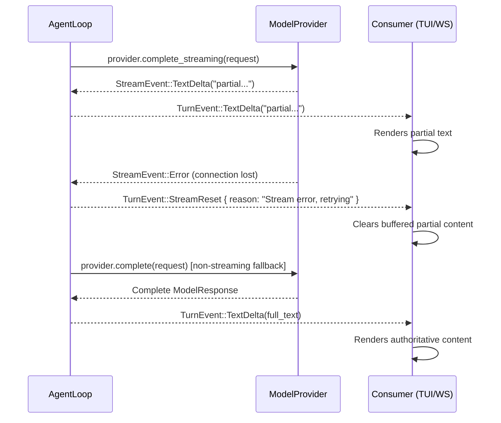

# Aura Harness — Architecture

This document describes the system architecture in two sections:

1. **Architecture** — every crate from most fundamental to least, with key types and submodules.
2. **User Flows** — how data moves through the system from the user's perspective.

---

## Part 1: Architecture

### Overview

Aura is a deterministic multi-agent runtime. Many agents run concurrently,
each maintaining its own append-only record log. A pluggable LLM provider
supplies reasoning; all side effects — filesystem writes, shell commands,
domain API calls — flow through authorized executors that capture structured
results. The full history of every agent is replayable from its record alone.

The central design decision is a strict separation between **orchestration**
and **determinism**:

**The AgentLoop** is the orchestration layer. It owns the multi-step
model-call-then-tool-execution cycle: building prompts, streaming responses,
managing token budgets, compacting context when the window fills, detecting
stalls, and emitting real-time `TurnEvent`s to whatever UI is attached
(terminal, WebSocket, CLI). The AgentLoop is intentionally stateless with
respect to persistence — it never touches the store, the policy engine, or
the record log directly. It receives a `ModelProvider` and a
`ToolExecutor` as trait objects and is unaware that these are kernel
gateways.

**The Kernel** is the deterministic core. It mediates every external
interaction: every LLM call passes through `Kernel::reason()`, every tool
execution passes through `Kernel::process()`, and every state change
produces a `RecordEntry` committed atomically to the store. The kernel
enforces policy (permission levels, session-scoped approvals), computes
context hashes for integrity verification, and maintains monotonic
sequencing. Given the same record, the kernel always produces the same
output.

This separation yields two properties:

1. **Auditability.** Because the kernel records every reasoning call, every
   tool proposal, every policy decision, and every effect, the full
   execution history is inspectable and replayable without a live LLM.

2. **Composability.** Because the AgentLoop depends only on trait
   interfaces, the same loop drives interactive TUI sessions, headless
   server workers, CLI REPLs, and long-running automaton workflows — all
   backed by the same kernel, storage, and reasoning stack.

The bridge between the two layers is a set of **gateway** types
(`KernelModelGateway`, `KernelToolGateway`) that implement the traits the
AgentLoop expects while routing calls through the kernel's recording and
policy pipeline. The AgentLoop never knows the difference.

### Foreground Subagents

The v1 subagent model is foreground and local to one harness instance. A
parent agent calls the `task` tool, which validates `Capability::SpawnAgent`
and hands an `aura-core::SubagentDispatchRequest` to a
`SubagentDispatchHook`. The tool is fail-closed when that hook is absent.

`aura-runtime` owns the concrete dispatcher. It looks up a fixed bundled
subagent kind (`general_purpose`, `explore`, `shell`, or `code_reviewer`),
creates a full child agent through `KernelSpawnHook`, enqueues the child
prompt, and runs that child through `Scheduler::schedule_agent_with_overrides`.
The child therefore uses the same `KernelModelGateway` and `KernelToolGateway`
path as every other agent: LLM calls, tool proposals, policy decisions, and
final assistant messages are recorded on the child record log. Parent
delegation is serialized before the parent tool batch commits, avoiding races
between parallel `task` tool calls.

Subagent protocol events deliberately reuse existing tool-result and text
surfaces in v1. Dedicated `OutboundMessage` variants are deferred until the
wire protocol has capability negotiation.

### Crate Summary

| Crate | Role |
|------|------|
| `aura-core` | Foundational domain types, IDs, hashing, time, shared subagent data shapes, and shared errors used across all crates. |
| `aura-store` | Durable RocksDB-backed storage for agent records, metadata, and inbox queues. |
| `aura-reasoner` | Model-provider abstraction for completion and streaming APIs. |
| `aura-compaction` | Single owner for pure context and storage compaction: message-history tiers, pressure-gated write-input redaction, structured `_redacted` markers, cached-result shaping, tool-surface compaction, and summary handoff data. |
| `aura-kernel` | Deterministic execution kernel with router, policies, sandboxing, and scheduler primitives. |
| `aura-tools` | Tool catalog, built-in/external tool execution, sandboxed filesystem and command tools, plus the fail-closed `task` dispatch surface. |
| `aura-agent` | Main agent orchestration loop: model calls, tool execution, streaming, budgets, and compaction orchestration. It calls `aura-compaction` for pure mutations and performs the model-backed summary escalation call. |
| `aura-protocol` | Wire-level request/response/event types for transport boundaries. |
| `aura-auth` | Auth token extraction/validation utilities for node and agent startup. |
| `aura-terminal` | Terminal UI layer: Ratatui-based TUI with themes, components, input, and rendering. |
| `aura-memory` | Per-agent memory: fact/event/procedure store, two-stage write pipeline, deterministic retrieval for prompt injection. |
| `aura-skills` | Skill system wire-compatible with the Claude Code `SKILL.md` / `AgentSkills` open standard; per-agent install store and activation. |
| `aura-automaton` | Workflow/automation helpers that drive scripted agent behavior. |
| `aura-runtime` | HTTP/WebSocket server runtime, session management, scheduler-backed processing, and bundled subagent dispatch. |
| `aura` | Root binary wiring for launch modes, runtime setup, and top-level command entrypoints. |

> **Historical deviation (Phase 0.5):** the runtime crate was previously
> named `aura-node`. In Phase 0.5 it was renamed to `aura-runtime` to
> match the layered-architecture vocabulary (the crate is the runtime
> that hosts the router, scheduler, and workers). The compiled binary
> keeps the name `aura-node` so that the Dockerfile `CMD` and operator
> muscle memory (`aura-node.exe`, `AURA_NODE_AUTH_TOKEN`,
> `AURA_NODE_REQUIRE_AUTH`) do not churn. Older spec text that
> references the `aura-node` crate now refers to `aura-runtime`.

> **Historical deviation (2026, Wave 4 / Phase 5d):** the v0.1.0 design
> specs mention a separate `aura-cli` crate. That crate was **never
> created** and has been dropped from the dependency graph and the
> crate table above. The canonical CLI entry is the root `aura`
> binary (`src/main.rs`), which covers the interactive TUI, login /
> logout / whoami, and the embedded HTTP API server. The headless
> half is `aura-node`. Spec references to `aura-cli/src/...` should
> be read as `src/...` under the root binary. See
> [`docs/specs/v0.1.0/README.md`](specs/v0.1.0/README.md) for the
> full mapping.

### Dependency Graph

Crates are arranged in layers — each layer may only depend on layers below it.
Arrows (`───▶`) show the primary dependency spine; side-annotations list
additional cross-cutting dependencies.

```
 Standalone (no aura-* dependencies)
 ┌────────────────┐  ┌────────────┐  ┌──────────────┐
 │ aura-protocol  │  │  aura-auth │  │aura-terminal │
 └────────────────┘  └────────────┘  └──────────────┘

 L0  Foundation
 ┌──────────────────────────────────────────────────┐
 │                   aura-core                      │
 │  IDs, types, hashing, time, errors               │
 └────────────────────────┬─────────────────────────┘
                          │
 L1  Storage & Reasoning  │
 ┌────────────────────────┴─────────────────────────┐
 │          ┌──────────┐       ┌──────────────┐     │
 │          │aura-store│       │aura-reasoner │     │
 │          │  → core  │       │    → core    │     │
 │          └────┬─────┘       └──────┬───────┘     │
 └───────────────┼────────────────────┼─────────────┘
                 │                    │
 L2  Kernel / Context Utilities      ▼
 ┌──────────────────────────────────────────────────┐
 │ ┌─────────────┐             ┌──────────────────┐ │
 │ │ aura-kernel │             │ aura-compaction  │ │
 │ │ → core,     │             │ → reasoner       │ │
 │ │   store,    │             │                  │ │
 │ │   reasoner  │             │                  │ │
 │ └─────────────┘             └──────────────────┘ │
 └────────────────────────┬─────────────────────────┘
                          │
 L3  Tools                ▼
 ┌──────────────────────────────────────────────────┐
 │                  aura-tools                      │
 │  → core, kernel, reasoner                        │
 └────────────────────────┬─────────────────────────┘
                          │
 L4  Agent                ▼
 ┌──────────────────────────────────────────────────┐
 │                  aura-agent                      │
 │  → core, kernel, reasoner, tools, store, auth,   │
 │    compaction                                    │
 └────────────────────────┬─────────────────────────┘
                          │
 L4a Memory / Skills      ▼
 ┌──────────────────────────────────────────────────┐
 │  ┌──────────────┐            ┌──────────────┐    │
 │  │ aura-memory  │            │ aura-skills  │    │
 │  │ → core,      │            │ → core,      │    │
 │  │   store,     │            │   store      │    │
 │  │   reasoner   │            │              │    │
 │  └──────┬───────┘            └──────┬───────┘    │
 └─────────┼───────────────────────────┼────────────┘
           │                           │
 L5  Higher Consumers                  │
 ┌────────┴───────────────────────────┴─────────────┐
 │  ┌──────────────┐                                │
 │  │aura-automaton│                                │
 │  │ → agent,core │                                │
 │  │   tools,     │                                │
 │  │   reasoner   │                                │
 │  └──────┬───────┘                                │
 └─────────┼────────────────────────────────────────┘
           │
 L6  Server▼
 ┌──────────────────────────────────────────────────┐
 │                  aura-runtime                    │
 │  → core, protocol, store, reasoner, kernel,      │
 │    tools, agent, automaton, memory, skills       │
 └────────────────────────┬─────────────────────────┘
                          │
 L7  Binary               ▼
 ┌──────────────────────────────────────────────────┐
 │                 aura (binary)                    │
 │  → terminal, core, kernel, store, reasoner,      │
 │    tools, agent, auth, node, memory, skills      │
 └──────────────────────────────────────────────────┘
```

Crates are described below in dependency order — most fundamental first.

---

### 1. `aura-core` — Domain Types & IDs

The foundation crate. Zero internal dependencies. Defines all shared domain types, strongly-typed identifiers, hashing, time utilities, and error types used across the system.

#### Key Types

| Type | Purpose |
|------|---------|
| `AgentId` | 32-byte agent identifier (BLAKE3 or UUID-derived) |
| `TxId` | 32-byte transaction identifier (content-addressed, deprecated) |
| `ActionId` | 16-byte action identifier (random) |
| `ProcessId` | 16-byte background process identifier |
| `Hash` | 32-byte BLAKE3 digest with chaining support |
| `Transaction` | Inbound work unit: `agent_id`, `TransactionType`, `payload` |
| `TransactionType` | `UserPrompt`, `AgentMsg`, `SessionStart`, `System`, `Reasoning`, ... |
| `Action` | Authorized operation: `action_id`, `ActionKind`, serialized payload |
| `ActionKind` | `Propose`, `Delegate`, `Record`, `System`, ... |
| `Effect` | Result of executing an action: `EffectKind`, `EffectStatus`, payload |
| `RecordEntry` | Immutable log entry: `seq`, `tx`, `context_hash`, proposals, actions, effects |
| `ToolCall` | Tool invocation: `tool` name + `args` (JSON) |
| `ToolResult` | Tool output: `content`, `is_error`, `metadata` |
| `ToolProposal` | Tool call with decision context |
| `ToolExecution` | Tool call + result pair |
| `ToolCallContext` | Contextual metadata for tool calls |
| `ToolDefinition` | Tool name + description + JSON Schema for input |
| `CacheControl` | Cache control hints for tool definitions |
| `InstalledToolDefinition` | External tool with endpoint, auth, schema |
| `Identity` | Agent identity struct |
| `AgentStatus` | Agent lifecycle status enum |
| `ProcessPending` | Pending background process descriptor |
| `AuraError` | Unified error enum (storage, serialization, kernel, executor, reasoner, validation) |

#### Submodules

| Module | Contents |
|--------|----------|
| `ids` | `AgentId`, `TxId`, `ActionId`, `ProcessId`, `Hash` — macro-generated newtypes with hex serde |
| `types` | All domain structs/enums — barrel re-export from `action`, `effect`, `identity`, `process`, `proposal`, `reasoner_types`, `record`, `status`, `tool/`, `transaction`. The `tool` module itself is a directory after the Phase 2a split: `types/tool/{mod,proposal,execution,installed,runtime_capability,call,result}.rs`. |
| `hash` | BLAKE3 helpers: `hash_bytes`, `hash_many`, `compute_context_hash`, `Hasher` |
| `time` | `now_ms` timestamp helper |
| `error` | `AuraError` with `thiserror` and `From` impls |
| `serde_helpers` | (crate-private) Custom serde modules for hex-encoded bytes, hashes, etc. |

---

### 2. `aura-store` — Persistent Storage

RocksDB-backed durable storage with column families for the record log, agent metadata, and transaction inbox. All mutations use `WriteBatch` for atomicity.

#### Key Types

| Type | Purpose |
|------|---------|
| `Store` (trait) | Abstract storage API: `enqueue_tx`, `dequeue_tx`, `append_entry_atomic`, `append_entry_direct`, `append_entries_batch`, `scan_record`, `get_record_entry`, `get_agent_status`, `set_agent_status`, `has_pending_tx`, `get_inbox_depth`, ... |
| `RocksStore` | `Store` implementation over RocksDB with configurable `sync_writes` |
| `DequeueToken` | Opaque token from `dequeue_tx` carrying the inbox sequence |
| `StoreError` | Error enum: `RocksDb`, `SequenceMismatch`, `ColumnFamilyNotFound`, `InboxCorruption`, `InvalidKey`, ... |

#### Column Families

| CF | Key Format | Purpose |
|----|-----------|---------|
| `record` | `R` + `AgentId` + `seq` (big-endian) | Append-only record log |
| `agent_meta` | `M` + `AgentId` + `MetaField` | Head sequence, inbox pointers, agent status |
| `inbox` | `Q` + `AgentId` + `inbox_seq` | Pending transaction queue |

#### Submodules

| Module | Contents |
|--------|----------|
| `store` | `Store` trait definition, `DequeueToken` |
| `rocks_store` | `RocksStore` implementation, `WriteBatch` atomics |
| `keys` | `RecordKey`, `AgentMetaKey`, `InboxKey` with `KeyCodec` encoding, `MetaField` enum |
| `error` | `StoreError` enum |
| `cf` | Column family name constants (`RECORD`, `AGENT_META`, `INBOX`) |

---

### 3. `aura-reasoner` — Model Provider Abstraction

Provider-agnostic interface for LLM completions. Defines normalized message types, streaming, and the `ModelProvider` trait. Ships with Anthropic and mock providers.

#### Key Types

| Type | Purpose |
|------|---------|
| `ModelProvider` (trait) | `complete(ModelRequest) -> ModelResponse`, `complete_streaming` → `StreamEventStream`, `health_check` |
| `ModelRequest` | `model`, `system`, `messages`, `tools`, `tool_choice`, `max_tokens`, `thinking`, auth headers |
| `ModelRequestBuilder` | Builder pattern for constructing `ModelRequest` |
| `ModelResponse` | `stop_reason`, `message`, `usage`, `trace`, `model_used` |
| `Message` | `role` (`User`/`Assistant`) + `content: Vec<ContentBlock>` |
| `ContentBlock` | `Text`, `Thinking`, `Image`, `ToolUse { id, name, input }`, `ToolResult { tool_use_id, content, is_error }` |
| `StopReason` | `EndTurn`, `ToolUse`, `MaxTokens`, `StopSequence` |
| `ToolChoice` | Tool selection mode |
| `ToolDefinition` | Tool name + description + JSON Schema (re-exported from `aura-core`) |
| `StreamEvent` | SSE-style events: `TextDelta`, `ThinkingDelta`, `InputJsonDelta`, `ContentBlockStart/Stop`, ... |
| `StreamAccumulator` | Folds `StreamEvent`s into a complete `ModelResponse` |
| `AnthropicProvider` | Anthropic-shaped HTTP client (router/proxy only) with retry + model-chain fallback |
| `AnthropicConfig` | Provider configuration: model, router URL, timeouts |
| `MockProvider` | Queued/canned responses for testing |

#### Submodules

| Module | Contents |
|--------|----------|
| `types/` | `Message`, `ContentBlock`, `Role`, `ImageSource`, `ModelRequest`, `ModelRequestBuilder`, `ThinkingConfig`, `ModelResponse`, `Usage`, `ProviderTrace`, `StopReason`, `StreamEvent`, `StreamContentType`, `StreamAccumulator`, `AccumulatedToolUse`, `ToolChoice` |
| `anthropic/` | `AnthropicProvider`, `AnthropicConfig`, SSE parser, API type conversion. The Phase 2b refactor split `anthropic/sse.rs` into `anthropic/sse/{mod,parse,event,state,tests}.rs` so the parser, event-shape, and accumulator state each get their own module. |
| `mock` | `MockProvider`, `MockResponse` |
| `request` | `ProposeRequest`, `RecordSummary`, `ProposeLimits` (kernel propose flow) |
| `error` | `ReasonerError` |

---

### Shared: `aura-compaction` — Pure Context Compaction

`aura-compaction` owns compaction logic that can run without side effects:
message-history tier selection, pressure-gated write/edit input redaction,
structured `_redacted` metadata, cached tool-result summaries, tool-surface
compaction, storage compaction, and the `SummaryInput` / `SummaryOutput` data
used for summary escalation. It does not call models itself; `aura-agent`
performs the model call and applies the summary output through the crate.

`aura-tools` treats attempts to reuse redacted write/edit payloads as
`CompactionStructural` errors, so redaction markers are never executed as real
filesystem content.

---

### 4. `aura-kernel` — Deterministic Kernel

The invariant core. Builds context from the record, calls the reasoner, enforces policy, dispatches execution through the router, and produces `RecordEntry`s. Given the same record, produces the same output. Uses dynamic dispatch (`Arc<dyn Store>`, `Arc<dyn ModelProvider>`) rather than generic type parameters.

#### Key Types

| Type | Purpose |
|------|---------|
| `Kernel` | End-to-end step processor bound to a specific agent, with `process_direct`, `process_dequeued`, `reason`, `reason_streaming`, `process_tools` |
| `KernelConfig` | `record_window_size`, `policy`, `workspace_base`, `replay_mode`, `proposal_timeout_ms` |
| `ProcessResult` | `entry`, `tool_output`, `had_failures` |
| `ReasonResult` | `entry`, `response` — result of a reasoning call |
| `ReasonStreamHandle` | Handle for recording streaming results (completed or failed) |
| `ToolOutput` | Single tool execution output: `tool_use_id`, `content`, `is_error` |
| `ExecutorRouter` | Routes `Action`s to the first matching `Executor` in a registry |
| `Executor` (trait) | `execute(ctx, action) -> Effect`, `can_handle(action) -> bool` |
| `ExecuteContext` | Per-action context: `agent_id`, `action_id`, `workspace_root`, `limits` |
| `ExecuteLimits` | Caps for read/write bytes, command timeout, stdout/stderr |
| `Policy` | Runtime policy engine for action kinds, capabilities, scope, integrations, and tri-state tool resolution |
| `PolicyConfig` | Allowed action kinds, capability/scope/integration gates, `UserToolDefaults`, and optional `AgentToolPermissions` |
| `PolicyResult` | Result of a policy check |
| `ContextBuilder` | Builds `Context` (context hash + record summaries) from transaction + record window |
| `decode_tool_effect` | Parses an `Effect` back into human-readable `DecodedToolResult` |
| `KernelDomainGateway` | Phase 1 addition (lives in `aura-agent` but belongs conceptually with the kernel boundary): the sole `DomainApi` wrapper that routes every automaton / agent domain call through `Kernel::process_direct` so mutations produce a `System/DomainMutation` `RecordEntry` (Invariant §1). |
| `KernelError` | Error enum: `Store`, `Reasoner`, `Timeout`, `Serialization`, `Internal` |

#### Submodules

| Module | Contents |
|--------|----------|
| `executor` | `Executor` trait, `ExecutorError`, `ExecuteContext`, `ExecuteLimits`, `DecodedToolResult`, `decode_tool_effect` |
| `router` | `ExecutorRouter` — fan-out dispatch to registered executors. **Phase 6:** ambiguous routing (multiple executors `can_handle` the same action) panics in debug builds and returns `Effect::Failed("ambiguous executor routing")` in release; previously it warned and silently picked the first registered match. |
| `policy` | `Policy`, `PolicyConfig`, `PolicyVerdict`, tri-state tool resolution. The `policy/check.rs` god-module was split (Phase 2a) into `policy/check/{mod,delegate_gate,agent_permissions,integration_gate,scope,verdict,tests}.rs`; `Policy` is now a thin orchestrator over the per-gate helpers. |
| `context` | `Context`, `ContextBuilder` — split (Phase 2a) into `context/{mod,tests}.rs` so the ~400 lines of `#[cfg(test)]` no longer live next to production code. |
| `kernel` | `Kernel`, `KernelConfig`, `ProcessResult`, `ReasonResult`, `ReasonStreamHandle`, `ToolOutput`. The `kernel/tools.rs` proposal pipeline was split (Phase 2a) into `kernel/tools/{mod,single,batch,shared}.rs`. The kernel-internal `ToolDecision` was renamed to **`ToolGateVerdict`** (Phase 4) so it no longer collides with the `aura_core::types::tool::ToolDecision` audit-log enum. |

---

### 5. `aura-tools` — Tool Registry & Execution

Filesystem, command, search, and domain tools. Sandboxed execution ensures agents cannot escape their workspace. Implements the `Executor` trait from `aura-kernel`.

#### Key Types

| Type | Purpose |
|------|---------|
| `ToolExecutor` | Dispatches `ToolCall`s to registered `Tool` impls; implements `Executor` |
| `ToolResolver` | Catalog-backed visibility + optional domain executor fallback; implements `Executor` |
| `ToolCatalog` | Merged catalog of all tools with profile-based visibility (`Core`, `Agent`, `Engine`) |
| `Sandbox` | Path validation: canonicalize, prefix-check, symlink guard |
| `Tool` (trait) | `name()`, `definition()`, `execute(ToolCall, Sandbox) -> ToolResult` — individual tool implementation |
| `ToolConfig` | Execution guardrails: command policy, path allowances, byte limits, timeouts, git push retry policy |
| `ToolError` | Tool execution error enum with `error_code()` and `is_recoverable()` |

#### Built-in Tools (`fs_tools/`)

| Tool | Module | Description |
|------|--------|-------------|
| `list_files` | `ls.rs` | Directory listing |
| `read_file` | `read.rs` | File read with size limits |
| `write_file` | `write.rs` | File write (creates directories) |
| `edit_file` | `edit.rs` | Targeted string replacement in files |
| `stat_file` | `stat.rs` | File metadata |
| `find_files` | `find.rs` | File search by name pattern |
| `delete_file` | `delete.rs` | File deletion |
| `search_code` | `search/` | Ripgrep-powered code search |
| `run_command` | `cmd/` | Shell command execution with sync/async threshold |
| `git_commit` | `git_tool/` | Stage + commit under the kernel-sandboxed workspace. Invariant §1 compliant. |
| `git_push` | `git_tool/` | Push `HEAD` to a remote with inline JWT-authenticated URL (no on-disk remote registration). |
| `git_commit_push` | `git_tool/` | Transactional `add`+`commit`+`push` used by the dev-loop automaton. |

#### Git Tools (`git_tool/`)

Phase 2 addition. Mutating `git` operations now live here — `aura-agent`'s
`git.rs` retains only read-only helpers (`is_git_repo`,
`list_unpushed_commits`). `GitExecutor` is the single permitted call-site
for mutating `Command::new("git")` in the tree and Invariant §1 is
enforced by an `rg` band in `scripts/check_invariants.sh`.

| Tool | Purpose |
|------|---------|
| `git_commit` | Stage (either explicit paths or all tracked changes) and commit under the kernel-sandboxed workspace. Returns the new commit SHA and parent SHA. |
| `git_push` | Push `HEAD` (or a named branch) to a remote using an inline JWT-authenticated URL — no on-disk remote registration, no credential leaks into `.git/config`. |
| `git_commit_push` | Transactional `add` + `commit` + `push` used by the dev-loop automaton. Fails atomically if the push step fails after a successful commit, leaving callers with a single success/failure boundary. |

All three route through `Kernel::process_direct` so every mutating git
operation produces a `System/DomainMutation` `RecordEntry` (Invariants
§1 + §3). The `orbit_push` domain tool reuses the shared
`git_commit_impl` / `git_push_impl` helpers under the hood.

#### Domain Tools (`domain_tools/`)

HTTP/API-backed tools dispatched through `DomainToolExecutor`. Provides handlers for specs, tasks, projects, storage, orbit, and network operations via the `DomainApi` trait.

#### Automaton Tools (`automaton_tools`)

Dev-loop and task control tools (`start_dev_loop`, `pause_dev_loop`, `stop_dev_loop`, `run_task`) gated behind an `AutomatonController` trait, registered separately from the default builtin set.

#### Submodules

| Module | Contents |
|--------|----------|
| `executor` | `ToolExecutor` — dispatches to `Tool` impls, builds `Sandbox` |
| `resolver` | `ToolResolver` — catalog + domain executor integration. The Phase 2b refactor split `resolver/trusted.rs` into `resolver/trusted/{mod,http,transforms,guards,integrations/}.rs`, with each provider (`github`, `linear`, `slack`, `resend`, `brave`) getting its own file under `integrations/`. |
| `catalog` | `ToolCatalog`, `ToolProfile`, `ToolOwner`, `CatalogEntry` |
| `sandbox` | `Sandbox` — path confinement and validation |
| `tool` | `Tool` trait, `ToolContext`, `builtin_tools()` |
| `definitions` | Static `ToolDefinition` sets for catalog profiles |
| `fs_tools/` | All built-in tool implementations |
| `git_tool/` | `GitExecutor` — kernel-mediated `git_commit`, `git_push`, `git_commit_push` tools. The single permitted call-site for mutating `Command::new("git")` (Invariant §1). The Phase 2b refactor split `git_tool/mod.rs` into `git_tool/{mod,executor,sandbox,commit,push,commit_push,redact,tests}.rs`; the shared helpers are re-used by the `orbit_push` domain tool. |
| `domain_tools/` | `DomainToolExecutor`, `DomainApi` trait, per-area handlers (orbit, network, specs, tasks, project, storage) |
| `automaton_tools` | `AutomatonController` trait and dev-loop/task tools |

---

### 6. `aura-agent` — Orchestration Layer

The heart of the runtime. `AgentLoop` is the **sole orchestrator** — it drives the multi-step agentic conversation loop, calling the model, executing tools, and managing streaming, blocking detection, stall detection, budget, and compaction.

#### Core Orchestration

```
 AgentLoop ──▶ ModelProvider
     │
     ├──▶ KernelToolGateway ──▶ ExecutorRouter ──▶ ToolExecutor ──▶ Sandbox
     │
     └──events──▶ Event Channel
```

| Type | Purpose |
|------|---------|
| `AgentLoop` | Multi-step loop: model call → tool execution → repeat until `EndTurn` or budget exhaustion |
| `AgentLoopConfig` | Tunables: `max_iterations`, `max_tokens`, `stream_timeout`, `credit_budget`, `exploration_allowance`, `system_prompt`, `model`, auth headers, `tool_hints`, thinking taper |
| `KernelToolGateway` | Bridges agent tool execution → `ExecutorRouter`: parallel/sequential mode, per-tool timeouts, policy deny |
| `KernelModelGateway` | Bridges agent model calls → kernel reasoning |
| `AgentToolExecutor` (trait) | `execute(&[ToolCallInfo]) -> Vec<ToolCallResult>` + optional `auto_build_check` |
| `TurnEvent` | Unified streaming events: `TextDelta`, `ThinkingDelta`, `ToolStart`, `ToolResult`, `IterationComplete`, `StreamReset`, `Error`, ... |
| `AgentLoopEvent` | Type alias for `TurnEvent` |
| `AgentLoopResult` | Final outcome: token totals, iteration count, `stalled`/`timed_out`/`insufficient_credits` flags, messages |
| `AgentError` | Error enum: model, tool, timeout, build, internal variants |

#### AgentLoop Iteration

```
 ┌─────────────────────┐
 │   Begin Iteration   │◄──────────────────────────────┐
 └──────────┬──────────┘                               │
            ▼                                          │
 ┌─────────────────────┐                               │
 │ Compact context     │                               │
 │ (if needed)         │                               │
 └──────────┬──────────┘                               │
            ▼                                          │
 ┌─────────────────────┐                               │
 │ Build model request │                               │
 └──────────┬──────────┘                               │
            ▼                                          │
 ┌─────────────────────┐                               │
 │ Call model provider │                               │
 └──────────┬──────────┘                               │
            ▼                                          │
       ┌─────────┐  yes  ┌───────────────────┐         │
       │Streaming│──────▶│ Accumulate stream  │         │
       │    ?    │       │ events             │         │
       └────┬────┘       └─────────┬─────────┘         │
         no │                      │                    │
            ▼                      │                    │
    ┌───────────────┐              │                    │
    │ Run complete  │              │                    │
    │ call          │              │                    │
    └───────┬───────┘              │                    │
            │◄─────────────────────┘                    │
            ▼                                          │
 ┌─────────────────────┐                               │
 │ Emit iteration      │                               │
 │ complete event      │                               │
 └──────────┬──────────┘                               │
            ▼                                          │
       ┌──────────┐                                    │
       │  Stop    │                                    │
       │  reason? │                                    │
       └─┬──┬──┬──┘                                    │
         │  │  │                                       │
 EndTurn │  │  │ ToolUse                               │
         │  │  │                                       │
         │  │  ▼                                       │
         │  │ ┌─────────────────────────────┐          │
         │  │ │ Split cached / uncached     │          │
         │  │ └─────────────┬───────────────┘          │
         │  │               ▼                          │
         │  │ ┌─────────────────────────────┐          │
         │  │ │ Split blocked / executable  │          │
         │  │ └─────────────┬───────────────┘          │
         │  │               ▼                          │
         │  │ ┌─────────────────────────────┐          │
         │  │ │ Execute tools               │          │
         │  │ └─────────────┬───────────────┘          │
         │  │               ▼                          │
         │  │ ┌─────────────────────────────┐          │
         │  │ │ Track blocking / stall /    │          │
         │  │ │ exploration                 │          │
         │  │ └─────────────┬───────────────┘          │
         │  │               ▼                          │
         │  │          ┌──────────┐  yes ┌───────────┐ │
         │  │          │  Write   │─────▶│ Auto-build│ │
         │  │          │succeeded?│      │ check     │ │
         │  │          └────┬─────┘      └─────┬─────┘ │
         │  │            no │                  │       │
         │  │               ▼                  ▼       │
         │  │           ┌──────────────────────────┐   │
         │  │           │     Next iteration       │───┘
         │  │           └──────────────────────────┘
         │  │ MaxTokens
         ▼  ▼
 ┌─────────────────┐
 │  Return result  │
 └─────────────────┘
```

#### Submodules

| Module | Contents |
|--------|----------|
| `agent_loop/` | Core loop: `mod.rs` (AgentLoop, config, state), `iteration/` (model calls — split Phase 4 into `iteration/{mod,truncation,counters,response,reasoning,scheduling}.rs`; `IterCounters` and `ThinkingBudget` live here), `streaming.rs` (event emission), `tool_execution.rs` (outer dispatch on `StopReason::ToolUse`: cache split / emit / termination), `tool_pipeline.rs` (inner pipeline: chunk guard / blocking / executor / effects / stall / auto-build — renamed Phase 4 from `tool_processing.rs`), `tool_result_cache.rs` (`ToolResultCache` — cached tool results shared across iterations), `context.rs` (compaction), `search_cache.rs` (cached `search_code` results shared across iterations). **Phase 6:** `AgentLoopConfig` gained an `Option<u32>` `thinking_budget` field that seeds `LoopState::thinking.budget`; the runner forwards the policy-derived value capped at `max_tokens`. |
| `kernel_gateway.rs` | `KernelToolGateway`, `KernelModelGateway` — kernel bridge implementations. The agent loop is *only* allowed to take a `ModelProvider` via the new sealed `RecordingModelProvider` marker (Phase 4); see `recording_stream.rs` and §1 in `docs/invariants.md`. |
| `kernel_domain_gateway/` | `KernelDomainGateway` (Phase 1; split Phase 2c into `kernel_domain_gateway/{mod,specs,project,storage,orbit,network,tasks,tests}.rs`): the sole `DomainApi` wrapper that routes every domain mutation through `Kernel::process_direct`, producing a `System/DomainMutation` `RecordEntry` per Invariant §1. |
| `events/` | Phase 4 split: `events/{mod,types,wire,mapper,tests}.rs`. `types.rs` carries `TurnEventSink` plus the agent-loop event enum, `wire.rs` the protocol marshalling, and `mapper.rs` the `map_agent_loop_event` dispatch shared by the TUI `UiCommandSink` and the node `OutboundMessageSink`. |
| `types.rs` | `AgentToolExecutor` trait, `ToolCallInfo`, `ToolCallResult`, `AgentLoopResult`, `BuildBaseline`, `AutoBuildResult` |
| `blocking/` | `detection/` (write-failure tracking, read-guard), `stall.rs` (repeated-target detection) |
| `budget.rs` | `BudgetState`, `ExplorationState` — token and exploration tracking |
| `constants.rs` | Shared constants: model names, iteration limits, thresholds, tool categories |
| `build.rs` | Build output parsing and baseline annotation |
| `prompts/` | `system/` (system prompt generation), `fix/` (error recovery prompts), `context.rs`, `turn_kernel_system.rs` |
| `verify/` | Build verification runner, error signatures, test baseline capture |
| `runtime/process_manager/` | `ProcessManager` — background process tracking with completion callbacks |
| `agent_runner/` | Higher-level agent run coordination (`AgentRunner`, `AgentRunnerConfig`, task execution) |
| `session_bootstrap.rs` | Shared embedder bootstrap (Phase 3): `resolve_store_path`, `open_store`, `load_auth_token`, `default_agent_config`, `build_executor_router`, `build_executor_router_with_config`. `src/session_helpers.rs` is a thin re-export layer over this module. Provider selection moved to `aura_reasoner::provider_factory`. |
| `sanitize.rs` | Message sanitization (malformed tool_use/tool_result repair) |
| `read_guard.rs` | Tracks which files have been read (full vs range) to prevent redundant reads |
| `helpers.rs` | `is_write_tool`, `is_exploration_tool`, `append_warning` |
| `policy.rs` | Agent-level policy checks, task complexity/budgets |
| `planning.rs` | Plan detection and handling |
| `shell_parse.rs` | Shell command output parsing |
| `self_review.rs` | Self-review guard |
| `task_context.rs` | Task-scoped context for multi-task agents |
| `task_executor/` | Task execution handlers |
| `file_ops/` | File operation pipeline: apply, validation, stub detection, workspace mapping, file walkers |
| `git.rs` | **Read-only** git helpers only (`is_git_repo`, `list_unpushed_commits`). Mutating ops (`add`, `commit`, `push`) moved to `aura-tools/src/git_tool/` — see Invariant §1 and the `GitExecutor` entry below. |
| `message_conversion.rs` | Protocol ↔ internal message conversion |
| `parser.rs` | Message/output parsing utilities |

---

### 7. `aura-protocol` — Wire Protocol Types

Serde types for the `/stream` WebSocket API. Consumed by both the harness server (`aura-runtime`) and external clients. Self-contained — no dependency on any `aura-*` crate (wire-compatible by convention).

| Type | Direction | Purpose |
|------|-----------|---------|
| `InboundMessage` | Client → Server | `SessionInit`, `UserMessage`, `Cancel`, `ApprovalResponse` |
| `OutboundMessage` | Server → Client | `SessionReady`, `AssistantMessageStart`, `TextDelta`, `ThinkingDelta`, `ToolUseStart`, `ToolResult`, `AssistantMessageEnd`, `Error` |
| `SessionInit` | Inbound | System prompt, model, max tokens, installed tools, workspace, auth, conversation history |
| `UserMessage` | Inbound | User message content |
| `ApprovalResponse` | Inbound | Approval decision for tool execution |
| `SessionReady` | Outbound | Session confirmation with tool list |
| `SessionUsage` | Outbound | Per-turn token counts, context utilization, model/provider name |
| `InstalledTool` | Inbound | External tool definition with endpoint, auth, schema |
| `ConversationMessage` | Both | Conversation history message |
| `FilesChanged` | Outbound | File operation tracking (embedded in `AssistantMessageEnd`) |

---

### 8. `aura-auth` — Authentication

JWT credential management for proxy-routed LLM access (zOS login). No dependency on any `aura-*` crate.

| Type | Purpose |
|------|---------|
| `CredentialStore` | Read/write `~/.aura/credentials.json` |
| `StoredSession` | `access_token`, `user_id`, `display_name`, `primary_zid`, `created_at` |
| `ZosClient` | HTTP client for zOS authentication endpoints |
| `AuthError` | Authentication failure types |

---

### 9. `aura-terminal` — Terminal UI

Ratatui-based TUI library. Provides the `App` state machine, themed rendering, input handling, and a component library. Communicates with the orchestration layer through `UiEvent`/`UiCommand` channels. No dependency on any `aura-*` crate.

| Type | Purpose |
|------|---------|
| `App` | UI state machine: messages, tools, streaming content, approval state, panel focus |
| `AppState` | `Idle`, `Processing`, `AwaitingApproval`, `ShowingHelp`, `LoginEmail`, `LoginPassword` |
| `Terminal` | Ratatui terminal wrapper with theme and rendering |
| `Theme` | Color scheme with `ThemeColors` and `BorderStyle` |
| `UiEvent` | User actions: `UserMessage`, `Approve`, `Cancel`, `Quit`, `NewSession`, ... |
| `UiCommand` | System → UI: `AppendText`, `ShowTool`, `CompleteTool`, `RequestApproval`, ... |

#### Components

`HeaderBar`, `InputField`, `Message`, `ToolCard`, `StatusBar`, `ProgressBar`, `DiffView`

#### Submodules

| Module | Contents |
|--------|----------|
| `app/` | `App` state machine, command handling, key bindings, formatting |
| `renderer/` | Panel rendering, segments, markdown, text, input, overlays |
| `events` | `UiEvent`, `UiCommand`, `MessageData`, `MessageRole`, `ToolData`, `RecordSummary` |
| `components/` | Reusable UI widgets: header, input, message, tool card, status, progress, diff, code block |
| `themes/` | `Theme`, `ThemeColors`, `BorderStyle`, color constants |
| `animation/` | `Spinner`, `SpinnerStyle` |
| `input/` | `InputHistory` |
| `layout/` | `LayoutMode`, responsive sizing |

---

### 10. `aura-memory` — Per-Agent Memory System

Phase-2 addition (Wave 5). Provides per-agent memory for Aura: fact
storage, episodic event logging, procedural pattern detection, a
two-stage write pipeline (heuristic extraction followed by LLM
refinement), and deterministic retrieval for system-prompt injection.
Routes through its own `MemoryStore` abstraction so facts, events, and
procedures live in RocksDB column families separate from the record log.

| Type | Purpose |
|------|---------|
| `MemoryManager` | High-level facade that owns a `MemoryStore`, a `MemoryRetriever`, and a `MemoryWritePipeline`; the single entry point embedders use. |
| `MemoryStore` / `MemoryStoreApi` | Trait + RocksDB-backed implementation for CRUD on facts, events, and procedures. `MemoryStats` is the dashboard snapshot shape. |
| `MemoryWritePipeline` | Two-stage pipeline: heuristic extraction → optional LLM refinement → commit. `WriteConfig` gates which stages run; `WriteReport` is the per-run summary. |
| `MemoryRetriever` | Scores facts/events/procedures against the active turn and produces a deterministic `MemoryPacket` for system-prompt injection. `RetrievalConfig` controls budgets and cutoffs. |
| `MemoryConsolidator` | Periodic compaction pass: demotes low-salience facts, expires stale events, and merges procedure variants. `ConsolidationReport` describes the diff. |
| `ProcedureExtractor` / `compute_skill_relevance` | Procedural learning: detects repeated tool-call sequences and promotes them to `Procedure`s; `compute_skill_relevance` is the canonical scorer shared with `aura-skills` activation. |
| `RefinerConfig` | LLM-refinement-stage tuning (model, token budget, retries). |
| `AgentEvent`, `Fact`, `Procedure`, `MemoryCandidate`, `MemoryPacket` | The core data shapes. `FactSource` distinguishes operator-supplied vs. extracted memories. |
| `score_event`, `score_fact`, `score_procedure`, `estimate_tokens` | Deterministic salience / token-budget helpers. |
| `MemoryError` | `thiserror` enum for the crate (store I/O, bad payload, refiner failures). |

#### Submodules

| Module | Contents |
|--------|----------|
| `store/` | `MemoryStore` trait, RocksDB impl, `MemoryStats` |
| `manager` | `MemoryManager` facade |
| `types` | Core data types and serde |
| `extraction` | Heuristic write-stage extractors; `ConversationTurn` |
| `refinement` | LLM refinement stage (`RefinerConfig`) |
| `write_pipeline` | `MemoryWritePipeline`, `WriteConfig`, `WriteReport` |
| `retrieval` | `MemoryRetriever`, `RetrievalConfig` |
| `consolidation` | `MemoryConsolidator`, `ConsolidationConfig`, `ConsolidationReport` |
| `procedures` | `ProcedureExtractor`, `StepSequence`, `compute_skill_relevance` |
| `salience` | Deterministic scoring functions |
| `error` | `MemoryError` |

---

### 11. `aura-skills` — Skill System

Skill system for Aura agents, wire-compatible with the Claude Code
`SKILL.md` / `AgentSkills` open standard. Skills are authored, versioned
packages of instructions plus supporting files that get installed on an
agent. Loader precedence: workspace (`{workspace}/skills/`) →
agent-personal (`~/.aura/agents/{id}/skills/`) → personal
(`~/.aura/skills/`) → extra directories from config → bundled. Dependency
footprint is deliberately minimal (just `aura-core` + `aura-store`) so
the TUI and the node can both reach it without pulling in the reasoner
or the agent loop.

| Type | Purpose |
|------|---------|
| `SkillLoader` | Discovers skills across the precedence chain, parses `SKILL.md` frontmatter, and returns a `Vec<Skill>`. `SkillLoaderConfig` controls extra search roots. |
| `SkillRegistry` | Indexed, deduplicated view of all loaded skills; the runtime lookup surface. |
| `SkillManager` | Facade tying loader + registry + installs together: `inject_skills` renders a catalogue into a system prompt; `activate(name, args)` returns a `SkillActivation`. |
| `SkillInstallStore` / `SkillInstallation` | RocksDB-backed per-agent installations (which skills are enabled on which agent, with permissions). |
| `AgentSkillPermissions` | Per-install policy — which tools the skill may invoke and under what conditions. |
| `Skill`, `SkillMeta`, `SkillFrontmatter`, `SkillSource`, `SkillActivation` | Core data shapes. `SkillSource` records which layer of the precedence chain a skill came from. |
| `SkillError` | `thiserror` enum (parse failure, missing file, conflicting install, etc.). |

#### Submodules

| Module | Contents |
|--------|----------|
| `loader` | `SkillLoader`, `SkillLoaderConfig`, filesystem discovery |
| `parser` | `SKILL.md` frontmatter + body parser |
| `registry` | `SkillRegistry` deduplication + lookup |
| `manager` | `SkillManager`, `AgentSkillPermissions` |
| `install` | `SkillInstallStore`, `SkillInstallation` (per-agent installs) |
| `activation` | `activate()` entry points and argument binding |
| `prompt` | System-prompt catalogue rendering |
| `types` | Core data shapes |
| `error` | `SkillError` |

---

### 12. `aura-automaton` — Workflow Automation

Long-running automaton workflows that drive `AgentLoop` on a schedule.

| Type | Purpose |
|------|---------|
| `Automaton` (trait) | `kind()`, `tick()`, `on_install()`, `on_stop()` |
| `AutomatonRuntime` | Installs, runs, and cancels automaton instances |
| `AutomatonHandle` | Control handle for a running automaton |
| `Schedule` | Tick scheduling configuration |
| `AutomatonState` | Runtime state for an automaton instance |
| `AutomatonId` | Unique automaton identifier |
| `AutomatonInfo` | Metadata about a running automaton |
| `AutomatonStatus` | Lifecycle status enum |
| `AutomatonError` | Error enum |
| `AutomatonEvent` | Events emitted during automaton execution |
| `TickContext` | Context provided to each automaton tick |

#### Built-in Automatons

| Automaton | Module | Description |
|-----------|--------|-------------|
| `ChatAutomaton` | `builtins/chat.rs` | Interactive chat sessions |
| `DevLoopAutomaton` | `builtins/dev_loop/` | Iterative development loop with commit-and-push support. Phase 4 split: `dev_loop/{mod,aggregate,forward_event,validation}.rs` — `aggregate.rs` collects per-iteration results, `forward_event.rs` translates agent-loop events to automaton events, `validation.rs` drives the post-iteration build/test gate. |
| `SpecGenAutomaton` | `builtins/spec_gen.rs` | Specification generation |
| `TaskRunAutomaton` | `builtins/task_run.rs` | Task execution |

#### Submodules

| Module | Contents |
|--------|----------|
| `runtime` | `Automaton` trait, `TickOutcome`, `AutomatonRuntime` |
| `handle` | `AutomatonHandle` |
| `schedule` | `Schedule` |
| `state` | `AutomatonState` |
| `types` | `AutomatonId`, `AutomatonInfo`, `AutomatonStatus`, `TaskExecution`, `TaskOutcome`, `FileOpRecord` |
| `context` | `TickContext` |
| `events` | `AutomatonEvent` |
| `error` | `AutomatonError` |
| `builtins/` | `ChatAutomaton`, `DevLoopAutomaton`, `SpecGenAutomaton`, `TaskRunAutomaton` |

---

### 13. `aura-runtime` — HTTP & WebSocket Server

Headless server with REST API, WebSocket streaming sessions, per-agent scheduling, and a worker loop.

| Type | Purpose |
|------|---------|
| `Node` | Top-level server: binds listener, opens store, starts scheduler + router |
| `NodeConfig` | `port`, `host`, `data_dir`, `sync_writes`, `workspace_base`, ... |
| `NodeError` | Server error types |
| `Scheduler` | Per-agent mutex scheduling; drains inbox via worker |
| `RouterState` | Axum shared state: store, scheduler, config, provider, catalog, automaton controller |
| `Session` | WebSocket session state: agent ID, model config, installed tools, messages, workspace |

#### HTTP Routes

| Endpoint | Method | Purpose |
|----------|--------|---------|
| `/health` | GET | Liveness check |
| `/tx` | POST | Submit transaction |
| `/tx/status/:agent_id/:tx_id` | GET | Transaction status |
| `/agents/:agent_id/head` | GET | Read agent head sequence |
| `/agents/:agent_id/record` | GET | Scan agent record log |
| `/api/files` | GET | List files from workspace |
| `/api/read-file` | GET | Read file content from workspace |
| `/workspace/resolve` | GET | Resolve workspace path |
| `/stream` | GET (WS) | WebSocket session for interactive use |
| `/stream/automaton/:automaton_id` | GET (WS) | WebSocket for automaton streaming |
| `/ws/terminal` | GET (WS) | Terminal WebSocket |
| `/automaton/start` | POST | Start an automaton |
| `/automaton/list` | GET | List running automatons |
| `/automaton/:automaton_id/status` | GET | Automaton status |
| `/automaton/:automaton_id/pause` | POST | Pause automaton |
| `/automaton/:automaton_id/stop` | POST | Stop automaton |
| `/users/:user_id/tool-defaults` | GET / PUT | Read or replace user-level tri-state tool defaults |
| `/agents/:agent_id/tool-permissions` | GET / PUT | Read or replace per-agent tri-state tool overrides |
| `/agents/:agent_id/tools` | GET | Return effective visible tools with `effective_state` |
| `/memory/:agent_id/facts` | GET / POST | List or create facts for an agent |
| `/memory/:agent_id/facts/:id` | GET / PUT / DELETE | Read / update / delete a fact by ID |
| `/memory/:agent_id/facts/by-key/:key` | GET | Read a fact by canonical key |
| `/memory/:agent_id/events` | GET / POST | List or append an event |
| `/memory/:agent_id/events/:id` | DELETE | Delete an event |
| `/memory/:agent_id/events/bulk-delete` | POST | Bulk-delete events by filter |
| `/memory/:agent_id/procedures` | GET / POST | List or create procedures |
| `/memory/:agent_id/procedures/:id` | GET / PUT / DELETE | Read / update / delete a procedure |
| `/memory/:agent_id/snapshot` | GET | Full memory snapshot |
| `/memory/:agent_id/wipe` | POST | Wipe all memory for an agent |
| `/memory/:agent_id/stats` | GET | `MemoryStats` dashboard snapshot |
| `/memory/:agent_id/consolidate` | POST | Run `MemoryConsolidator` and return the diff |
| `/api/agents/:agent_id/memory/...` | various | `aura-os` proxy aliases mirroring the above |
| `/api/skills` | GET / POST | List skills in registry / create a new one |
| `/api/skills/:name` | GET | Get a single skill by name |
| `/api/skills/:name/activate` | POST | Activate a skill (runs `SkillManager::activate`) |
| `/api/agents/:agent_id/skills` | GET / POST | List or install skills for an agent |
| `/api/agents/:agent_id/skills/:name` | DELETE | Uninstall a skill for an agent |
| `/api/harness/agents/:agent_id/skills[/:name]` | various | Legacy compatibility aliases for older harness callers |

All `/api/*`, `/memory/*`, `/workspace/*`, `/tx`, `/agents/:id/*`,
`/automaton/*`, and `/stream*` routes sit behind the bearer-token
middleware (`auth::require_bearer_mw`) when `config.require_auth` is
set. The mutating subset (`/tx`, `/users/:user_id/tool-defaults`,
`/agents/:agent_id/tool-permissions`, `/automaton/start`,
`/automaton/:id/pause`, `/automaton/:id/stop`)
additionally gets a stricter per-IP governor (5 req/s burst 10) on top
of the global 30 req/s cap.

#### Submodules

| Module | Contents |
|--------|----------|
| `node.rs` | `Node` struct and `run` |
| `config/` | `NodeConfig`, env loading |
| `router/` | Phase 4 split. `router/state.rs` owns `RouterState` and the (now type-narrowed) `Arc<dyn Store>` field; `router/build.rs` constructs the Axum router from a `RouterState` (the single executor source of truth — see Invariant §10 and Phase 6 ambiguity fix); `router/memory/` is the memory-API surface, split Phase 4 into `router/memory/{mod,handlers,wire,tests}.rs` (`handlers.rs` holds the async axum handlers; `wire.rs` carries the request/response shapes). Other route handlers (`tx`, `ws`, `files`, `automaton`) live alongside in submodules. |
| `scheduler.rs` | `Scheduler` — per-agent locking and dispatch |
| `tool_permissions.rs` | HTTP-driven permission writes (Phase 0). The single sanctioned non-kernel/store call-site for `append_entry_*` and the only non-router runtime holder of `Arc<dyn Store>`; both are guarded by the per-agent scheduler lock. See Invariants §2 and §10. |
| `worker.rs` | `process_agent` — dequeue + `AgentLoop` execution |
| `session/` | `Session` state, `handle_ws_connection`. `TurnEvent` → `OutboundMessage` mapping goes through `aura_agent::TurnEventSink` (Phase 3) via the local `OutboundMessageSink`. |
| `files_api.rs` | Shared workspace walker + capped file reader (Phase 3). Used by both the node's own `/api/files` / `/api/read-file` handlers and the TUI-embedded `src/api_server.rs`. |
| `terminal.rs` | Terminal WebSocket handler |
| `automaton_bridge/` | Phase 2c split: `automaton_bridge/{mod,build,event_channel,dispatch,tests}.rs`. `event_channel.rs` owns the per-automaton MPSC fan-out; `build.rs` wires the bridge into the runtime; `dispatch.rs` translates automaton events to outbound messages. |
| `domain.rs` | `HttpDomainApi` — HTTP-backed `DomainApi` implementation |
| `jwt_domain.rs` | `JwtDomainApi` — JWT-authenticated domain API |
| `executor_factory.rs` | `build_tool_resolver`, `build_executor_router` |
| `protocol.rs` | Helper conversions between protocol and internal types |

---

### 14. `aura` (Root Binary)

The primary entry point. Supports TUI mode (default) and headless mode.

| Module | Purpose |
|--------|---------|
| `main.rs` | CLI parse, auth subcommands (`login`/`logout`/`whoami`), `run_with_args` |
| `cli.rs` | Clap definitions: `Cli`, `Commands`, `RunArgs`, `UiMode` (Terminal/None) |
| `event_loop/` | Terminal event loop: `EventLoopContext`, `run_event_loop` — bridges `UiEvent` ↔ `AgentLoop` ↔ `UiCommand`. Subfiles: `handlers.rs`, `agent_events.rs`, `record_ui.rs` |
| `session_helpers.rs` | Thin re-export layer over `aura_agent::session_bootstrap` (Phase 3 consolidation). Shared bootstrap helpers such as `default_agent_config` and `build_executor_router_with_config` live in `aura_agent`. |
| `api_server.rs` | Embedded HTTP server for TUI mode: `/health` plus bearer-gated `/api/files` and `/api/read-file`. File walking / reading logic lives in `aura_runtime::files_api` (Phase 3 consolidation). |
| `record_loader.rs` | Record loading utilities |

---

## Part 2: User Flows

### Flow 1: Interactive TUI Session

The default mode when a user runs `cargo run` or `aura`.



**Data path:** User input → `UiEvent` channel → Event Loop appends to `Vec<Message>` → `AgentLoop.run_with_events()` → streaming `TurnEvent`s back through `mpsc` channel → Event Loop maps to `UiCommand` → Terminal renders.

---

### Flow 2: WebSocket Session (aura-runtime)

Used by `aura-os` and other clients connecting over the `/stream` WebSocket endpoint.



**Data path:** JSON over WebSocket → `InboundMessage` deserialized → Session state updated → `AgentLoop` runs with event channel → `TurnEvent`s mapped to `OutboundMessage` → JSON back over WebSocket.

---

### Flow 3: Headless Node (Scheduler-Driven)

When running `aura run --ui none` or as `aura-node`, transactions are submitted via HTTP and processed by the scheduler.



**Data path:** HTTP POST → Store inbox → Scheduler dequeues → Worker runs `AgentLoop` (no streaming) → Result committed atomically to record log → Client polls via GET.

> **Phase 1 note:** automaton lifecycle transitions (start / stop) also flow
> through this same scheduler. `AutomatonBridge::record_lifecycle_event`
> now `.await`s `scheduler.schedule_agent` *after* enqueueing the
> `System/AutomatonLifecycle` transaction, so every lifecycle change
> reliably becomes a committed `RecordEntry` rather than sitting in the
> inbox until the next user prompt.

---

### Flow 4: Streaming Error Recovery (StreamReset)

When a streaming model call fails mid-stream, the system recovers deterministically.



---

### Data Lifecycle Summary

```
 INPUT                 PROCESSING                                      OUTPUT
 ─────                 ──────────                                      ──────

 User Prompt           ┌─────────────────────────────────────────┐
     │                 │                                         │
     ▼                 │  AgentLoop                              │
 Transaction ─────────▶│     │                                   │
                       │     ▼                                   │
                       │  ModelProvider ──▶ ModelResponse         │
                       │                       │                 │
                       │                  StopReason?            │
                       │                 ╱          ╲            │
                       │           ToolUse          EndTurn      │     Record Entry
                       │              │                │         │──▶  ──▶ RocksDB
                       │              ▼                ▼         │
                       │  KernelToolGateway      AgentLoopResult │──▶  TurnEvents
                       │       │                                 │     ──▶ UI / WS
                       │       ▼                                 │
                       │  ExecutorRouter                         │
                       │       │                                 │
                       │       ▼                                 │
                       │  ToolExecutor + Sandbox                 │
                       │       │                                 │
                       │       ▼                                 │
                       │    Effect ───────▶ (back to AgentLoop)  │
                       │                                         │
                       └─────────────────────────────────────────┘
```

Every user interaction follows the same fundamental path: input becomes a transaction, the `AgentLoop` orchestrates model calls and tool execution in a loop, results are emitted as `TurnEvent`s for real-time display, and the final state is persisted as a `RecordEntry` in the append-only log.
