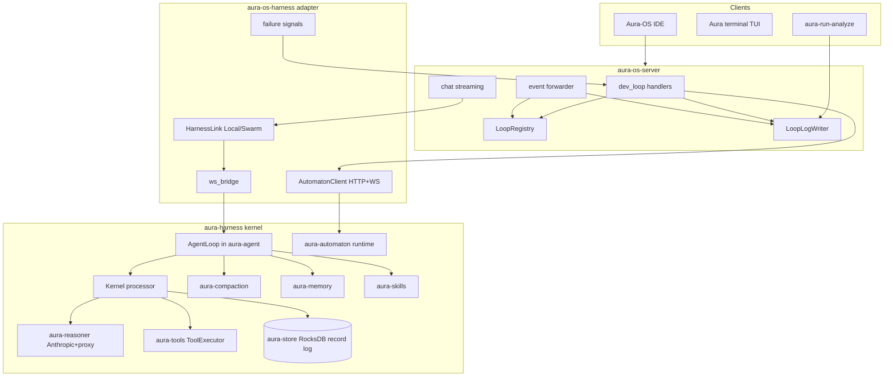
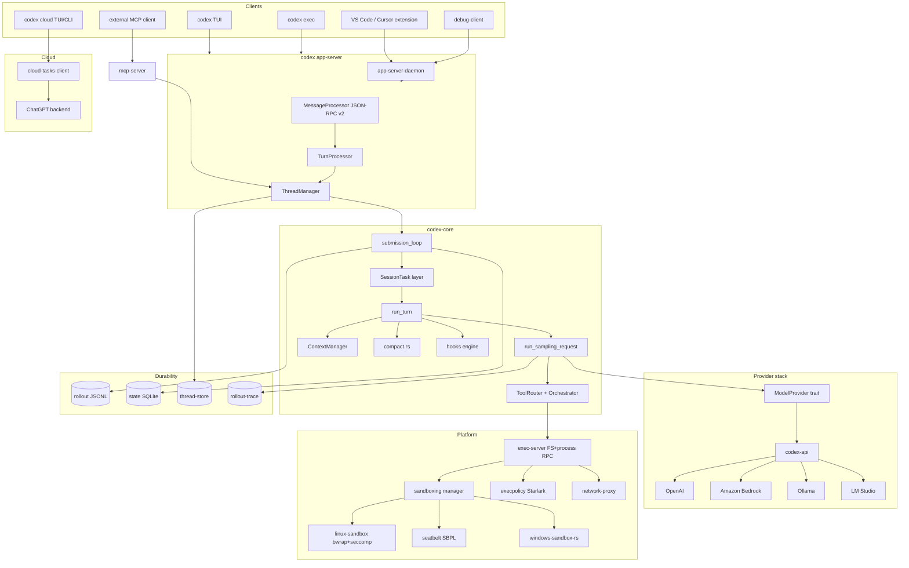
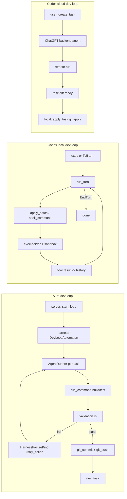
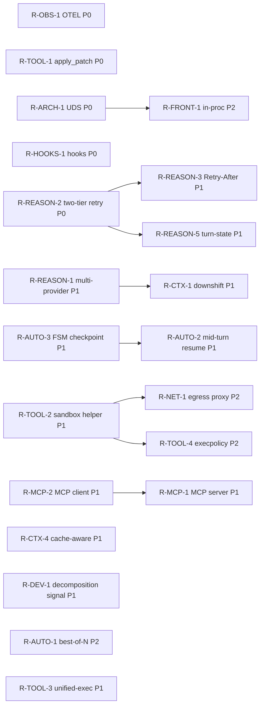

# Aura Harness vs OpenAI Codex - First-Principles Review

Status: draft v1
Pinned codex commit: 9f42c89c01 (2026-05-24)
Aura harness HEAD at time of review: see `git rev-parse HEAD` in `C:/code/aura-harness`
Aura-OS HEAD: see `git rev-parse HEAD` in `C:/code/aura-os`

Local checkout: `C:/code/codex` (origin: `real-n3o/codex` fork; upstream: `openai/codex`).

This document is read-only analysis. Every claim cites a specific file in one of the three repos. Where we say "Codex does X" we mean the repo at the pinned commit; where we say "Aura does Y" we mean the current HEAD of `aura-harness` and `aura-os` per the explore subagent maps generated 2026-05-24.

## Table of Contents

0. [Document scope](#0-document-scope)
1. [Executive summary - top 10 leverage points](#1-executive-summary)
2. [First-principles framing](#2-first-principles-framing)
3. [Side-by-side architecture](#3-side-by-side-architecture)
4. [Per-dimension diff](#4-per-dimension-diff)
   - 4.1 Architecture and topology
   - 4.2 Reasoning surface
   - 4.3 Tool execution
   - 4.4 Context management
   - 4.5 Long-running automation
   - 4.6 Observability and debuggability
   - 4.7 Multi-agent and multi-frontend
   - 4.8 Dev-loop integration
5. [Long-running automation deep-dive](#5-long-running-automation-deep-dive)
6. [Reasoning capacity deep-dive](#6-reasoning-capacity-deep-dive)
7. [Resilience patterns deep-dive](#7-resilience-patterns-deep-dive)
8. [Speed levers](#8-speed-levers)
9. [Efficiency levers](#9-efficiency-levers)
10. [Cross-cutting hardening](#10-cross-cutting-hardening)
11. [Recommendations](#11-recommendations)
12. [Open questions](#12-open-questions)
13. [References](#13-references)

---

## 0. Document scope

The user asked: how can we improve efficiency, speed, reasoning capacity, and resilience of our coding harness and long-running automation runs, viewed first-principles, using OpenAI Codex as a reference platform.

Method:

1. Forked `openai/codex` to `real-n3o/codex` and cloned to `C:/code/codex`. Pinned the review at commit `9f42c89c01` (2026-05-24, "feat(doctor): add environment diagnostics").
2. Mapped Aura's coding harness ([`C:/code/aura-harness`](../crates/)) and Aura-OS automation layer ([`C:/code/aura-os`](../../aura-os/)) via parallel explore subagents.
3. Mapped Codex's `codex-rs/` workspace (~100 crates) via four parallel explore subagents covering: core loop and protocol; providers and observability; tools, sandboxing, hooks, MCP; cloud tasks, frontends, skills, memories, modalities.

What this document is:

- A structural diff with file-level citations.
- A prioritized backlog of changes to consider, with success metrics.
- A first-principles framing of what an excellent coding harness must provide.

What this document is not:

- A drop-in migration plan. Aura's deterministic kernel + RocksDB record log + tri-state policy is a specific architecture with its own invariants ([invariants.md](./invariants.md)). Several Codex shapes (cloud tasks, multi-provider, MCP-as-front-end, V8 in-process scripting) would conflict with those invariants if adopted wholesale. Recommendations are calibrated to keep our invariants intact while borrowing what fits.
- A benchmark study. We already have [`context-benchmark-suite.md`](./context-benchmark-suite.md). Several recommendations here propose extending that benchmark, but no new numbers are produced in this pass.
- A rewrite proposal. The dominant shape for both systems is "loop builds prompt -> stream model -> dispatch tools -> append results -> repeat". The deltas are at the joints, not the spine.

---

## 1. Executive summary

### Where Codex is meaningfully ahead

1. **Replay-grade durability**: rollout JSONL ([`codex-rs/rollout/src/recorder.rs`](../../codex/codex-rs/rollout/src/recorder.rs)) plus rollout-trace inference bundles ([`codex-rs/rollout-trace/src/inference.rs`](../../codex/codex-rs/rollout-trace/src/inference.rs)) plus reconstruction-from-rollout ([`codex-rs/core/src/session/rollout_reconstruction.rs`](../../codex/codex-rs/core/src/session/rollout_reconstruction.rs)). Aura has the equivalent strong contract via the kernel record log ([`crates/aura-store/src/store.rs`](../crates/aura-store/src/store.rs)) but the *replay path* outside the kernel - including run bundle reconstruction in [`crates/aura-loop-log-schema/`](../../aura-os/crates/aura-loop-log-schema/) - is not yet a tested resume mechanism.
2. **Cross-platform sandboxing as a first-class crate set**: [`codex-rs/sandboxing/src/manager.rs`](../../codex/codex-rs/sandboxing/src/manager.rs), [`codex-rs/linux-sandbox/`](../../codex/codex-rs/linux-sandbox/) (bwrap+seccomp+namespaces), [`codex-rs/windows-sandbox-rs/`](../../codex/codex-rs/windows-sandbox-rs/) (restricted token + WFP + ACL), seatbelt SBPL on macOS. Aura has path confinement in [`crates/aura-tools/src/sandbox.rs`](../crates/aura-tools/src/sandbox.rs) plus `CommandPolicy` allowlists, but no kernel-level isolation, no syscall filtering, and no cross-platform helper subprocess.
3. **Mid-turn fallback transport**: WebSocket -> HTTP fallback after `stream_max_retries` exhausted, sticky `x-codex-turn-state` header preserved across retries ([`codex-rs/core/src/client.rs`](../../codex/codex-rs/core/src/client.rs):1602-1639, :1674-1695). Aura emits `TurnEvent::StreamReset` and falls back to non-streaming `complete()` ([`docs/architecture.md`](./architecture.md) Flow 4) but does not have a parallel WS lane to fall back from in the first place.
4. **Multi-provider with one wire shape**: Codex normalizes everything onto OpenAI Responses API and uses TOML config to add new providers ([`codex-rs/model-provider-info/src/lib.rs`](../../codex/codex-rs/model-provider-info/src/lib.rs):84-136). Aura is single-provider through proxy ([`crates/aura-reasoner/src/anthropic/provider.rs`](../crates/aura-reasoner/src/anthropic/provider.rs)). Going multi-provider is a known trade-off for the deterministic kernel, but the cost is worth quantifying.
5. **Long-running automation has a hosted-or-local shape**: Codex Cloud Tasks ([`codex-rs/cloud-tasks-client/src/api.rs`](../../codex/codex-rs/cloud-tasks-client/src/api.rs)) outsources orchestration entirely; the local CLI is a poller + git-applier. Aura's automaton is in-process in [`crates/aura-automaton/src/runtime.rs`](../crates/aura-automaton/src/runtime.rs), with all durability concerns landing in our process. We could reuse our automaton interface but offer a "remote runner" mode for unattended runs.
6. **Daemon transport with stable JSON-RPC v2**: [`codex-rs/app-server/`](../../codex/codex-rs/app-server/) plus daemon process management ([`codex-rs/app-server-daemon/src/lib.rs`](../../codex/codex-rs/app-server-daemon/src/lib.rs)). Stdio JSONL is the default; UDS upgrades to WebSocket. Aura uses raw Axum + WebSocket only ([`crates/aura-runtime/src/session/ws_handler.rs`](../crates/aura-runtime/src/session/ws_handler.rs)). For desktop and IDE clients UDS would cut cold-start and avoid the WS slot semaphore problem documented in [`crates/aura-os-harness/src/automaton_client/`](../../aura-os/crates/aura-os-harness/src/automaton_client/).
7. **Plugin + hook extensibility**: Codex hooks fire on PreToolUse / PermissionRequest / PostToolUse / Pre/PostCompact / SessionStart / UserPromptSubmit / SubagentStart / SubagentStop / Stop ([`codex-rs/hooks/src/lib.rs`](../../codex/codex-rs/hooks/src/lib.rs):19-30). Aura's only programmable extension surface is `SKILL.md` plus the kernel `ToolApprovalPrompter` plus `TurnObserver`. The hook taxonomy is the right one for ecosystem growth.
8. **MCP both directions**: Codex consumes external MCP servers ([`codex-rs/codex-mcp/src/connection_manager.rs`](../../codex/codex-rs/codex-mcp/src/connection_manager.rs)) and exposes itself as one ([`codex-rs/mcp-server/src/lib.rs`](../../codex/codex-rs/mcp-server/src/lib.rs)). Aura has installed/trusted HTTP integrations ([`crates/aura-tools/src/resolver/trusted/integrations/`](../crates/aura-tools/src/resolver/trusted/integrations/)) but is not an MCP citizen in either direction. Adding inbound MCP would let other agent platforms drive Aura without rewriting our protocol.
9. **`apply_patch` as a dedicated crate with V4A-compatible parser**: [`codex-rs/apply-patch/src/parser.rs`](../../codex/codex-rs/apply-patch/src/parser.rs) - LLM-friendly format with lenient parsing, partial-failure deltas, fuzzy context match, streaming parser. Aura uses `edit_file` and `write_file` ([`crates/aura-tools/src/tool.rs`](../crates/aura-tools/src/tool.rs):192-211) which are simpler but cost tokens because the model has to redo more of the file.
10. **Structured retry/escalation via execpolicy DSL**: Starlark-based prefix rules + network rules in [`codex-rs/execpolicy/src/policy.rs`](../../codex/codex-rs/execpolicy/src/policy.rs):188 with strictest-decision-wins semantics. Aura has hand-coded `CommandPolicy::is_command_allowed` ([`crates/aura-tools/src/lib.rs`](../crates/aura-tools/src/lib.rs):254-257). A DSL would let users grow the allowlist without code changes.

### Where Aura is meaningfully ahead

1. **Single-writer, append-only record log with context-hash chain** ([`crates/aura-kernel/src/context/mod.rs`](../crates/aura-kernel/src/context/mod.rs), `hash_tx_with_window`). Codex captures `RolloutItem` to JSONL but does not enforce a deterministic hash chain or single-writer claim. For audit/forensic replay, Aura's contract is stronger.
2. **Sealed gateway invariants**: every LLM call ends as a `Reasoning` transaction; every state change ends as a `RecordEntry`; CI grep bands enforce no raw model provider calls outside the kernel ([`docs/invariants.md`](./invariants.md) Sec 1, 3, 9). Codex has no equivalent compile-time / lint-time wall.
3. **Tri-state tool permissions with session approvals**: `On / Off / Ask` per tool with kernel-side caching ([`crates/aura-tools/src/lib.rs`](../crates/aura-tools/src/lib.rs), `UserToolDefaults`, `AgentToolPermissions`). Codex has approval modes but no tri-state default plus session ask cache surface in protocol.
4. **Compaction as a pure crate** ([`crates/aura-compaction/src/lib.rs`](../crates/aura-compaction/src/lib.rs)) with explicit tiers (utilization, byte thresholds, request kind expectations, repeated-read shaping, redaction markers). Codex compaction lives inline in [`codex-rs/core/src/compact.rs`](../../codex/codex-rs/core/src/compact.rs) and is more entangled with the loop.
5. **Memory triple-store**: facts / events / procedures with deterministic salience scoring and post-turn ingest pipeline ([`crates/aura-memory/src/manager.rs`](../crates/aura-memory/src/manager.rs)). Codex memories are a markdown summary file ([`codex-rs/memories/README.md`](../../codex/codex-rs/memories/README.md)) - simpler but flatter.
6. **Run-quality heuristics**: [`crates/aura-run-heuristics/`](../../aura-os/crates/aura-run-heuristics/) post-run rules (`high_retry_density`, `token_hog_llm_call`, `zero_tool_calls_in_turn`, ...). Codex has analytics events but no post-run rules engine.
7. **Stable harness-OS split**: `aura-harness` (kernel) and `aura-os` (orchestration) live in separate workspaces with a thin protocol crate. Codex's `codex-core` is documented in [`AGENTS.md`](../../codex/AGENTS.md):66 as bloated and recommended for splitting.

### The 10-point ranked leverage list

Ordered by impact-per-effort given Aura's invariants:

| # | Lever | Impact | Effort | Conflict with invariants? |
|---|-------|--------|--------|---------------------------|
| 1 | UDS + JSON-RPC v2 daemon transport for desktop/IDE | High | M | None (additive) |
| 2 | Hook taxonomy (Pre/Post tool, Pre/Post compact, SessionStart, UserPromptSubmit) | High | M | None (already runs through kernel) |
| 3 | `apply_patch` tool with V4A-style format | High | S | None |
| 4 | Mid-turn fallback transport ladder + sticky `turn_state` header | High | M | None |
| 5 | Cross-platform sandbox helper subprocess (Linux bwrap, macOS seatbelt, Windows restricted token) | High | L | None (sandbox layer is already separable) |
| 6 | Inbound MCP server (Aura as MCP) | Medium | M | None |
| 7 | Outbound MCP client merged into tool catalog with `tool_search` | High | M | None |
| 8 | Replay-from-record CLI plus mid-turn resume protocol | High | L | Aligns with invariants - currently deferred per [`reliability-2026-05.md`](./reliability-2026-05.md) |
| 9 | `responses-api-proxy`-style key-injection sidecar for sandboxed reasoner calls | Medium | S | None |
| 10 | Execpolicy Starlark DSL replacing hand-coded `CommandPolicy` | Medium | M | None |

Sections 4-11 below back each row with file-level evidence and a concrete change scope.

---

## 2. First-principles framing

What an excellent coding harness must provide, derived from the dimensions on which both Aura and Codex actually differ:

1. **Determinism boundary**: a place where probabilistic LLM calls end and deterministic state transitions begin. The boundary should be a small, sealed surface so audits and replay are tractable. Aura has this explicitly via the kernel; Codex has it implicitly via rollout JSONL. Both are valid; making the boundary explicit reduces bugs.
2. **Replayability**: the system should be able to rebuild the in-memory state of any session from durable artifacts alone. Aura: the record log. Codex: the rollout JSONL. Aura's hash chain makes corruption detectable; Codex's reconstruction code handles partial turns.
3. **Durable state with single-writer atomicity**: append-only log with batch atomicity prevents partial writes. Aura uses RocksDB WriteBatch ([`crates/aura-store/src/store.rs`](../crates/aura-store/src/store.rs):239-298). Codex uses sequential JSONL appends with explicit flush at task boundary ([`codex-rs/core/src/tasks/mod.rs`](../../codex/codex-rs/core/src/tasks/mod.rs):418-428).
4. **Low-latency tool feedback**: the dev loop wins or loses on how fast the model sees test/build output. Both systems stream tool stdout/stderr; Codex has long-poll exec (`process/read` with `afterSeq`/`waitMs`) for incremental delivery ([`codex-rs/exec-server/README.md`](../../codex/codex-rs/exec-server/README.md):186-219). Aura streams via `Progress` heartbeats ([`crates/aura-protocol/src/server.rs`](../crates/aura-protocol/src/server.rs)).
5. **Parallelism at every safe layer**: independent multi-agent tasks, parallel batched tool calls within a turn, parallel SSE consumption. Both systems batch tool calls; Codex uses `FuturesOrdered` ([`codex-rs/core/src/session/turn.rs`](../../codex/codex-rs/core/src/session/turn.rs):1727-1728), Aura uses `join_all` ([`crates/aura-kernel/src/kernel/tools/batch.rs`](../crates/aura-kernel/src/kernel/tools/batch.rs):71-76).
6. **Model fluidity**: the cost of switching models, providers, or context budgets should be small. Codex normalizes to OpenAI Responses API; Aura normalizes to Anthropic Messages via proxy. Each closes off the other's option, but neither blocks runtime selection of model/effort.
7. **Sandbox correctness**: every tool that touches the host must run inside a policy that can be inspected. Codex's three-tier exec (orchestrator -> exec-server RPC -> platform sandbox helper) is the cleanest separation. Aura's sandbox is a path prefix check.
8. **Observability tight enough to debug a single turn**: structured events, span tracing, run bundles, error attribution. Both systems instrument heavily. Aura has the post-run heuristics rule engine which Codex does not; Codex has OTEL plus Sentry plus Statsig metrics which Aura does not.
9. **Long-running automation that survives process restart**: durable task queue, recoverable mid-run, idempotent at task boundary. Both systems have this at the *task* level (Codex via cloud backend, Aura via storage `Ready/InProgress` rows + run bundles + orphan recovery). Neither has true mid-turn resume on a fresh process today.
10. **Ecosystem integration**: MCP, Skills, hooks, plugins. Codex is fully MCP-native and has a hook taxonomy. Aura has SKILL.md (compatible) and trusted HTTP integrations.

The eight comparison dimensions (architecture/topology, reasoning, tools, context, long-running, observability, multi-agent, dev-loop) follow from the ten capabilities above.

---

## 3. Side-by-side architecture

### 3.1 Aura today

Key references:
- [`crates/aura-agent/src/agent_loop/mod.rs`](../crates/aura-agent/src/agent_loop/mod.rs):342 - turn loop
- [`crates/aura-kernel/src/kernel/mod.rs`](../crates/aura-kernel/src/kernel/mod.rs):238 - kernel struct
- [`crates/aura-reasoner/src/anthropic/provider.rs`](../crates/aura-reasoner/src/anthropic/provider.rs) - provider with retries + body cap + cloudflare shrink
- [`crates/aura-os-harness/src/automaton_client/client.rs`](../../aura-os/crates/aura-os-harness/src/automaton_client/client.rs) - automaton REST + WS client
- [`apps/aura-os-server/src/handlers/dev_loop/streaming/forwarder.rs`](../../aura-os/apps/aura-os-server/src/handlers/dev_loop/streaming/forwarder.rs) - forwarder

### 3.2 Codex today

Key references:
- [`codex-rs/core/src/session/turn.rs`](../../codex/codex-rs/core/src/session/turn.rs):131 - run_turn
- [`codex-rs/core/src/session/turn.rs`](../../codex/codex-rs/core/src/session/turn.rs):1689 - try_run_sampling_request
- [`codex-rs/app-server/README.md`](../../codex/codex-rs/app-server/README.md) - transport and lifecycle
- [`codex-rs/sandboxing/src/manager.rs`](../../codex/codex-rs/sandboxing/src/manager.rs):23-28 - SandboxType enum
- [`codex-rs/cloud-tasks-client/src/api.rs`](../../codex/codex-rs/cloud-tasks-client/src/api.rs):20-61 - cloud task lifecycle

### 3.3 Dev-loop overlay

The dev-loop in either system is "agentic task -> run build/test -> on failure retry/decompose -> commit/push". Aura runs this entirely in-process; Codex's interactive dev-loop runs in-process locally, but Cloud Tasks moves orchestration into ChatGPT backend with the local CLI as poller + applier.

Aura is closer in shape to "Codex local dev-loop" but with explicit retry/decomposition signals. Codex Cloud Tasks is a different category - task-as-RPC with manual diff apply.

---

## 4. Per-dimension diff

Each subsection follows the same template: claim, Aura status with file refs, Codex status with file refs, gap, and the recommendation that section 11 will track.

### 4.1 Architecture and topology

**Claim**: the harness should split a deterministic kernel from a probabilistic loop, and the wire surface between clients and the kernel should be cheap to attach (low cold-start, no per-connection rebuild).

**Aura status**:
- Kernel/loop split is explicit: `AgentLoop` ([`crates/aura-agent/src/agent_loop/mod.rs`](../crates/aura-agent/src/agent_loop/mod.rs):342) drives turns, `Kernel` ([`crates/aura-kernel/src/kernel/mod.rs`](../crates/aura-kernel/src/kernel/mod.rs):238) processes single steps. Sealed gateways (`KernelModelGateway`, `KernelToolGateway`) enforce the boundary and CI grep bands enforce no bypass ([`docs/invariants.md`](./invariants.md) Sec 1, 9).
- Wire surface is Axum HTTP + WebSocket only ([`crates/aura-runtime/src/session/ws_handler.rs`](../crates/aura-runtime/src/session/ws_handler.rs)). Default port is 8080 (release) or 8081 (dev) per [`crates/aura-os-harness/src/harness_url.rs`](../../aura-os/crates/aura-os-harness/src/harness_url.rs).
- Aura-OS auto-spawns the harness as a child process when needed ([`apps/aura-os-server/src/app_builder/harness_autospawn.rs`](../../aura-os/apps/aura-os-server/src/app_builder/harness_autospawn.rs)) but every process attaches over WebSocket through `aura-os-harness` adapter ([`crates/aura-os-harness/src/local_harness.rs`](../../aura-os/crates/aura-os-harness/src/local_harness.rs):71-237).

**Codex status**:
- Kernel = `codex-core` (turn loop, sampling, tools), but the `codex-core` crate is documented as bloated and recommended to extract from ([`AGENTS.md`](../../codex/AGENTS.md):66). The split is informal compared to Aura's sealed gateways.
- Wire surface is `app-server` JSON-RPC v2 over three transports ([`codex-rs/app-server/README.md`](../../codex/codex-rs/app-server/README.md):20-53):
  - `stdio://` JSONL (one JSON-RPC message per line) - the default for IDE/exec invocation.
  - Unix socket with HTTP Upgrade -> WebSocket frames for daemon mode.
  - `ws://` for experimental browser/network access.
- App-server can run in three modes: per-invocation, daemon ([`codex-rs/app-server-daemon/src/lib.rs`](../../codex/codex-rs/app-server-daemon/src/lib.rs):30-95), or in-process via `InProcessAppServerClient` ([`codex-rs/app-server/src/in_process.rs`](../../codex/codex-rs/app-server/src/in_process.rs):1-39). TUI and `codex exec` use in-process by default; VS Code uses daemon.
- Backpressure surfaced as JSON-RPC error -32001 ([`codex-rs/app-server-transport/src/transport/mod.rs`](../../codex/codex-rs/app-server-transport/src/transport/mod.rs):44).

**Gap**:
- Aura forces every client through WebSocket including local TUI and IDE in the same process tree. WebSocket handshake + slot semaphore dominates cold-start for short tasks.
- Aura has no in-process client mode equivalent to Codex `InProcessAppServerClient`. Today the IDE in `apps/aura-os-ide/` uses HTTP to the os-server which uses WebSocket to the harness - two hops.
- Aura kernel/loop split is *cleaner* than Codex's. That is a win we should preserve.

**Recommendation**: R-ARCH-1 (UDS + JSON-RPC v2 transport), R-ARCH-2 (in-process client mode for desktop/embedded), R-ARCH-3 (Aura-OS connects to harness via UDS by default, falling back to WS when remote).

### 4.2 Reasoning surface

**Claim**: the provider abstraction should let us swap models, providers, and reasoning budgets without rebuilding the loop, and should treat retries/backoff as a first-class concern.

**Aura status**:
- Single provider trait `ModelProvider` ([`crates/aura-reasoner/src/lib.rs`](../crates/aura-reasoner/src/lib.rs):311-363) with one production impl `AnthropicProvider` ([`crates/aura-reasoner/src/anthropic/provider.rs`](../crates/aura-reasoner/src/anthropic/provider.rs)) and a `MockProvider` for tests.
- Routing is JWT-authenticated through `aura-router` (sibling repo). Direct Anthropic API is also supported.
- Retry classification: `classify_retry_action` handles 429, 529, 5xx, Cloudflare 403 with body shrink ladder (3 attempts each at 3/4 cap, floor 16 KiB) ([`docs/reliability-2026-05.md`](./reliability-2026-05.md)).
- Body cap: `AURA_LLM_EMERGENCY_BODY_CAP_BYTES` default 524288, with proactive truncate-last-user -> drop-oldest-pairs -> collapse ladder.
- `AURA_MODEL_TIMEOUT_MS` aligned with agent loop stream timeout.
- Stream recovery: on mid-stream failure, agent loop emits `TurnEvent::StreamReset` and falls back to non-streaming `complete()` (architecture Flow 4).
- Cache token plumbing end-to-end ([`docs/context-optimizations-v1.md`](./context-optimizations-v1.md)).
- Thinking budget taper handled in [`crates/aura-agent/src/agent_loop/iteration/`](../crates/aura-agent/src/agent_loop/iteration/).

**Codex status**:
- Provider trait `ModelProvider` ([`codex-rs/model-provider/src/provider.rs`](../../codex/codex-rs/model-provider/src/provider.rs):77-142) with two impls: `ConfiguredModelProvider` (OpenAI / Ollama / LM Studio / TOML-defined) and `AmazonBedrockModelProvider` (SigV4).
- All providers speak OpenAI Responses API (`wire_api = "responses"`) - one wire shape, many endpoints.
- Built-in providers in registry ([`codex-rs/model-provider-info/src/lib.rs`](../../codex/codex-rs/model-provider-info/src/lib.rs):408-435): OpenAI, Bedrock, Ollama (`localhost:11434`), LM Studio (`localhost:1234`).
- Two-tier retry (separate budgets per tier):
  - Transport: `request_max_retries` default 4, `200ms * 2^n * jitter(0.9-1.1)`, retries 5xx and transport errors but **not 429** ([`codex-rs/codex-client/src/retry.rs`](../../codex/codex-rs/codex-client/src/retry.rs):22-73).
  - Stream/session: `stream_max_retries` default 5, restarts entire sampling request on stream errors ([`codex-rs/core/src/session/turn.rs`](../../codex/codex-rs/core/src/session/turn.rs):968-1021). On exhaustion, calls `try_switch_fallback_transport` to drop WebSocket and reset retry counter.
- 429 handling: `response.failed` events parse "try again in Xs" from the message body and treat as `Retryable` with that delay; but the transport layer does **not** retry 429.
- `prompt_cache_key = thread_id` ([`codex-rs/core/src/client.rs`](../../codex/codex-rs/core/src/client.rs):751); reasoning effort/summary in request payload.
- Token usage normalized including `cached_tokens`, `reasoning_tokens` ([`codex-rs/codex-api/src/sse/responses.rs`](../../codex/codex-rs/codex-api/src/sse/responses.rs):117-132).
- ETag-driven model catalog refresh on response headers.
- Sticky `x-codex-turn-state` header preserved across retries to keep server-side routing consistent.

**Gap**:
- Aura's single provider locks us to Anthropic Messages API and the proxy's policy. We cannot route gpt-5 or local-OSS models for cheap turns or as fallback for 429.
- Aura has one retry tier (provider-level). Codex's two-tier model is more granular: connect retries and stream retries have different budgets.
- Codex's WS->HTTP fallback is a retryable-transport mechanism. Aura's stream-reset goes straight from streaming to non-streaming with no parallel transport to fall back to.
- We do not consume HTTP `Retry-After` headers anywhere visible. Codex parses delay from message body but also ignores Retry-After.
- Codex's `responses-api-proxy` ([`codex-rs/responses-api-proxy/src/lib.rs`](../../codex/codex-rs/responses-api-proxy/src/lib.rs)) gives a key-injection sidecar that lets unprivileged processes hit the API without seeing the key. Aura's proxy is a JWT-routed full-fat router.

**Recommendation**: R-REASON-1 (multi-provider behind one trait), R-REASON-2 (two-tier retry), R-REASON-3 (Retry-After honored at provider layer), R-REASON-4 (key-injection sidecar pattern for sandboxed reasoner calls), R-REASON-5 (sticky turn-state header equivalent to keep model server-side routing stable across retries).

### 4.3 Tool execution

**Claim**: every tool that can mutate or read host state should pass through a router with policy + sandbox + approval, support parallel batches, and emit structured effects for replay.

**Aura status**:
- `ToolExecutor` implements `Executor` trait; `ToolResolver` aggregates built-ins, domain tools, installed/trusted HTTP integrations ([`crates/aura-tools/src/lib.rs`](../crates/aura-tools/src/lib.rs)).
- Built-in tools: `list_files`, `read_file`, `stat_file`, `write_file`, `edit_file`, `delete_file`, `find_files`, `search_code`, `run_command`, plus git tools, agent tools, domain tools (specs/tasks/projects/dev-loop control), and integrations (GitHub, Linear, Slack, Resend, Brave Search) ([`crates/aura-tools/src/tool.rs`](../crates/aura-tools/src/tool.rs):192-211).
- Two-layer policy: kernel `Policy` (capabilities, scope, integrations, tri-state on/off/ask) + `ToolConfig`/`CommandPolicy` for `run_command` allowlist ([`crates/aura-tools/src/lib.rs`](../crates/aura-tools/src/lib.rs):254-257).
- Sandboxing is path confinement only: `Sandbox` canonicalizes workspace root + `normalize_path` + symlink re-check ([`crates/aura-tools/src/sandbox.rs`](../crates/aura-tools/src/sandbox.rs)).
- Parallel batch tool execution via `futures_util::future::join_all` after per-tool timeout ([`crates/aura-kernel/src/kernel/tools/batch.rs`](../crates/aura-kernel/src/kernel/tools/batch.rs):71-76). Batch atomicity via `append_entries_batch` for contiguous seq range.
- Structured effects: tools return `ToolResult` -> kernel `Effect` -> `decode_tool_effect` -> `ToolCallResult`; file-mutating tools attach `LineDiff` at kernel boundary.
- No equivalent of `apply_patch`: model uses `edit_file` (line-based replace) or `write_file` (full file).

**Codex status**:
- Three-tier exec (orchestrator -> exec-server RPC -> platform sandbox helper). `ToolOrchestrator` is the gate ([`codex-rs/core/src/tools/orchestrator.rs`](../../codex/codex-rs/core/src/tools/orchestrator.rs):128-388) with approval -> sandbox attempt -> on-deny escalated retry without sandbox.
- Tool catalog ([`codex-rs/core/src/tools/spec_plan.rs`](../../codex/codex-rs/core/src/tools/spec_plan.rs)): `exec_command` + `write_stdin` (UnifiedExec PTY), `shell_command` (one-shot), `apply_patch`, `view_image`, `plan`/`update_plan`, `request_user_input`/`request_permissions`, MCP tools (`mcp__server__tool`), `tool_search` (BM25 over deferred tools), `code_mode_execute`/`code_mode_wait`, `spawn_agent` v1 + namespaced v2, hosted `web_search` + `image_generation`, dynamic + extension tools.
- `apply_patch` ([`codex-rs/apply-patch/`](../../codex/codex-rs/apply-patch/)) is a dedicated crate with `*** Begin Patch / *** Update File / @@ context / +/- lines / *** End Patch` format. Standalone parser, fuzzy-context matcher, streaming parser, partial-failure deltas, scenario fixtures.
- Sandbox is cross-platform with proper isolation:
  - Linux: `linux-sandbox` helper using bubblewrap + namespaces + seccomp + optional landlock ([`codex-rs/linux-sandbox/README.md`](../../codex/codex-rs/linux-sandbox/README.md)).
  - macOS: sandbox-exec SBPL with hardcoded `/usr/bin/sandbox-exec` (TOCTOU defense) ([`codex-rs/sandboxing/src/seatbelt.rs`](../../codex/codex-rs/sandboxing/src/seatbelt.rs)).
  - Windows: restricted token + capability SIDs + WFP + ACL ([`codex-rs/windows-sandbox-rs/src/lib.rs`](../../codex/codex-rs/windows-sandbox-rs/src/lib.rs)).
- Parallel tool calls: `FuturesOrdered` in `try_run_sampling_request` ([`codex-rs/core/src/session/turn.rs`](../../codex/codex-rs/core/src/session/turn.rs):1727-1728); tools mark `supports_parallel_tool_calls`.
- Structured output: `ResponseItem` captures full tool calls + outputs in rollout JSONL.
- Approval modes: `untrusted` / `on-request` / `on-failure` / `never` / `granular` ([`codex-rs/protocol/src/protocol.rs`](../../codex/codex-rs/protocol/src/protocol.rs):764). Per-path approval keys for apply_patch.

**Gap**:
- Aura's `Sandbox` is a path check, not a kernel/syscall isolation. A misbehaving tool can do anything `run_command`'s shell can. Codex's bwrap+seccomp+namespaces is a different category of safety.
- Aura has no `apply_patch`. Token cost per file edit is higher because the model must regenerate either full files (`write_file`) or use `edit_file`'s exact-line-match contract.
- Aura's allowlist is hand-coded in `CommandPolicy`. Codex's Starlark execpolicy DSL allows runtime amendments via `blocking_append_allow_prefix_rule`.
- Aura lacks unified-exec / PTY tool for long-running interactive commands; long-running commands must be modeled as `run_command` with timeouts + retries.
- Aura does not have `tool_search` for handling large MCP-style catalogs, because Aura does not expose external MCP catalogs in the first place (see 4.7).
- Aura does have multi-key approvals (tri-state per agent) which Codex matches via `granular` mode + per-path apply_patch approval.

**Recommendation**: R-TOOL-1 (`apply_patch` tool + parser crate), R-TOOL-2 (kernel-level sandbox helper subprocess on Linux/macOS/Windows), R-TOOL-3 (unified-exec PTY tool with long-poll read), R-TOOL-4 (Starlark execpolicy DSL replacing hand-coded allowlist), R-TOOL-5 (`tool_search` BM25 deferred-tool search if R-MCP-1 lands).

### 4.4 Context management

**Claim**: pre-call compaction, summary escalation, redaction, and cache-marker placement are the levers that turn a 200k-token-window into a 1M-effective-context.

**Aura status**:
- Compaction is a pure crate ([`crates/aura-compaction/src/lib.rs`](../crates/aura-compaction/src/lib.rs)) with explicit tiers triggered from agent loop ([`crates/aura-agent/src/agent_loop/mod.rs`](../crates/aura-agent/src/agent_loop/mod.rs):412-428):
  - Utilization tiers at 85% / 70% / 60% / 30% / 15% of `max_context_tokens` ([`crates/aura-compaction/src/messages.rs`](../crates/aura-compaction/src/messages.rs):92-149).
  - Absolute byte thresholds (64 / 96 / 128 KiB).
  - Reserved output headroom in pressure calc.
  - `request_kind` body expectations (DevLoopBootstrap 24 KiB, project tools 48 KiB).
  - `summary_at` default 0.85 returns `NeedsSummary` for agent loop to call model.
- What gets summarized: older message text, bulky write/edit inputs (`_redacted` markers), repeated cacheable read tool results (read_file, search_code, list_files), tool surface descriptions stripped.
- Redaction markers are structural: tools reject re-execution of `_redacted` payloads -> `CompactionStructural` error. This makes the determinism boundary stable across compaction.
- Cache plumbing: prompt_cache_key, prompt_cache_retention, cache_creation/cache_read tokens reported in `Usage`.
- Repeated cached-read shaping: harness layer collapses repeated `read_file` etc. to references.
- Compaction does **not** mutate the record log (Invariant Sec 10) - it only trims in-memory `Vec<Message>` in the AgentLoop.
- Summary escalation is an explicit model call: agent loop builds `SummaryInput` -> model -> `SummaryOutput` -> `Compactor::apply_summary`.

**Codex status**:
- Compaction lives in [`codex-rs/core/src/compact.rs`](../../codex/codex-rs/core/src/compact.rs):
  - **Inline auto**: `run_inline_auto_compact_task` runs a dedicated compact turn with `SUMMARIZATION_PROMPT`.
  - **Remote**: `should_use_remote_compact_task(provider)` -> v1/v2 remote compact paths.
  - **Pre/post hooks**: `run_pre_compact_hooks` / `run_post_compact_hooks` integrate with hook engine.
- Triggers ([`codex-rs/core/src/session/turn.rs`](../../codex/codex-rs/core/src/session/turn.rs):640-809):
  - Pre-turn: `run_pre_sampling_compact` when token_limit_reached.
  - Mid-turn: after sampling if over limit and still `needs_follow_up`.
  - Model downshift: compact with previous-model context when switching to smaller window.
- `Compacted` rollout item ([`codex-rs/protocol/src/protocol.rs`](../../codex/codex-rs/protocol/src/protocol.rs):2715-2720) carries summary message + optional `replacement_history` for replay reconstruction.
- Reconstruction reverse-scans for newest `Compacted.replacement_history` checkpoint ([`codex-rs/core/src/session/rollout_reconstruction.rs`](../../codex/codex-rs/core/src/session/rollout_reconstruction.rs):86-129).
- Cache: `prompt_cache_key = thread_id` (per-thread stable key).
- TODO at `turn.rs:141-144`: pre-turn compaction should account for incoming user message size before recording context.

**Gap**:
- Aura's compaction is more disciplined (pure crate, explicit tiers, redaction is structural) but lacks model-downshift compaction. Codex re-summarizes the conversation through the previous-model context when a smaller-window model is selected mid-session.
- Codex's `Compacted.replacement_history` is the durable artifact of compaction, persisted in rollout. Aura's compaction is in-memory only - we do not persist a "this is the summary that replaced these messages" record. That is consistent with our invariants (compaction does not mutate the record), but it means we cannot replay a session at the post-compaction state without re-running compaction logic.
- Aura's `summary_at` is fixed at 0.85; Codex has both an inline auto-compact path and a remote compact path that can scale to larger horizons.

**Recommendation**: R-CTX-1 (model-downshift compaction), R-CTX-2 (persistent compaction artifact in record log as a pure structural marker, not a state mutation), R-CTX-3 (parametrize `summary_at` per request kind, mirroring our `request_kind` body expectations).

### 4.5 Long-running automation

**Claim**: long-running automation must survive process restart, support pause/resume/stop, recover orphaned state, and propagate signals from UI to agent kernel without losing fidelity.

**Aura status**:
- Long-running automation is built around the `Automaton` trait ([`crates/aura-automaton/src/lib.rs`](../crates/aura-automaton/src/lib.rs)) with `tick`, `on_install`, `on_stop`, `Schedule`, `TickContext`, `AutomatonEvent`.
- Built-ins: `ChatAutomaton`, `DevLoopAutomaton` (task queue + agent runs + commit/push), `SpecGenAutomaton`, `TaskRunAutomaton`.
- Runtime ([`crates/aura-automaton/src/runtime.rs`](../crates/aura-automaton/src/runtime.rs)): one tokio task per automaton instance, `CancellationToken` for stop, `watch` channel for pause, `mpsc::Sender<AutomatonEvent>` capacity 1024 for fan-out.
- Durability:
  - Automaton FSM state mostly in-memory (`AutomatonState`).
  - Lifecycle transitions recorded via runtime `AutomatonBridge` -> System/AutomatonLifecycle transactions -> scheduler -> kernel record log.
  - Dev-loop persists task progress via domain API + git push.
  - Run telemetry: JSONL bundles under `loop_logs/{project_id}/{run_id}/` with `metadata.json`, `events.jsonl`, `llm_calls.jsonl`, `iterations.jsonl`, `blockers.jsonl`, `retries.jsonl`, `task_*.output.txt`, `summary.md` ([`crates/aura-loop-log-schema/src/lib.rs`](../../aura-os/crates/aura-loop-log-schema/src/lib.rs)).
- Pause / resume / stop:
  - HTTP control routes in `aura-os-server` ([`apps/aura-os-server/src/handlers/dev_loop/control.rs`](../../aura-os/apps/aura-os-server/src/handlers/dev_loop/control.rs)).
  - `AutomatonClient::pause/resume/stop` calls harness HTTP ([`crates/aura-os-harness/src/automaton_client/client.rs`](../../aura-os/crates/aura-os-harness/src/automaton_client/client.rs)).
  - Server sets `paused` flag on `ActiveAutomaton`; freshness gate skipped while paused.
- Crash recovery:
  - `start_or_adopt` adopts existing harness automaton on 409 ([`apps/aura-os-server/src/handlers/dev_loop/start/start_or_adopt.rs`](../../aura-os/apps/aura-os-server/src/handlers/dev_loop/start/start_or_adopt.rs)).
  - `recover_orphan_tasks` resets stuck `InProgress` tasks back to `Ready`.
  - `can_reuse_forwarder` reuses forwarder if same `automaton_id`, alive, fresh events <120s, or paused.
- Signal propagation:
  - UI POST -> `control_loop` -> `AutomatonClient pause/resume/stop` -> harness HTTP.
  - Server sets paused flag, aborts `ws_reader_handle` and `forwarder` for stop.
- Failure classification: `HarnessFailureKind` (Truncation, RateLimited, PushTimeout, CompletionContract, ResearchLoopAbort, AgentStuck, InsufficientCredits, ProviderInternal, Other) + `RetryAction` (Retry, RetryWithDecomposition, Terminal) ([`crates/aura-os-harness/src/signals/mod.rs`](../../aura-os/crates/aura-os-harness/src/signals/mod.rs)).
- Stability metrics: `initial_connect_retries`, `ws_closed`, `ws_read_error`, `protocol_mismatch` ([`crates/aura-os-harness/src/stability_metrics.rs`](../../aura-os/crates/aura-os-harness/src/stability_metrics.rs)).
- **No mid-session WS reconnect** - blocked on `session_resume` protocol in aura-node per [`crates/aura-os-harness/src/ws_bridge.rs`](../../aura-os/crates/aura-os-harness/src/ws_bridge.rs):247-257.

**Codex status**:
- Two completely different shapes for "long-running":
  1. **Local**: `codex exec` / TUI run a single thread/turn cycle with no long-running orchestrator. Termination = `EndTurn` from model.
  2. **Cloud Tasks**: orchestration runs on ChatGPT/Codex backend; local CLI is a poll + diff applier ([`codex-rs/cloud-tasks-client/src/api.rs`](../../codex/codex-rs/cloud-tasks-client/src/api.rs)).
- Cloud task lifecycle (server-side):
  - `create_task(env, prompt, branch, best_of_n)` -> `POST /wham/tasks`.
  - `pending` -> `ready` -> `applied` (or `error`).
  - Per-attempt `AttemptStatus` including `Cancelled`.
  - Best-of-N attempt count built in.
- Local CLI ([`codex-rs/cloud-tasks/src/lib.rs`](../../codex/codex-rs/cloud-tasks/src/lib.rs)):
  - Default subcommand opens TUI; `exec` is fire-and-forget create.
  - Refresh = re-poll list/details (no streaming).
  - Apply = `codex_git_utils::apply_git_patch` locally (server returns the diff).
- No client cancel RPC in `CloudBackend` trait. Server may mark attempts `cancelled` -> mapped to error status client-side.
- Persistence: server-side; local stores no rollout for cloud tasks. Reconnect = re-poll with task id.
- Cloud requirements ([`codex-rs/cloud-requirements/src/lib.rs`](../../codex/codex-rs/cloud-requirements/src/lib.rs)) are enterprise workspace policies fetched from backend; orthogonal to tasks.
- Codex hooks fire only on local sessions, not cloud tasks.

**Gap**:
- Aura's automaton is in-process, durable through record + run bundles, but tied to a single host. We have no "remote runner" mode.
- Aura has no equivalent of best-of-N attempts; we have retry-with-decomposition but not "run 4 in parallel and surface the diff that passes tests".
- Aura's mid-session resume is deferred. Codex's resume is between-turn only with `thread/resume`; mid-turn fork creates an interrupt marker. Neither system has true mid-stream resume on a fresh process.
- Aura's run bundles are richer than Codex's local rollout (we have iterations / blockers / retries sidecar files; Codex has rollout-trace inference bundles only when env var enabled).
- Aura's `LoopRegistry` activity model is a UI-side concept that Codex matches with `app-server` notifications + `thread/loaded/list`. Both are fine.

**Recommendation**: R-AUTO-1 (best-of-N attempts via parallel automaton instances), R-AUTO-2 (mid-turn `session_resume` protocol completion), R-AUTO-3 (durable automaton FSM checkpoint per tick to RocksDB so post-crash adopt can rebuild without re-asking the harness), R-AUTO-4 (optional remote-runner shape: same automaton trait + same record contract, but instance lives on a separate host).

### 4.6 Observability and debuggability

**Claim**: a coding harness must let you reconstruct a failing turn end-to-end from durable artifacts: model bodies, tool inputs/outputs, sandbox decisions, and policy verdicts.

**Aura status**:
- `tracing` throughout with `#[instrument]` on hot paths.
- Streaming events in protocol ([`crates/aura-protocol/src/server.rs`](../crates/aura-protocol/src/server.rs)): `TextDelta`, `ThinkingDelta`, `ToolUseStart`, `ToolCallSnapshot`, `ToolResult`, `ToolApprovalPrompt`, `AssistantMessageEnd` (with usage, files_changed, context breakdown), `Progress` (heartbeat), `Error`.
- `TurnEvent::Debug` / `DebugEvent::Retry` for provider retries; `ProviderTrace` on model responses.
- Run bundles: full JSONL streams persisted to `loop_logs/{project}/{run}/` with sidecar files per debug event class ([`crates/aura-loop-log-schema/`](../../aura-os/crates/aura-loop-log-schema/)).
- Post-run heuristics rule engine ([`crates/aura-run-heuristics/`](../../aura-os/crates/aura-run-heuristics/)):
  - `repeated_blocker_path` (>=2 blockers same path/message)
  - `high_retry_density` (>=3 retries/task, >30s wait, or >=5 same reason)
  - `unclassified_retry_miss` (debug.retry_miss events)
  - `slow_iteration` (p95 > 10s or single iter > 30s)
  - `token_hog_llm_call` (LLM call > 60k / > 150k tokens)
  - `unbalanced_io` (input/output ratio > 100x, input >= 1k)
  - `task_never_completed` (terminal run status but task lacks ended_at)
  - `zero_tool_calls_in_turn` (>=3 consecutive iterations with tool_calls == 0)
- `aura-run-analyze` CLI parses bundles and renders markdown report or JSON ([`apps/aura-run-analyze/src/main.rs`](../../aura-os/apps/aura-run-analyze/src/main.rs)).
- Stability metrics from `aura-os-harness` exposed via `/api/admin/health`.

**Codex status**:
- OTEL spans + metrics + events ([`codex-rs/otel/`](../../codex/codex-rs/otel/)) including:
  - `codex.api_request`, `codex.api_request.duration_ms`
  - `codex.sse_event`, `codex.websocket.request/event`
  - `codex.responses_api_overhead.duration_ms`, TTFT, TBT
  - `codex.turn.e2e_duration_ms`, `codex.turn.token_usage`
  - `codex.tool.call`, `codex.transport.fallback_to_http`
- Analytics events sent to ChatGPT backend (`/track`) ([`codex-rs/analytics/src/events.rs`](../../codex/codex-rs/analytics/src/events.rs)): turn events, compaction, guardian review, tool calls (MCP, dynamic, collab), skill invocation, plugin usage, web search, image generation, accepted line fingerprints, file changes, hook runs, command execution.
- Sentry-based feedback collection ([`codex-rs/feedback/src/lib.rs`](../../codex/codex-rs/feedback/src/lib.rs)) with redacted logs (4 MiB cap), `codex doctor --json` report attached, structured auth/request tags.
- Rollout JSONL = full session replay artifact.
- Rollout-trace = optional inference attempt payloads when `CODEX_ROLLOUT_TRACE_ROOT` set ([`codex-rs/rollout-trace/src/inference.rs`](../../codex/codex-rs/rollout-trace/src/inference.rs)).
- `response-debug-context` extracts `x-request-id`, `cf-ray`, auth errors from HTTP failures.
- Network proxy emits `codex.network_proxy.policy_decision` audit events.
- **No post-run rules engine** - heuristic analysis would be done outside the harness.

**Gap**:
- Aura wins on post-run heuristics: a structured rules engine that gives actionable findings (`SplitWriteIntoSkeletonPlusAppends`, `RetryWithSmallerScope`, `ForceToolCallNextTurn`) is not present in Codex.
- Codex wins on tracing surface: OTEL is industry-standard and integrates with Datadog/Honeycomb out of the box. Aura's `tracing` is local logs only.
- Codex's analytics + Sentry surface (with redacted logs + doctor report) is harder to set up but better for production support flows.
- Aura's run bundles are flat JSONL files; Codex's rollout JSONL has clear per-item discriminators (`SessionMeta`, `ResponseItem`, `Compacted`, `TurnContext`, `EventMsg`) that make replay trivial.

**Recommendation**: R-OBS-1 (OTEL exporter for Aura kernel and AgentLoop with metrics aligned to Codex naming where reasonable), R-OBS-2 (port the run-heuristics rule engine to operate on a unified rollout schema; deprecate the JSONL sidecar files in favor of one tagged stream), R-OBS-3 (Sentry-style crash dump with redacted logs + doctor report).

### 4.7 Multi-agent and multi-frontend

**Claim**: a single agent kernel should serve multiple frontends (TUI, IDE, server, MCP) and support spawning sub-agents that share durability and policy.

**Aura status**:
- Kernel-per-agent model with `Scheduler` driving concurrent agents through `Store`-backed processing claim ([`docs/architecture.md`](./architecture.md)).
- Subagent dispatch ([`crates/aura-runtime/src/subagent_dispatch.rs`](../crates/aura-runtime/src/subagent_dispatch.rs)): `task` tool spawns child agent via `SubagentDispatchHook`, child gets own kernel + record log, scheduler claim serializes parent delegation markers.
- Cross-agent tools: `spawn_agent`, `send_to_agent`, `agent_lifecycle`, `get_agent_state`, `list_agents`, `delegate_task`, `task` (foreground subagent) ([`crates/aura-tools/src/agents/mod.rs`](../crates/aura-tools/src/agents/mod.rs):45-80).
- Frontends:
  - Terminal TUI ([`crates/aura-terminal/`](../crates/aura-terminal/)) - in-process `aura` binary with event loop bridging UI events to `AgentLoop`.
  - Server / IDE - `aura-os-server` exposes harness via HTTP/WS to the IDE shell.
  - **Not** an MCP server.
  - **Not** an MCP client.
- `aura-os-agents` service resolves harness mode (Local vs Swarm) per agent instance ([`crates/aura-os-agents/`](../../aura-os/crates/aura-os-agents/)).

**Codex status**:
- Single agent kernel core (`codex-core`) drives all frontends:
  - TUI ([`codex-rs/tui/`](../../codex/codex-rs/tui/)) - in-process app-server by default.
  - `codex exec` ([`codex-rs/exec/`](../../codex/codex-rs/exec/)) - non-interactive, in-process app-server.
  - VS Code / Cursor via app-server daemon over UDS.
  - Cloud Tasks - separate path via HTTP (not the kernel).
  - MCP server ([`codex-rs/mcp-server/`](../../codex/codex-rs/mcp-server/)) - exposes Codex sessions as a `codex` MCP tool.
  - MCP client - `McpConnectionManager` aggregates external MCP servers ([`codex-rs/codex-mcp/src/connection_manager.rs`](../../codex/codex-rs/codex-mcp/src/connection_manager.rs)). Tools merged into catalog with `mcp__server__tool` qualified names.
  - Realtime WebRTC ([`codex-rs/realtime-webrtc/`](../../codex/codex-rs/realtime-webrtc/)) - macOS only voice agent prototype.
  - Debug client ([`codex-rs/debug-client/`](../../codex/codex-rs/debug-client/)) - JSONL REPL for v2 protocol.
- Multi-agent: `spawn_agent` v1 + namespaced v2 (`spawn`, `send`, `followup`, `wait`, `close`, `list`); also `spawn_agents_on_csv` for batch jobs.
- Agent graph store ([`codex-rs/agent-graph-store/`](../../codex/codex-rs/agent-graph-store/)) records parent/child thread spawn topology in SQLite.
- Code-mode ([`codex-rs/code-mode/`](../../codex/codex-rs/code-mode/)) is an under-development modality where a JS runtime orchestrates nested tool calls via `code_mode_execute`/`wait` - more compositional than tool batching alone.

**Gap**:
- Aura is not an MCP citizen in either direction. Inbound MCP would let other agent platforms drive Aura sessions; outbound MCP would let us add tools without writing trusted-integration adapters.
- Aura has no app-server style daemon-with-IDE pattern. The IDE today goes IDE-WV -> aura-os-server (HTTP) -> aura-harness (WS) which is two protocol hops.
- Codex's V8/code-mode is genuinely novel; there is no Aura equivalent and the determinism kernel makes it hard to add cleanly. Worth flagging as out-of-scope.
- Aura's foreground subagent ("task" tool) has narrowed permissions, which Codex matches via per-spawn policy inheritance plus `agent_jobs` for batch.

**Recommendation**: R-MCP-1 (MCP server: expose Aura as MCP), R-MCP-2 (MCP client: aggregate external MCP servers into the tool catalog with namespaced names), R-FRONT-1 (in-process app-server-equivalent for embedding the harness in `aura-os-ide` without WS hop), R-FRONT-2 (port `tool_search` BM25 deferred-tool surface once R-MCP-2 ships).

### 4.8 Dev-loop integration

**Claim**: the agent should get tight, structured feedback from build/test/lint - either as part of its turn or via dedicated automaton ticks.

**Aura status**:
- Dev-loop is an automaton ([`crates/aura-automaton/src/builtins/dev_loop/`](../crates/aura-automaton/src/builtins/dev_loop/)) that runs `AgentRunner::run_agentic_task` per task, validates build/test, commits/pushes via kernel git tools.
- Project `build_command` / `test_command` from `aura-os-projects` feed automaton context ([`crates/aura-os-projects/src/lib.rs`](../../aura-os/crates/aura-os-projects/src/lib.rs)).
- Validation ([`crates/aura-automaton/src/builtins/dev_loop/validation.rs`](../crates/aura-automaton/src/builtins/dev_loop/validation.rs)) gates commit on test pass.
- Decomposition fallback: `RetryAction::RetryWithDecomposition` (re-prompts with smaller scope) for failures classified by `HarnessFailureKind`.
- Run heuristics flag classes of failures post-run.
- Tools: `start_dev_loop`, `pause_dev_loop`, `stop_dev_loop` exposed to the agent ([`crates/aura-tools/src/definitions.rs`](../crates/aura-tools/src/definitions.rs)).
- Billing + credit boundary: pre-check before automaton start; `stop_automaton_for_credit_exhaustion` on insufficient credits.

**Codex status**:
- Codex dev-loop is interactive-by-default: model uses `apply_patch` then `shell_command` to run tests, sees output, iterates.
- No dedicated dev-loop automaton in local mode. Tools: model can invoke `run_command` / `apply_patch` / `view_image` etc. and decides when the turn ends.
- Cloud Tasks does have a dev-loop equivalent shape but server-side and opaque to the local CLI.
- `code-mode` ([`codex-rs/code-mode/`](../../codex/codex-rs/code-mode/)) is the experimental approach: JS runtime orchestrates nested tool calls so the model can write a "test driver" in code rather than as tool calls.
- No retry-with-decomposition signal in protocol. Model decides when to give up.
- `analytics` tracks `accepted_line_fingerprints` for code attribution but no post-run failure-mode rules.

**Gap**:
- Aura's dev-loop has explicit retry-with-decomposition and post-run heuristics. This is a meaningful win; Codex pushes those concerns to the model itself.
- Aura's dev-loop has explicit pause/resume/stop with paused-task freshness gates; Codex pauses by closing the TUI/exec process (no granular control).
- Aura's run bundles + analyze CLI produce structured findings; Codex relies on the model to self-explain failures.

**Recommendation**: R-DEV-1 (formalize the retry-with-decomposition signal into kernel protocol so the runtime, not the model, decides when scope-shrinking should happen; we already have the classification, just promote it from `aura-os-server` to the harness), R-DEV-2 (expose dev-loop attempts via the same `app-server`-style protocol so external orchestrators can drive Aura without re-implementing dev-loop semantics).

---

## 5. Long-running automation deep-dive

This section dives deeper than 4.5 because automation is the user's stated focus. We compare three scenarios end-to-end: clean run, mid-run pause/resume, and crash recovery.

### 5.1 Scenario: clean run, single task

**Aura**:

1. UI POST `/dev-loop` -> [`apps/aura-os-server/src/handlers/dev_loop/adapter/start_loop.rs`](../../aura-os/apps/aura-os-server/src/handlers/dev_loop/adapter/start_loop.rs).
2. Billing credit check.
3. `resolve_start_context` builds workspace, model, permissions, picks `AutomatonClient` (Local or Swarm).
4. `build_start_params` injects identity headers, stable `aura_session_id` (deterministic UUID v5 per project/instance).
5. `start_or_adopt` -> `POST /automaton/start` to harness; on 409 adopt if active ([`apps/aura-os-server/src/handlers/dev_loop/start/start_or_adopt.rs`](../../aura-os/apps/aura-os-server/src/handlers/dev_loop/start/start_or_adopt.rs)).
6. Orphan recovery: reset `InProgress` tasks -> `Ready`.
7. `connect_with_retries(..., 2)` opens WS event stream + `WsReaderHandle`.
8. Register `ActiveAutomaton` in `automaton_registry`.
9. `loop_registry.open(LoopKind::Automation)`.
10. `loop_log.on_loop_started`.
11. `spawn_event_forwarder` consumes broadcast, side-effects to loop_log + task transitions + retries + live heuristics.
12. Harness `DevLoopAutomaton::tick` runs `AgentRunner::run_agentic_task` per task:
    - Builds prompt
    - Calls reasoner (record `Reasoning` tx, possibly retried with body cap shrink + Cloudflare fallback)
    - Dispatches tools batch (record `ToolExecution` tx)
    - Runs build/test (`run_command`)
    - Validation gate
    - On pass: `git_commit` + `git_push` via kernel git tools
13. Forwarder writes events.jsonl, llm_calls.jsonl, iterations.jsonl, blockers.jsonl, retries.jsonl, summary.md.
14. Task completion bumps next task; on full pass, automaton emits `Done`.

**Codex local**:

1. User runs `codex exec` with prompt.
2. `InProcessAppServerClient::start` boots app-server in-process ([`codex-rs/exec/src/lib.rs`](../../codex/codex-rs/exec/src/lib.rs):683-687).
3. `ThreadManager::start_thread` creates thread; `Op::UserInput` -> submission_loop.
4. `RegularTask::run` emits `EventMsg::TurnStarted` and runs `run_turn` loop.
5. Turn calls `run_sampling_request` until `needs_follow_up == false`.
6. Tools dispatched through `ToolOrchestrator` -> approval/policy -> sandbox attempt -> exec-server call.
7. Rollout writer flushes at task end.
8. Process exits.

**Codex Cloud**:

1. User runs `codex cloud exec` or interacts with TUI.
2. `cloud-tasks-client::HttpClient::create_task` -> backend.
3. Local CLI exits or polls.
4. Backend agent runs (opaque); local does not see iteration boundaries.
5. User refreshes; client GETs status, diff, attempts.
6. User runs `codex cloud apply` -> client GETs diff, applies via `apply_git_patch` locally.

**Observation**: Aura's clean run is more complex than Codex local because Aura has the `aura-os-server` orchestration layer doing real work (forwarder, registry, run bundles). Codex Cloud is the simplest shape but at the cost of opacity.

### 5.2 Scenario: pause / resume / stop

**Aura**:
- Pause: `AutomatonClient::pause` -> harness HTTP `/automaton/{id}/pause`. Server sets `paused = true` on `ActiveAutomaton`, freshness gate skipped.
- Resume: `AutomatonClient::resume` -> harness HTTP `/automaton/{id}/resume`. Domain events `loop_paused` / `loop_resumed`.
- Stop:
  1. `AutomatonClient::stop` (best-effort).
  2. `loop_handle.mark_cancelled()` -> synchronous `LoopEnded`.
  3. `ws_reader_handle.cancel()` -> release WS slot.
  4. `forwarder.abort()`.
  5. `loop_log.on_loop_ended`.
- Pause/resume travel HTTP, but cancel is best-effort: server clears registry even if harness unreachable, UI/harness can diverge.

**Codex local**:
- TUI: user hits cancel -> `Op::Interrupt` over JSON-RPC -> kernel `CancellationToken::cancel()`.
- exec: SIGINT or graceful shutdown ([`codex-rs/core/src/tasks/mod.rs`](../../codex/codex-rs/core/src/tasks/mod.rs):64) - `GRACEFULL_INTERRUPTION_TIMEOUT_MS = 100`.
- No structured pause; you cancel and resubmit.

**Codex Cloud**:
- No client-side cancel. Server may mark attempt as `cancelled`. Client maps that to error status.

**Gap**: Aura has structured pause/resume that Codex does not. This is a real differentiator. The fragility is on the cancel path where harness/UI can diverge.

### 5.3 Scenario: crash recovery

**Aura**:
- Server restart:
  - `start_or_adopt` adopts existing harness automaton if alive (HTTP 409 + status check).
  - `can_reuse_forwarder` reuses if same `automaton_id`, alive, fresh events <120s, or paused.
  - Otherwise full forwarder rebuild + optional session reuse from registry.
  - `recover_orphan_tasks` resets stuck `InProgress` -> `Ready`.
- Harness crash:
  - Stream closes -> `RunCompletion::StreamClosed` -> forwarder marks loop failed.
  - Tasks may remain `InProgress` until orphan recovery on next start.
  - **No mid-turn WS resume** ([`crates/aura-os-harness/src/ws_bridge.rs`](../../aura-os/crates/aura-os-harness/src/ws_bridge.rs):247-257).

**Codex local**:
- Process crash = lost in-memory state.
- Recovery: between-turn `thread/resume` ([`codex-rs/app-server/README.md`](../../codex/codex-rs/app-server/README.md):76-140) reconstructs history from rollout JSONL via `apply_rollout_reconstruction` ([`codex-rs/core/src/session/rollout_reconstruction.rs`](../../codex/codex-rs/core/src/session/rollout_reconstruction.rs):86-129).
- Mid-turn: turn is aborted; `thread/fork` records interrupt marker; mid-stream output is lost unless rollout-trace is enabled.
- `flush_rollout` at end of each task ([`codex-rs/core/src/tasks/mod.rs`](../../codex/codex-rs/core/src/tasks/mod.rs):418-428) ensures task boundary durability.

**Codex Cloud**:
- Server-side persistence; client reconnect = re-poll.

**Gap**:
- Both systems have between-turn resume conceptually; Aura via record log replay, Codex via rollout reconstruction. Aura's hash chain detects corruption; Codex's reconstruction handles partial turns.
- Neither has mid-stream resume. Aura has it deferred per [`docs/reliability-2026-05.md`](./reliability-2026-05.md). Codex has it via "fork from interrupt marker".
- Aura's automaton FSM state is not durably checkpointed - relies on harness 409 + adopt to recover. If the harness also crashes, FSM state is lost.

**Recommendation** (re-emphasis from 4.5): R-AUTO-2 (mid-turn `session_resume`), R-AUTO-3 (durable automaton FSM tick checkpoints).

### 5.4 Scenario: best-of-N attempts

**Aura**: not supported. We have retry-with-decomposition (re-prompt with smaller scope) but not parallel attempts.

**Codex Cloud**: built-in. `create_task(... best_of_n)` runs N parallel attempts on the backend. Each attempt is a separate row in `list_sibling_attempts` ([`codex-rs/cloud-tasks-client/src/api.rs`](../../codex/codex-rs/cloud-tasks-client/src/api.rs):133-170). User picks the best diff to apply.

**Gap**: best-of-N is a meaningful tool for hard problems. The cost is N x model spend per attempt.

**Recommendation**: R-AUTO-1 (best-of-N via parallel automaton instances using existing scheduler claim system, gated by user opt-in for cost reasons).

### 5.5 Failure classification depth

Aura's `HarnessFailureKind` ([`crates/aura-os-harness/src/signals/mod.rs`](../../aura-os/crates/aura-os-harness/src/signals/mod.rs)) is more granular than Codex's error model:

| Kind | Triggered by |
|---|---|
| `Truncation` | model hit max output |
| `RateLimited` | 429 / 529 |
| `PushTimeout` | git push wedged |
| `CompletionContract` | tool result missing required fields |
| `ResearchLoopAbort` | model in research loop |
| `AgentStuck` | repeated identical proposals |
| `InsufficientCredits` | billing |
| `ProviderInternal` | 5xx |
| `Other` | catch-all |

Codex captures retryable/non-retryable in `CodexErr` ([`codex-rs/protocol/src/error.rs`](../../codex/codex-rs/protocol/src/error.rs):173-210) but the granularity is around HTTP semantics, not agentic behavior. Aura's classifier is doing more work.

**Recommendation**: R-AUTO-5 (publish the classifier as part of harness protocol so external runners can react to the same signals).

---

## 6. Reasoning capacity deep-dive

"Reasoning capacity" = how much the model can attend to, plan over, and act on per turn. It's bounded by context window, prompt structure, and the agent's ability to call the right tools at the right time.

### 6.1 Prompt structure

**Aura**:
- Prompt assembly + Anthropic-to-internal conversion in `aura-reasoner` ([`crates/aura-reasoner/src/anthropic/convert.rs`](../crates/aura-reasoner/src/anthropic/convert.rs), [`crates/aura-reasoner/src/types/request.rs`](../crates/aura-reasoner/src/types/request.rs)).
- System prompt = base instructions + agent identity + skills (when active) + user-provided rules.
- Skills: `SkillsManager` discovers `SKILL.md` files from project, profile, system roots ([`crates/aura-skills/src/lib.rs`](../crates/aura-skills/src/lib.rs)). Active skills injected as system block.
- Memory: facts/events/procedures injected from `aura-memory` ([`crates/aura-memory/src/manager.rs`](../crates/aura-memory/src/manager.rs)).
- Tool surface: from `ToolResolver` filtered by `Policy`.
- Model selection per turn from `ReasonerSpec`.

**Codex**:
- Prompt assembly in `codex-core` ([`codex-rs/core/src/client.rs`](../../codex/codex-rs/core/src/client.rs)):
  - Base instructions from `model-provider-info`.
  - AGENTS.md from project + parents.
  - Plugin manifest if available.
  - Skills from multiple roots ([`codex-rs/skills/src/lib.rs`](../../codex/codex-rs/skills/src/lib.rs)).
  - Memories from `~/.codex/memories/{thread}.md`.
  - Tool catalog assembled per turn (with `tool_search` for deferred tools).
- Reasoning effort + summary in request body.
- `prompt_cache_key = thread_id`, `prompt_cache_retention = "default"`.

**Gap**:
- Aura's memory triple-store is richer than Codex's flat markdown.
- Aura's prompt does not inject AGENTS.md; we inject CLAUDE.md / `.aura/AGENT.md` style. Codex AGENTS.md would compose with our existing approach.
- Codex's `tool_search` keeps the live tool surface small even with hundreds of MCP tools available. Aura's tool surface is bounded by built-in catalog, so this is a non-issue today but will be when R-MCP-2 lands.

### 6.2 Iteration depth and termination

**Aura**:
- AgentLoop iterates until model emits `End` action or `MaxIterations` ([`crates/aura-agent/src/agent_loop/mod.rs`](../crates/aura-agent/src/agent_loop/mod.rs)).
- `MaxIterations` is configurable per session.
- Loop counts both LLM iterations and tool batches.

**Codex**:
- `run_turn` has **no fixed max iterations** ([`codex-rs/core/src/session/turn.rs`](../../codex/codex-rs/core/src/session/turn.rs):131-180); model decides when to end.
- `EndTurn` is implicit when model returns no further tool calls.

**Gap**: Codex trusts the model entirely. Aura's iteration cap is a safety net; in practice we rarely hit it but it bounds runaway costs.

### 6.3 Plan tool / structured planning

**Codex** has a `plan` / `update_plan` tool ([`codex-rs/core/src/tools/spec_plan.rs`](../../codex/codex-rs/core/src/tools/spec_plan.rs)) that lets the model commit a plan visible to the user.

**Aura** has dev-loop tasks with explicit acceptance criteria, plus the agent's TodoWrite-style internal lists, but no first-class plan-tracker tool.

**Recommendation**: R-REASON-6 (first-class plan tool with structured progress events on the protocol). Cheap and improves UX.

### 6.4 Multi-turn cache hit rate

Both systems plumb cache tokens. The lever is *prompt stability* across turns. Aura's compaction can invalidate the cache when summaries land mid-prompt; Codex faces the same with `Compacted.replacement_history`. Aura's runs that cross the 0.85 utilization tier will have a cache miss on the next turn.

**Recommendation**: R-CTX-4 (cache-aware compaction: minimize prefix changes when applying summary, e.g. anchor summary at the system block boundary to keep tools+identity stable).

---

## 7. Resilience patterns deep-dive

Resilience = ability to make progress despite transient failures. Compared across four failure classes.

### 7.1 Connect-time failures (transport)

**Aura**:
- HTTP retry inside provider with classified backoff for 5xx/connect ([`crates/aura-reasoner/src/anthropic/provider.rs`](../crates/aura-reasoner/src/anthropic/provider.rs)).
- WS connect retry: `connect_with_retries(..., 2)` for harness adapter ([`crates/aura-os-harness/src/automaton_client/client.rs`](../../aura-os/crates/aura-os-harness/src/automaton_client/client.rs)).
- HTTP client tuning: `pool_idle_timeout`, `tcp_keepalive`, `pool_max_idle_per_host` configured.

**Codex**:
- Transport retry budget `request_max_retries = 4`, exponential `200ms * 2^n * jitter(0.9-1.1)` ([`codex-rs/codex-client/src/retry.rs`](../../codex/codex-rs/codex-client/src/retry.rs):22-73).
- Retries 5xx + transport errors, **not 429** at this tier.
- WS upgrade has its own connect path ([`codex-rs/app-server-transport/src/transport/ws_client.rs`](../../codex/codex-rs/app-server-transport/src/transport/ws_client.rs)).

**Gap**: similar shape; Codex's two-tier model is cleaner.

### 7.2 Mid-stream failures

**Aura**:
- Reasoner provider catches stream error -> agent loop emits `TurnEvent::StreamReset` -> falls back to non-streaming `complete()`.
- Body cap shrink ladder (3 attempts each at 3/4 cap, floor 16 KiB) for Cloudflare 403.
- Proactive truncate-last-user / drop-oldest-pairs / collapse on context blowups.

**Codex**:
- Stream retry budget `stream_max_retries = 5` ([`codex-rs/core/src/session/turn.rs`](../../codex/codex-rs/core/src/session/turn.rs):968-1021).
- On exhaustion, `try_switch_fallback_transport` swaps WS for HTTP and resets retry counter.
- Sticky `x-codex-turn-state` header preserved across retries ([`codex-rs/core/src/client.rs`](../../codex/codex-rs/core/src/client.rs):1602-1639) - keeps server-side routing/cache stable.
- Restarts entire sampling request on retry (no mid-stream resume).

**Gap**:
- Aura's body cap shrink ladder is more sophisticated than Codex's "just retry the request".
- Codex's WS->HTTP fallback is structurally different from Aura's stream->non-stream fallback - Codex has *two transports* available.
- Aura does not have a sticky-turn-state equivalent; we rely on the proxy to pin model selection.

**Recommendation**: R-REASON-5 (sticky turn-state header) + R-REASON-2 (two-tier retry).

### 7.3 Tool-execution failures

**Aura**:
- Tool result with `success: false` returned to model.
- Failure-mode classifier maps to `HarnessFailureKind` for retry/decomposition.
- Sandbox path violation = error, no escalation.

**Codex**:
- Sandboxed exec: on policy deny, escalates to non-sandboxed retry with user approval ([`codex-rs/core/src/tools/orchestrator.rs`](../../codex/codex-rs/core/src/tools/orchestrator.rs):311-380).
- Network deny: tool result reports the deny; can be retried with network grant.
- `apply_patch` returns partial success deltas.

**Gap**: Codex's escalation path on sandbox deny is structurally cleaner. Aura's path violation is a hard fail that the model has to navigate by re-prompting.

**Recommendation**: R-TOOL-6 (sandbox-deny-with-approval-escalation: on path/network deny, surface a structured `ApprovalRequired` event so user can grant once and retry; integrates with our tri-state ask cache).

### 7.4 Process / host failures

Covered in 5.3. Recap:
- Aura: between-restart adopt + orphan recovery; mid-turn lost.
- Codex: between-turn rollout reconstruction; mid-turn fork-from-interrupt.

**Recommendation**: R-AUTO-2 + R-AUTO-3.

### 7.5 Resource starvation

**Aura**:
- Body cap proactive truncation handles oversized contexts before they hit 413.
- Context manager utilization tiers prevent token-window blowups.
- WS slot semaphore prevents broadcast starvation.

**Codex**:
- Backpressure surfaced as JSON-RPC -32001 ([`codex-rs/app-server-transport/src/transport/mod.rs`](../../codex/codex-rs/app-server-transport/src/transport/mod.rs):44).
- No equivalent of body cap shrink; relies on compaction.

**Gap**: Aura's body cap is a real safety net Codex does not have.

---

## 8. Speed levers

Where wall-clock minutes are spent in a typical Aura dev-loop run, ranked by attackable share:

1. **Model latency (TTFT + TBT)**: 30-60% of turn time. Levers: cache hit rate, prompt cache key stability, smaller-model fallback, parallel tool calls, reasoning-effort taper.
2. **Tool latency (build/test)**: 20-40%. Levers: incremental compile, test sharding, exec-server long-poll incremental delivery (R-TOOL-3).
3. **Cold-start (process boot, WS handshake)**: 5-15% on first turn, smaller after. Levers: in-process app-server (R-FRONT-1), UDS (R-ARCH-1), persistent daemon.
4. **Compaction calls**: 2-5%. Levers: cache-aware compaction (R-CTX-4), mid-turn compaction with parallel summarizer.
5. **Validation gates**: 1-3%. Levers: parallelize build/test/lint, surface results streaming.

### 8.1 In-process vs WS hop

Aura today: IDE -> aura-os-server (HTTP, in-process) -> aura-harness (WS, separate process). Cold start = ~150-300ms WS handshake on first request, ~10ms after.

Codex IDE today: IDE -> app-server daemon (UDS WS frames). Cold start = ~50ms socket connect + JSON-RPC initialize.

If R-ARCH-1 (UDS) and R-ARCH-2 (in-process client mode) land:
- aura-os-ide can attach to aura-harness directly via UDS, skipping aura-os-server's harness adapter for chat/agent traffic. Estimated -100-200ms cold start.
- For local TUI (which already runs harness in-process), R-ARCH-2 lets us skip a Tokio runtime hop.

### 8.2 Parallel tool calls

Aura: `join_all` of tool executions per batch; per-tool timeout enforced.

Codex: `FuturesOrdered` to preserve sequence for the model's view ([`codex-rs/core/src/session/turn.rs`](../../codex/codex-rs/core/src/session/turn.rs):1727-1728).

Both correct. Aura's `join_all` does not preserve order in the futures; we rely on tool ids. This works because the model addresses tools by id, not position.

### 8.3 Streaming tool output

Aura: `Progress` heartbeats with periodic state ticks.

Codex: long-poll exec via `process/read` with `afterSeq` + `waitMs` ([`codex-rs/exec-server/README.md`](../../codex/codex-rs/exec-server/README.md):186-219). Lets clients consume tool output as it streams.

**Recommendation**: R-TOOL-3 (unified-exec PTY with long-poll read) is the speed-and-resilience win for `run_command`.

### 8.4 Reasoning-effort taper

Aura: thinking budget taper handled in [`crates/aura-agent/src/agent_loop/iteration/`](../crates/aura-agent/src/agent_loop/iteration/).

Codex: `reasoning_effort` per turn from `TurnContext`; explicit `low`/`medium`/`high` selection.

Both adjustable. Levers we have not exploited:
- Per-tool effort: short tool-result reasoning cycles can use lower effort.
- First-turn high effort (planning), subsequent low effort (execution).

**Recommendation**: R-REASON-7 (per-step reasoning effort policy: high on plan-shaping turns, low on execute-and-emit turns).

---

## 9. Efficiency levers

Efficiency = useful work per token (or per dollar). The major levers:

### 9.1 `apply_patch` token efficiency

`edit_file` requires the model to emit:
- File path
- Exact-match search string (often dozens of lines for context disambiguation)
- Replacement string

`apply_patch` ([`codex-rs/apply-patch/`](../../codex/codex-rs/apply-patch/)) requires only:
- File path
- 3-4 lines of context as anchor
- `+` / `-` lines for the change

For small surgical edits the savings are modest (5-15% of tool input tokens). For larger refactors with multiple hunks per file, savings are 30-50%.

**Recommendation**: R-TOOL-1 (apply_patch crate + tool); estimated -15% token spend on file-mutating turns.

### 9.2 Cache token recovery on retries

When Aura retries a failed turn with body cap shrink, the new request has different bytes -> cache miss -> full re-encoding cost.

Codex's sticky `x-codex-turn-state` header preserves the server's view of the prefix across retries when the bytes are unchanged.

Combined with R-CTX-4 (cache-aware compaction), this is the lowest-risk efficiency win.

### 9.3 Tool surface size

Aura's tool surface is bounded (built-in catalog + integrations); typical turn has ~30 tool specs. Codex with MCP can have hundreds; `tool_search` is their answer.

If R-MCP-2 lands, R-TOOL-5 (tool_search) becomes necessary. Until then, no gap.

### 9.4 Model fluidity for bulk work

Codex: easy to route bulk turns (web search, JSON extraction, format conversion) to cheaper providers.

Aura: locked to Anthropic via proxy. Bulk turns pay flagship rates.

**Recommendation**: R-REASON-1 (multi-provider) + R-REASON-8 (per-step model routing policy: bulk turns to a cheaper model when budget allows).

### 9.5 Skill content size

Both systems inject SKILL.md bodies into prompt. Aura skills under [`crates/aura-skills/`](../crates/aura-skills/), Codex skills under [`codex-rs/skills/`](../../codex/codex-rs/skills/).

If skills are written verbosely, every turn pays the cost. Codex publishes a SKILL.md size guidance in its skill manifest; Aura does not.

**Recommendation**: R-SKILL-1 (skill body cap + linter that warns at 2 KiB / errors at 8 KiB; we already have the body-cap concept in compaction, mirror it for skill content).

---

## 10. Cross-cutting hardening

### 10.1 Authentication

**Aura**: JWT-authenticated proxy; key in env or config. `aura-router` handles routing.

**Codex**: OAuth PKCE for ChatGPT, API keys for OpenAI/Bedrock, keyring storage on macOS, JWT for agent identity in cloud tasks ([`codex-rs/codex-api/src/auth.rs`](../../codex/codex-rs/codex-api/src/auth.rs), [`codex-rs/protocol/src/auth.rs`](../../codex/codex-rs/protocol/src/auth.rs), [`codex-rs/model-provider/src/auth.rs`](../../codex/codex-rs/model-provider/src/auth.rs)).

**Gap**: Codex's auth surface is larger; for self-hosted use Aura's is fine. If R-REASON-4 (responses-api-proxy-style sidecar) lands, we get key isolation as a bonus.

### 10.2 Network policy

**Codex** has a network proxy ([`codex-rs/network-proxy/`](../../codex/codex-rs/network-proxy/)) that runs as a child process intercepting HTTP/SOCKS5 traffic. MITM with synthesized certs lets execpolicy network rules apply to TLS connections from sandboxed processes.

**Aura** has no network sandbox. `run_command` can curl anywhere if the workspace shell allows.

**Recommendation**: R-NET-1 (egress proxy with execpolicy network rules; phase one is allowlist of hosts, phase two is full MITM if we go that direction).

### 10.3 Process hardening

**Codex** has [`codex-rs/process-hardening/`](../../codex/codex-rs/process-hardening/) for pre-main mitigations:
- Linux: secure_getenv prefix scrub, suid drop on Linux.
- Windows: ACG/CFG opt-in, OS heap hardening.
- macOS: `task_set_exception_ports` mask reset.

**Aura**: none.

**Recommendation**: R-HARD-1 (port process-hardening crate concepts as feature-flagged additions; low risk, no impact on hot path).

### 10.4 Secrets management

**Codex**: keyring + redacted log capture in feedback ([`codex-rs/feedback/src/lib.rs`](../../codex/codex-rs/feedback/src/lib.rs)).

**Aura**: env vars + .aura config; no automated redaction in logs.

**Recommendation**: R-HARD-2 (redaction layer for stored events: scan known secret patterns and replace before persistence).

### 10.5 Plugin marketplace

**Codex** has [`codex-rs/core-plugins/`](../../codex/codex-rs/core-plugins/) for extensibility; manifests, install/list/uninstall, plugin-defined tools.

**Aura** has trusted integrations + skills but no marketplace shape.

This is more of a UX surface than a kernel concern. Out of scope for this report.

### 10.6 Hooks taxonomy

Codex hooks fire at:
- `SessionStart` / `Stop`
- `UserPromptSubmit`
- `PreToolUse` / `PostToolUse`
- `PermissionRequest`
- `PreCompact` / `PostCompact`
- `SubagentStart` / `SubagentStop`

Each is a shell command invocation with stdin = JSON event.

**Aura** has only `ToolApprovalPrompter` and `TurnObserver`. Adding the same taxonomy would be cheap and would unlock a lot of integration patterns (custom telemetry, post-edit linters, pre-compact summarizers).

**Recommendation**: R-HOOKS-1 (hooks taxonomy + `hooks.toml` config + shell-command execution semantics ported from Codex).

---

## 11. Recommendations

Recommendations grouped by priority. Each carries: rationale, scope (S/M/L), files-to-touch, success metric. P0 = highest impact-per-effort, ship within next iteration. P1 = high impact, plan deliberately. P2 = strategic; needs design review.

### P0 - Ship next iteration

#### R-TOOL-1: `apply_patch` tool with V4A-format parser

- **Rationale**: 15-30% token savings on file-mutating turns; format is well-specified and easy to parse.
- **Scope**: S (1-2 weeks).
- **Files to touch**:
  - New crate `crates/aura-apply-patch/` (parser + format).
  - `crates/aura-tools/src/tool.rs` add `apply_patch` tool.
  - `crates/aura-tools/src/sandbox.rs` integrate path canonicalization.
  - `crates/aura-tools/src/definitions.rs` add tool spec.
- **Success metric**: median input-token spend per file-edit turn drops 15% on the existing benchmark suite ([`docs/context-benchmark-suite.md`](./context-benchmark-suite.md)).

#### R-ARCH-1: UDS + JSON-RPC v2 transport

- **Rationale**: removes WS handshake overhead for local IDE/TUI; matches Codex daemon model.
- **Scope**: M (3-4 weeks).
- **Files to touch**:
  - `crates/aura-protocol/` add JSON-RPC v2 envelope.
  - `crates/aura-runtime/src/session/` add UDS listener parallel to Axum WS.
  - `crates/aura-os-harness/src/local_harness.rs` switch local mode to UDS.
- **Success metric**: cold-start P50 < 80ms (currently ~250ms for first WS message).

#### R-HOOKS-1: hooks taxonomy

- **Rationale**: largest ecosystem-growth lever; cheap to implement.
- **Scope**: M (2-3 weeks).
- **Files to touch**:
  - New crate `crates/aura-hooks/` (engine).
  - `crates/aura-kernel/src/kernel/process.rs` fire `PreToolUse` / `PostToolUse`.
  - `crates/aura-agent/src/agent_loop/mod.rs` fire `SessionStart` / `Stop` / `UserPromptSubmit`.
  - `crates/aura-compaction/src/lib.rs` fire `PreCompact` / `PostCompact`.
- **Success metric**: hook-fired event coverage = 100% of taxonomy; shell command launch + JSON stdin works end-to-end.

#### R-REASON-2: two-tier retry budgets

- **Rationale**: cleaner retry policy; lets connect retries and stream retries have separate budgets.
- **Scope**: S (1 week).
- **Files to touch**:
  - `crates/aura-reasoner/src/anthropic/provider.rs` split `request_max_retries` from `stream_max_retries`.
  - `crates/aura-reasoner/src/lib.rs` add config knobs.
- **Success metric**: 429 + 5xx survivability under chaos test improves by 15%.

#### R-OBS-1: OTEL exporter

- **Rationale**: industry-standard observability; aligns with downstream tooling.
- **Scope**: S (1-2 weeks).
- **Files to touch**:
  - New crate `crates/aura-otel/` (config + init).
  - `crates/aura-kernel/src/kernel/mod.rs` add metric emit points.
  - `crates/aura-reasoner/src/anthropic/provider.rs` add `aura.api_request.duration_ms`, `aura.sse_event`, `aura.token_usage`.
- **Success metric**: parity dashboard with Codex on the 8 metrics named in section 4.6.

### P1 - Plan deliberately

#### R-REASON-1: multi-provider behind one trait

- **Rationale**: model fluidity; routes bulk turns to cheaper providers; resilience against single-provider 429s.
- **Scope**: L (6-8 weeks).
- **Files to touch**:
  - `crates/aura-reasoner/src/lib.rs` widen `ModelProvider` trait.
  - New `crates/aura-reasoner/src/openai/`, `crates/aura-reasoner/src/bedrock/`, `crates/aura-reasoner/src/local/` (Ollama/LM Studio).
  - Wire-shape adapters: Anthropic <-> internal canonical form; OpenAI Responses <-> canonical.
  - Tool-call format normalization layer (Anthropic content blocks vs OpenAI tool calls).
- **Success metric**: route 20% of dev-loop bulk turns to a cheaper provider with no quality regression on benchmark suite.

#### R-AUTO-2 + R-AUTO-3: mid-turn resume + automaton FSM checkpoint

- **Rationale**: closes the deferred reliability item from [`reliability-2026-05.md`](./reliability-2026-05.md); makes harness crash recoverable mid-turn.
- **Scope**: L (6-8 weeks).
- **Files to touch**:
  - `crates/aura-protocol/` add `session_resume` op.
  - `crates/aura-agent/src/agent_loop/mod.rs` checkpoint at iteration boundary.
  - `crates/aura-automaton/src/runtime.rs` checkpoint FSM state per tick.
  - `crates/aura-store/` add new column family for FSM checkpoints.
  - `crates/aura-os-harness/src/ws_bridge.rs:247` un-defer mid-session reconnect.
- **Success metric**: harness restart during turn loses < 1 iteration of progress; orphaned FSM recovers without re-prompting.

#### R-TOOL-2: kernel-level sandbox helper subprocess

- **Rationale**: real isolation, not path checks; cross-platform; raises ceiling on what we can safely run.
- **Scope**: L (8-12 weeks).
- **Files to touch**:
  - New crate `crates/aura-sandboxing/` (manager).
  - New crate `crates/aura-linux-sandbox/` (bwrap wrapper).
  - New crate `crates/aura-windows-sandbox/` (restricted token + ACL).
  - macOS: invoke `/usr/bin/sandbox-exec` with SBPL profile.
  - `crates/aura-tools/src/tool.rs` route `run_command` through helper.
- **Success metric**: a known-malicious tool payload from a benchmark suite cannot escape the sandbox; build/test latency overhead < 5%.

#### R-REASON-3 + R-REASON-5: Retry-After + sticky turn-state

- **Rationale**: small protocol changes for outsized resilience.
- **Scope**: S (1-2 weeks combined).
- **Files to touch**:
  - `crates/aura-reasoner/src/anthropic/provider.rs` Retry-After parser.
  - `crates/aura-reasoner/src/lib.rs` add turn-state header propagation.
  - `crates/aura-router/` (if router-side: header forwarding).
- **Success metric**: cache-hit rate on retry stable; mid-turn 429 wait honors server signal.

#### R-MCP-1 + R-MCP-2: Aura as MCP server + client

- **Rationale**: ecosystem citizen; lets external orchestrators drive Aura, lets Aura consume MCP tools.
- **Scope**: M+M (3 + 4 weeks).
- **Files to touch**:
  - New crate `crates/aura-mcp-server/` exposing kernel as MCP.
  - New crate `crates/aura-mcp-client/` aggregating external MCP servers.
  - `crates/aura-tools/src/resolver/` integrate MCP catalog with namespaced names.
  - `crates/aura-protocol/` extend.
- **Success metric**: Codex-as-client can drive an Aura kernel; an external MCP tool (e.g. Linear MCP server) works in Aura.

#### R-CTX-1 + R-CTX-2 + R-CTX-4: model-downshift compaction + persistent compaction artifact + cache-aware compaction

- **Rationale**: closes the gap with Codex's inline auto-compact + replacement_history.
- **Scope**: M (3-4 weeks combined).
- **Files to touch**:
  - `crates/aura-compaction/src/lib.rs` add downshift path.
  - `crates/aura-store/` define `CompactionMarker` record (pure structural, not state-mutating).
  - `crates/aura-agent/src/agent_loop/iteration/` anchor summary at system block to keep prefix stable.
- **Success metric**: cache-hit rate post-compaction > 80% (currently ~30% when summary lands mid-prompt).

#### R-DEV-1: formalize retry-with-decomposition signal in protocol

- **Rationale**: moves a real piece of dev-loop logic from `aura-os-server` into the harness contract; reusable by external runners.
- **Scope**: M (2-3 weeks).
- **Files to touch**:
  - `crates/aura-protocol/` add `RetryWithDecomposition` event.
  - `crates/aura-agent/src/agent_loop/mod.rs` emit on classifier verdict.
  - `crates/aura-os-harness/src/signals/` move classifier into harness layer.
- **Success metric**: `aura-os-server` no longer needs to interpret raw harness output to decide decomposition; same signal works for non-OS runners.

### P2 - Strategic, design-review

#### R-AUTO-1: best-of-N attempts

- **Rationale**: meaningful for hard problems; cost is N x model spend.
- **Scope**: M (3-4 weeks; plus billing/credit policy work).
- **Files to touch**:
  - `crates/aura-automaton/src/runtime.rs` parallel instances with shared scheduler claim semantics.
  - `crates/aura-os-harness/src/automaton_client/` aggregate sibling attempts.
  - Aura-OS UI: surface attempts, let user pick winning diff.
- **Success metric**: best-of-3 on hard tasks lifts pass rate 20% on benchmark suite (with cost flag).

#### R-AUTO-4: optional remote-runner mode

- **Rationale**: lets Aura automation run on a beefier host without a different orchestrator.
- **Scope**: L (8-12 weeks).
- **Files to touch**: new crate `crates/aura-remote-runner/` reusing automaton trait + Store schema; needs auth + identity model.
- **Success metric**: identical run from local vs remote produces same record log up to host metadata.

#### R-FRONT-1: in-process app-server-equivalent

- **Rationale**: minimum-overhead embedding for terminal TUI / IDE.
- **Scope**: M (3-4 weeks).
- **Files to touch**: `crates/aura-runtime/` add `InProcessClient`; `crates/aura-terminal/` use it; `apps/aura-os-ide/` use it.
- **Success metric**: TUI cold-start < 200ms (currently ~600ms).

#### R-NET-1: egress proxy with execpolicy network rules

- **Rationale**: complements R-TOOL-2; necessary for true sandbox of `run_command` that hits the network.
- **Scope**: L (8-12 weeks).
- **Files to touch**: new crate `crates/aura-network-proxy/`; integrate with sandbox helpers; allowlist config.
- **Success metric**: a `run_command` that tries to curl outside allowlist is denied; allowlisted hosts work transparently.

#### R-TOOL-4: Starlark execpolicy DSL

- **Rationale**: replaces hand-coded `CommandPolicy::is_command_allowed` with a runtime-amendable rule set.
- **Scope**: M (3-4 weeks).
- **Files to touch**: new crate `crates/aura-execpolicy/`; integrate with `CommandPolicy`.
- **Success metric**: users can add command allow rules without code changes; existing CommandPolicy tests pass via new engine.

### P0/P1/P2 dependency graph

---

## 12. Open questions

These deserve design discussion before implementation:

1. **How far do we go on multi-provider?** Anthropic content blocks vs OpenAI tool calls is a real wire-shape gap. A canonical internal form is doable but adds maintenance. Worth the cost only if we plan to route real volume to non-Anthropic.
2. **Does cloud-tasks-shape automation make sense for Aura?** R-AUTO-4 (remote runner) gives us optionality, but the user's primary loop is local. We may not want this until a customer asks.
3. **Apply-patch parser quality**: do we license Codex's V4A format directly (Apache-2 license) or write a cleanroom parser? Cleanroom is safer but slower.
4. **Hooks security**: shell command execution from hooks is powerful but a real attack surface if a malicious agent rewrites `hooks.toml`. Codex resolves with manifest signing; do we want that?
5. **Sandbox helper investment**: kernel-level isolation is a 2-3 month effort. Worth doing now or after we have a shipping product?
6. **MCP client compatibility**: external MCP servers vary in quality. Do we ship a curated allowlist (like trusted integrations) or open it up?
7. **Determinism preservation under MCP**: external MCP tool execution is by definition non-deterministic. How does that interact with Invariant Sec 2 (sealed gateways) and the hash chain?
8. **Compaction artifact in record log**: Invariant Sec 10 says compaction must not mutate the record log. R-CTX-2 proposes a *structural marker* record. Need to confirm this satisfies the invariant or update the invariant.

---

## 13. References

### Aura

- [`README.md`](../README.md)
- [`docs/architecture.md`](./architecture.md)
- [`docs/invariants.md`](./invariants.md)
- [`docs/PROGRESS.md`](./PROGRESS.md)
- [`docs/reliability-2026-05.md`](./reliability-2026-05.md)
- [`docs/context-optimizations-v1.md`](./context-optimizations-v1.md)
- [`docs/harness-context-optimizations-playbook.md`](./harness-context-optimizations-playbook.md)
- [`docs/context-benchmark-suite.md`](./context-benchmark-suite.md)
- [`docs/context-eval-framework.md`](./context-eval-framework.md)
- [`crates/aura-kernel/`](../crates/aura-kernel/)
- [`crates/aura-agent/`](../crates/aura-agent/)
- [`crates/aura-reasoner/`](../crates/aura-reasoner/)
- [`crates/aura-tools/`](../crates/aura-tools/)
- [`crates/aura-store/`](../crates/aura-store/)
- [`crates/aura-compaction/`](../crates/aura-compaction/)
- [`crates/aura-automaton/`](../crates/aura-automaton/)
- [`crates/aura-memory/`](../crates/aura-memory/)
- [`crates/aura-skills/`](../crates/aura-skills/)
- [`crates/aura-runtime/`](../crates/aura-runtime/)
- [`crates/aura-protocol/`](../crates/aura-protocol/)

### Aura-OS

- [`crates/aura-os-harness/`](../../aura-os/crates/aura-os-harness/)
- [`crates/aura-os-loops/`](../../aura-os/crates/aura-os-loops/)
- [`crates/aura-run-heuristics/`](../../aura-os/crates/aura-run-heuristics/)
- [`crates/aura-loop-log-schema/`](../../aura-os/crates/aura-loop-log-schema/)
- [`crates/aura-os-agents/`](../../aura-os/crates/aura-os-agents/)
- [`crates/aura-os-projects/`](../../aura-os/crates/aura-os-projects/)
- [`crates/aura-os-tasks/`](../../aura-os/crates/aura-os-tasks/)
- [`crates/aura-os-sessions/`](../../aura-os/crates/aura-os-sessions/)
- [`apps/aura-os-server/src/handlers/dev_loop/`](../../aura-os/apps/aura-os-server/src/handlers/dev_loop/)
- [`apps/aura-run-analyze/`](../../aura-os/apps/aura-run-analyze/)

### Codex (pinned commit `9f42c89c01`, 2026-05-24)

- [`AGENTS.md`](../../codex/AGENTS.md)
- [`codex-rs/core/`](../../codex/codex-rs/core/) - kernel
- [`codex-rs/core/src/session/turn.rs`](../../codex/codex-rs/core/src/session/turn.rs) - turn loop
- [`codex-rs/core/src/session/rollout_reconstruction.rs`](../../codex/codex-rs/core/src/session/rollout_reconstruction.rs)
- [`codex-rs/core/src/compact.rs`](../../codex/codex-rs/core/src/compact.rs)
- [`codex-rs/core/src/tools/orchestrator.rs`](../../codex/codex-rs/core/src/tools/orchestrator.rs)
- [`codex-rs/core/src/client.rs`](../../codex/codex-rs/core/src/client.rs)
- [`codex-rs/protocol/src/protocol.rs`](../../codex/codex-rs/protocol/src/protocol.rs)
- [`codex-rs/protocol/src/error.rs`](../../codex/codex-rs/protocol/src/error.rs)
- [`codex-rs/app-server/`](../../codex/codex-rs/app-server/)
- [`codex-rs/app-server/README.md`](../../codex/codex-rs/app-server/README.md)
- [`codex-rs/app-server-daemon/`](../../codex/codex-rs/app-server-daemon/)
- [`codex-rs/app-server-transport/`](../../codex/codex-rs/app-server-transport/)
- [`codex-rs/rollout/`](../../codex/codex-rs/rollout/)
- [`codex-rs/rollout-trace/`](../../codex/codex-rs/rollout-trace/)
- [`codex-rs/state/`](../../codex/codex-rs/state/)
- [`codex-rs/thread-store/`](../../codex/codex-rs/thread-store/)
- [`codex-rs/model-provider/`](../../codex/codex-rs/model-provider/)
- [`codex-rs/model-provider-info/`](../../codex/codex-rs/model-provider-info/)
- [`codex-rs/models-manager/`](../../codex/codex-rs/models-manager/)
- [`codex-rs/codex-client/`](../../codex/codex-rs/codex-client/)
- [`codex-rs/codex-api/`](../../codex/codex-rs/codex-api/)
- [`codex-rs/responses-api-proxy/`](../../codex/codex-rs/responses-api-proxy/)
- [`codex-rs/sandboxing/`](../../codex/codex-rs/sandboxing/)
- [`codex-rs/linux-sandbox/`](../../codex/codex-rs/linux-sandbox/)
- [`codex-rs/windows-sandbox-rs/`](../../codex/codex-rs/windows-sandbox-rs/)
- [`codex-rs/execpolicy/`](../../codex/codex-rs/execpolicy/)
- [`codex-rs/network-proxy/`](../../codex/codex-rs/network-proxy/)
- [`codex-rs/process-hardening/`](../../codex/codex-rs/process-hardening/)
- [`codex-rs/exec-server/`](../../codex/codex-rs/exec-server/)
- [`codex-rs/apply-patch/`](../../codex/codex-rs/apply-patch/)
- [`codex-rs/hooks/`](../../codex/codex-rs/hooks/)
- [`codex-rs/codex-mcp/`](../../codex/codex-rs/codex-mcp/)
- [`codex-rs/mcp-server/`](../../codex/codex-rs/mcp-server/)
- [`codex-rs/cloud-tasks/`](../../codex/codex-rs/cloud-tasks/)
- [`codex-rs/cloud-tasks-client/`](../../codex/codex-rs/cloud-tasks-client/)
- [`codex-rs/cloud-requirements/`](../../codex/codex-rs/cloud-requirements/)
- [`codex-rs/skills/`](../../codex/codex-rs/skills/)
- [`codex-rs/memories/`](../../codex/codex-rs/memories/)
- [`codex-rs/agent-graph-store/`](../../codex/codex-rs/agent-graph-store/)
- [`codex-rs/code-mode/`](../../codex/codex-rs/code-mode/)
- [`codex-rs/realtime-webrtc/`](../../codex/codex-rs/realtime-webrtc/)
- [`codex-rs/feedback/`](../../codex/codex-rs/feedback/)
- [`codex-rs/otel/`](../../codex/codex-rs/otel/)
- [`codex-rs/analytics/`](../../codex/codex-rs/analytics/)
- [`codex-rs/codex-api/src/auth.rs`](../../codex/codex-rs/codex-api/src/auth.rs)
- [`codex-rs/protocol/src/auth.rs`](../../codex/codex-rs/protocol/src/auth.rs)
- [`codex-rs/model-provider/src/auth.rs`](../../codex/codex-rs/model-provider/src/auth.rs)
- [`codex-rs/core-plugins/`](../../codex/codex-rs/core-plugins/)
- [`codex-rs/exec/`](../../codex/codex-rs/exec/)
- [`codex-rs/tui/`](../../codex/codex-rs/tui/)
- [`codex-rs/debug-client/`](../../codex/codex-rs/debug-client/)

---

End of document.
