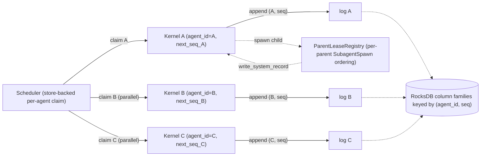
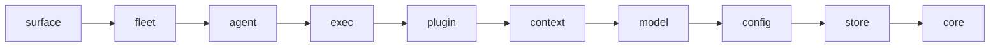

# Architectural Invariants

This document defines the invariants that the Aura system must uphold. Every
code change should be validated against these rules. Violations are bugs.

Unless a section says otherwise, every invariant below is **scoped to a single
agent's kernel and that agent's record log**. Cross-agent contracts live in
Part D (§15, Cross-Agent Parallelism). The architecture model below
establishes the per-agent framing that the rest of the document relies on.

---

## Architecture Model

Aura is built around **per-agent kernels with cross-agent parallelism**:

- **Each agent owns its own `Kernel` instance.** `Kernel::new(store, provider,
  executor, config, agent_id)` binds an `agent_id` at construction. The
  in-kernel `next_seq` counter and the record window the kernel hashes against
  are both scoped to that `agent_id`. See
  [`crates/aura-agent-kernel/src/kernel/mod.rs`](../crates/aura-agent-kernel/src/kernel/mod.rs)
  (`Kernel::new` ~line 343; `next_seq` ~line 409; the in-kernel `seq` `Mutex`
  initialised to `head_seq + 1` ~line 374).
- **Each agent owns its own append-only record log.** Sequence monotonicity
  (§7), context-hash determinism (§6), append atomicity (§10), and replay
  (§5 AuditedLite + `ReplayConsumer`) are all per-agent guarantees. There
  is no global cross-agent sequence, and the system intentionally does not
  promise one. The physical RocksDB store backs many agents at once via column
  families keyed by `(agent_id, seq)` — see
  [`crates/aura-store-db/src/keys/mod.rs`](../crates/aura-store-db/src/keys/mod.rs) —
  but the **logical** contract is per-agent.
- **Cross-agent parallelism is a first-class property, not an accident.**
  Unrelated agents process concurrently. The only intentional cross-agent
  serialization points are the per-agent processing claim (§12) and the
  per-parent `SubagentSpawn` audit lease (§12 / §15). Quota admission
  (`aura-fleet-quota::QuotaPool`) gates budgets, not record ordering.
- **Determinism survives parallelism.** Because every guarantee is per-agent,
  replaying any one agent's log is byte-deterministic regardless of which
  other agents were running concurrently. That is the property that lets us
  run agents in parallel for speed without losing the audit/replay contract.



### Crate landscape

The kernel and store crates were split during Phase 2/6 and the original
crate names are now thin re-export shells. When this document cites a
crate it uses the **active** name; the shells are listed here once for
orientation:

| Active crate | Layer | Shell that still resolves the legacy name |
|---|---|---|
| [`aura-agent-kernel`](../crates/aura-agent-kernel/) | agent | [`aura-kernel`](../crates/aura-kernel/src/lib.rs) — `pub use aura_agent_kernel::*;` |
| [`aura-store-db`](../crates/aura-store-db/) (RocksDB impl + `WriteStore`/`ReadStore` traits) | store | [`aura-store`](../crates/aura-store/src/lib.rs) — `pub use aura_store_db::*;` |
| [`aura-store-record`](../crates/aura-store-record/) (`RecordKind`, `RecordLog`, `RecordPayload`, `SCHEMA_VERSION`) | store | — |
| [`aura-store-snapshot`](../crates/aura-store-snapshot/src/lib.rs) (`SnapshotStore` for AuditedLite replay) | store | — |

---

## How To Read This Document

The architectural invariants are grouped into **five parts**, each binding a
related set of properties. **Numbering of individual invariants (§1–§15) is
stable** — same numbers as previous revisions and as `Invariant §N`
annotations sprinkled through the source — so external references continue
to resolve. The physical order is **grouped** rather than strictly numeric:

| Part | Theme | Invariants |
|---|---|---|
| [A](#part-a--kernel-boundary--mediation) | Kernel boundary & mediation | §1, §2, §3, §8, §9 |
| [B](#part-b--policy--authorization) | Policy & authorization | §4, §11 |
| [C](#part-c--record-audit-determinism--replay) | Record, audit, determinism & replay | §5, §6, §7, §10 |
| [D](#part-d--concurrency--cross-agent-parallelism) | Per-agent concurrency & cross-agent parallelism | §12, §15 |
| [E](#part-e--workspace--plugin-structure) | Workspace & plugin structure | §13, §14 |

Strict numeric index for cross-references:

| # | Title | Part |
|---|---|---|
| §1 | Each Agent's Kernel Is The Sole External Gateway | A |
| §2 | Every State Change For Agent A Passes Through Agent A's Kernel | A |
| §3 | Every LLM Call Is Recorded | A |
| §4 | Full Policy Enforcement | B |
| §5 | Complete Audit Trail | C |
| §6 | Per-Agent Deterministic Context | C |
| §7 | Per-Agent Monotonic Sequencing | C |
| §8 | Gateway Transparency | A |
| §9 | AgentLoop Isolation | A |
| §10 | Per-Agent Append-Only Record | C |
| §11 | Session-Scoped Tool Decisions | B |
| §12 | Single Writer Per Agent | D |
| §13 | Layered Architecture | E |
| §14 | Plugin Sandbox | E |
| §15 | Cross-Agent Parallelism | D |

---

## Enforcement Map

Each invariant below is guarded by one or more tests. The table below is
the living index of which suite enforces which invariant; it is kept in
sync with the `Enforcement:` lines under each section.

### Part A — Kernel Boundary & Mediation

| # | Invariant | Enforcement |
|---|---|---|
| §1 | Each agent's kernel is the sole external gateway | CI-gated `rg` bands in [`scripts/check_invariants.sh`](../scripts/check_invariants.sh) + [`.github/workflows/invariants.yml`](../.github/workflows/invariants.yml) (`ModelProvider.complete(`, `append_entry_*`, `Command::new("git")`, `aura_store` imports inside `aura-agent/src/agent_loop/`). Type-level seal: [`aura_agent::RecordingModelProvider`](../crates/aura-agent/src/kernel_gateway.rs) is a crate-sealed marker trait; automatons take `P: RecordingModelProvider` so only `KernelModelGateway` (the recording wrapper) can be plugged in. Git-mutation surface covered by [`crates/aura-tools/src/git_tool/tests.rs`](../crates/aura-tools/src/git_tool/tests.rs) (`commit_reports_sha_when_there_are_changes`, `commit_rejects_empty_message`, `commit_surfaces_nonzero_exit_from_add`, `spawn_git_enforces_subcommand_allowlist`, `tool_executes_commit_via_context`, `tool_rejects_workspace_escape_via_config`, `git_push_rejects_missing_fields`). Automaton `DomainApi` mediation covered by [`crates/aura-agent/src/kernel_domain_gateway/tests.rs`](../crates/aura-agent/src/kernel_domain_gateway/tests.rs). |
| §2 | Every state change for agent A passes through agent A's kernel | [`tests/pipeline_tests.rs`](../tests/pipeline_tests.rs), [`tests/kernel_integration.rs`](../tests/kernel_integration.rs), [`crates/aura-agent-kernel/src/kernel/tests.rs`](../crates/aura-agent-kernel/src/kernel/tests.rs), [`crates/aura-engine/src/automaton/tests.rs`](../crates/aura-engine/src/automaton/tests.rs) (`start_then_stop_records_two_automaton_lifecycle_entries`), and the end-to-end task-tool dispatch tests in [`crates/aura-fleet-subagent/tests/`](../crates/aura-fleet-subagent/tests/) (`task_tool_override_e2e.rs`, `task_tool_subagent_result_snapshot.rs`, `orphan_handoff.rs`). |
| §3 | Every LLM call is recorded | [`crates/aura-agent/src/recording_stream.rs`](../crates/aura-agent/src/recording_stream.rs) tests (`streaming_natural_end_records_completed`, `streaming_error_records_failed`, `streaming_drop_records_failed`), [`crates/aura-agent-kernel/src/kernel/tests.rs`](../crates/aura-agent-kernel/src/kernel/tests.rs) (`reason_sync_error_records_failed`, `reason_streaming_handshake_error_records_failed`), [`tests/automaton_reasoning_recording.rs`](../tests/automaton_reasoning_recording.rs). |
| §8 | Gateway transparency | [`crates/aura-agent/src/agent_loop/parity_tests.rs`](../crates/aura-agent/src/agent_loop/parity_tests.rs). |
| §9 | AgentLoop isolation | Architectural / `rg` grep bands (see Declared Exceptions) — CI-gated via [`scripts/check_invariants.sh`](../scripts/check_invariants.sh) (`aura_store` import band scoped to `aura-agent/src/agent_loop/`). |

### Part B — Policy & Authorization

| # | Invariant | Enforcement |
|---|---|---|
| §4 | Full policy enforcement | [`crates/aura-core/src/types/tool_permissions.rs`](../crates/aura-core/src/types/tool_permissions.rs) resolver/full-access tests, [`crates/aura-agent-kernel/src/policy/check/tests.rs`](../crates/aura-agent-kernel/src/policy/check/tests.rs), [`crates/aura-runtime/src/tool_permissions.rs`](../crates/aura-runtime/src/tool_permissions.rs) validation/monotonic tests, [`crates/aura-runtime/src/gateway/session/helpers.rs`](../crates/aura-runtime/src/gateway/session/helpers.rs) session tool-config composition tests, [`crates/aura-agent-subagent/src/tests.rs`](../crates/aura-agent-subagent/src/tests.rs) policy-narrowing tests, [`crates/aura-tools/src/fs_tools/cmd/tests.rs`](../crates/aura-tools/src/fs_tools/cmd/tests.rs) command guardrail tests, and [`crates/aura-runtime/tests/hook_permission_request_short_circuits.rs`](../crates/aura-runtime/tests/hook_permission_request_short_circuits.rs) (carve-out 5b). |
| §11 | Session-scoped tool decisions | [`crates/aura-agent-kernel/src/policy/check/tests.rs`](../crates/aura-agent-kernel/src/policy/check/tests.rs) live prompt and session-state tests. |

### Part C — Record, Audit, Determinism & Replay

| # | Invariant | Enforcement |
|---|---|---|
| §5 | Complete audit trail | [`crates/aura-agent-kernel/src/kernel/tests.rs`](../crates/aura-agent-kernel/src/kernel/tests.rs) + the §4 matrix asserts `decision`/`actions`/`context_hash`. AuditedLite summarisation round-trip pinned by [`crates/aura-agent-kernel/tests/replay_round_trip.rs`](../crates/aura-agent-kernel/tests/replay_round_trip.rs) and the `maybe_summarise_effect_payload` unit tests in [`crates/aura-agent-kernel/src/kernel/tools/shared.rs`](../crates/aura-agent-kernel/src/kernel/tools/shared.rs) (`summarisation_tests` module). |
| §6 | Per-agent deterministic context | [`crates/aura-agent-kernel/tests/invariant_determinism.rs`](../crates/aura-agent-kernel/tests/invariant_determinism.rs) (proptest). |
| §7 | Per-agent monotonic sequencing | [`crates/aura-store-db/tests/invariant_atomicity.rs`](../crates/aura-store-db/tests/invariant_atomicity.rs), [`crates/aura-store-db/src/rocks_store/tests.rs`](../crates/aura-store-db/src/rocks_store/tests.rs), and [`crates/aura-store-db/src/rocks_store/tests_concurrent.rs`](../crates/aura-store-db/src/rocks_store/tests_concurrent.rs) (concurrent appends across distinct agents). |
| §10 | Per-agent append-only record | [`crates/aura-store-db/tests/invariant_atomicity.rs`](../crates/aura-store-db/tests/invariant_atomicity.rs) (sealed-trait `static_assertions` + atomic-commit fault injection) + [`crates/aura-store-db/tests/invariant_readstore_surface.rs`](../crates/aura-store-db/tests/invariant_readstore_surface.rs) (pins the `ReadStore` trait surface so record-append methods stay on the sealed `WriteStore`). |

### Part D — Per-Agent Concurrency & Cross-Agent Parallelism

| # | Invariant | Enforcement |
|---|---|---|
| §12 | Single writer per agent | [`crates/aura-engine/src/scheduler.rs`](../crates/aura-engine/src/scheduler.rs) (`test_processing_claim_released_after_error`, `scheduler must construct at most one Kernel per agent claim`), [`crates/aura-store-db/src/rocks_store/tests_concurrent.rs`](../crates/aura-store-db/src/rocks_store/tests_concurrent.rs), [`crates/aura-fleet-spawn/tests/parent_lease_concurrent_spawns.rs`](../crates/aura-fleet-spawn/tests/parent_lease_concurrent_spawns.rs), and [`crates/aura-fleet-spawn/tests/spawn_idempotent_dedupe.rs`](../crates/aura-fleet-spawn/tests/spawn_idempotent_dedupe.rs). |
| §15 | Cross-agent parallelism | [`crates/aura-fleet-spawn/tests/parent_lease_independent_parents.rs`](../crates/aura-fleet-spawn/tests/parent_lease_independent_parents.rs) (parallel across parents), [`crates/aura-fleet-spawn/tests/parent_lease_concurrent_spawns.rs`](../crates/aura-fleet-spawn/tests/parent_lease_concurrent_spawns.rs) (serialized within a parent), [`crates/aura-fleet-spawn/tests/parallel_subagents.rs`](../crates/aura-fleet-spawn/tests/parallel_subagents.rs), [`crates/aura-store-db/src/rocks_store/tests_concurrent.rs`](../crates/aura-store-db/src/rocks_store/tests_concurrent.rs), [`crates/aura-agent-kernel/tests/replay_round_trip.rs`](../crates/aura-agent-kernel/tests/replay_round_trip.rs). |

### Part E — Workspace & Plugin Structure

| # | Invariant | Enforcement |
|---|---|---|
| §13 | Layered architecture | [`tests/layer_boundary.rs`](../tests/layer_boundary.rs) (`every_crate_carries_a_matching_layer_doc_tag`, `warn_on_upward_layer_dependencies`). |
| §14 | Plugin sandbox | [`crates/aura-plugin-hooks/tests/sandbox_env_scrubbing.rs`](../crates/aura-plugin-hooks/tests/sandbox_env_scrubbing.rs), [`crates/aura-runtime/tests/hook_permission_request_short_circuits.rs`](../crates/aura-runtime/tests/hook_permission_request_short_circuits.rs), [`crates/aura-runtime/tests/plugin_e2e.rs`](../crates/aura-runtime/tests/plugin_e2e.rs). |

---

# Part A — Kernel Boundary & Mediation

These invariants establish **what crosses the boundary** between agent code
and external systems, **how the per-agent kernel mediates every crossing**,
and the structural rules that keep the boundary tight: gateways are
transparent to consumers (§8), and the agent loop is isolated from kernel-
owned resources (§9). Read these first — they define the surface that every
other part defends.

---

## 1. Each Agent's Kernel Is The Sole External Gateway

**For any agent `A`, the only code permitted to interact with external
systems on `A`'s behalf is `A`'s `Kernel` instance.**

No code outside the kernel may:

- Call a `ModelProvider` (`complete`, `complete_streaming`).
- Execute an `Action` via `ExecutorRouter`.
- Append to a record log. The record-append family
  (`append_entry_atomic`, `append_entry_dequeued`, `append_entry_direct`,
  their `*_with_runtime_capabilities` variants, and `append_entries_batch`)
  lives on the **sealed** `aura_store_db::WriteStore` trait — see §10. Non-kernel
  callers bind to `Arc<dyn ReadStore>` and may still invoke the explicitly-
  allowed inbox/metadata writes (`enqueue_tx`, `set_agent_status`) that live
  on `ReadStore`.
- Make HTTP calls to domain services (`DomainApi` mutating methods).
- Spawn subprocesses for git mutations (`git add`, `git commit`, `git push`).

All external interactions for agent `A` are mediated through
`Kernel::process_direct`, `Kernel::process_dequeued`, `Kernel::process_tools`,
`Kernel::reason`, or `Kernel::reason_streaming` on the per-agent kernel — or
through the [`aura_agent_kernel::write_system_record`](../crates/aura-agent-kernel/src/kernel/mod.rs)
helper, which assembles a context-hashed `RecordEntry` and calls the sealed
`WriteStore::append_entry_direct` for the named agent.

The harness is the runtime authorization and execution boundary, not the
credential authority. Org-level credential persistence and canonical secret
retrieval live in the surface-layer [`aura-surface-auth`](../crates/aura-surface-auth/)
crate, not inside any agent kernel.

### Type-level enforcement: sealed `RecordingModelProvider`

In addition to the `rg`-band CI gate on `.complete(`, automatons
(`SpecGenAutomaton`, `DevLoopAutomaton`, `TaskRunAutomaton`, `ChatAutomaton`)
accept their `ModelProvider` parameter as `P: aura_agent::RecordingModelProvider`
rather than `Arc<dyn ModelProvider>`. The `RecordingModelProvider` trait is
sealed via a crate-private marker module
([`crates/aura-agent/src/kernel_gateway.rs`](../crates/aura-agent/src/kernel_gateway.rs)
lines ~126–150) so the *only* type that can satisfy the bound from outside
`aura-agent` is `KernelModelGateway` — the recording wrapper that funnels
every call through `Kernel::reason` / `Kernel::reason_streaming`. External
crates — including tests — cannot smuggle a raw `dyn ModelProvider` into an
automaton without opting in through the `#[cfg(test)]`-gated test-double
constructor.

### Sanctioned non-kernel `append_*` callers

Two production sites append to an agent's record log *without* going through
`Kernel::process_*`, both via the `aura_agent_kernel::write_system_record`
helper (so they still emit a kernel-built, context-hashed `RecordEntry`):

- [`crates/aura-runtime/src/tool_permissions.rs`](../crates/aura-runtime/src/tool_permissions.rs)
  (`append_agent_tool_permissions_entry` ~line 172) — HTTP-driven tool-permission
  PUT. Acquires the scheduler's per-agent processing claim first so the write
  serializes with concurrent inbox drains for the same agent.
- [`crates/aura-fleet-spawn/src/spawner.rs`](../crates/aura-fleet-spawn/src/spawner.rs)
  — appends the `TransactionType::SubagentSpawn` audit row (`spawner.rs` ~line 324,
  ~line 602) and the `promote_to_orphan` audit row (~line 951) under the per-parent
  `ParentLeaseRegistry` lease.

Both sites are pinned by the §2 allowlist in
[`scripts/check_invariants.sh`](../scripts/check_invariants.sh); any other
non-kernel/non-store call into the `append_entry_*` family is a CI failure.

### Subprocess surfaces

Sanctioned `Command::new(...)` call sites:

| Call site | Purpose | Rule |
|---|---|---|
| [`crates/aura-tools/src/git_tool/`](../crates/aura-tools/src/git_tool/) (`commit.rs`, `push.rs`, `commit_push.rs`, `executor.rs`) | Mutating `git add` / `commit` / `push` | Funnels through the kernel's `ToolExecutor`; allowlisted by `Command::new("git")` band. |
| [`crates/aura-agent/src/git.rs`](../crates/aura-agent/src/git.rs) | Read-only `git log` / `git status` helpers (`is_git_repo`, `list_unpushed_commits`) | No external side effect; declared exception. |
| [`crates/aura-exec-isolation/src/lib.rs`](../crates/aura-exec-isolation/src/lib.rs) | `git worktree add` / `worktree remove` for parallel-safe subagent workspaces | Sandbox/isolation infrastructure, not a mutating commit/push; declared exception. |
| [`crates/aura-plugin-hooks/src/engine.rs`](../crates/aura-plugin-hooks/src/engine.rs) | Lifecycle hook scripts (PreToolUse, PostToolUse, PermissionRequest, …) | Scrubbed env per §14; never touches `append_entry_*` or `ModelProvider`. |
| [`crates/aura-plugin-mcp/src/client.rs`](../crates/aura-plugin-mcp/src/client.rs) | MCP server stdio JSON-RPC clients | Scrubbed env per §14; tool calls reaching models must still route through the kernel gateway. |

---

## 2. Every State Change For Agent A Passes Through Agent A's Kernel

**Every mutation to agent `A`'s state passes through `A`'s
`Kernel::process_direct` or `Kernel::process_dequeued` and produces a
`RecordEntry` in `A`'s log.**

State changes include:

- User message arrives (`TransactionType::UserPrompt`).
- Agent produces a response (`AgentMsg`).
- LLM suggests a tool call (`ToolProposal`).
- Tool execution completes (`ToolExecution`).
- Session boundary (`SessionStart`).
- Async process completes (`ProcessComplete`).
- Automaton starts/stops, capability install, domain mutation, auth change
  (`System` with the matching `SystemKind`).
- Subagent spawn audit (`SubagentSpawn` — Phase 10 schema-v2 typed wire variant,
  defined in [`crates/aura-core/src/types/transaction.rs`](../crates/aura-core/src/types/transaction.rs)).
- Orphan-related lifecycle events (`ChildCancelledByParentDeath`,
  `ChildOrphanedByParentDeath`, `OrphanReaped` `RecordKind` variants in
  [`crates/aura-store-record/src/kind.rs`](../crates/aura-store-record/src/kind.rs)).
- Session lifecycle end marker (`SessionStop`) emitted by the fleet daemon
  shutdown path.

The kernel's transaction dispatcher
([`crates/aura-agent-kernel/src/kernel/process.rs`](../crates/aura-agent-kernel/src/kernel/process.rs)
`process_tx`) routes each tx by `TransactionType` to the matching handler
(`process_tool_proposal`, capability-install decoder, `SubagentSpawn` arm, etc.)
and the wrapping `process_direct` / `process_dequeued` call the appropriate
`append_entry_*_with_runtime_capabilities` variant on the kernel's store.

No state change to agent `A` may occur without a corresponding entry in `A`'s
record log.

---

## 3. Every LLM Call Is Recorded

**Every call to a model provider passes through the kernel's
`reason` / `reason_streaming` and produces a `RecordEntry` with
`TransactionType::Reasoning` in the calling agent's log.**

The entry records:

- Request snapshot: model name, message count, tool count, system prompt hash,
  token config.
- Response metadata: model used, stop reason, token usage (input + output),
  tool_use block names.

For streaming calls, recording occurs when the stream completes (accumulated
by the kernel's stream wrapper in
[`crates/aura-agent-kernel/src/kernel/stream.rs`](../crates/aura-agent-kernel/src/kernel/stream.rs)
— `ReasonStreamHandle::record_completed` / `record_failed`). The agent-side
[`crates/aura-agent/src/recording_stream.rs`](../crates/aura-agent/src/recording_stream.rs)
wrapper guarantees the handle is finalized exactly once on natural end,
error, or drop.

**Enforcement:** [`crates/aura-agent/src/recording_stream.rs`](../crates/aura-agent/src/recording_stream.rs)
(`streaming_natural_end_records_completed`, `streaming_error_records_failed`,
`streaming_drop_records_failed`) covers natural-end, mid-stream error, and
early-drop termination paths.
[`crates/aura-agent-kernel/src/kernel/tests.rs`](../crates/aura-agent-kernel/src/kernel/tests.rs)
covers the sync (`reason_sync_error_records_failed`) and handshake-error
(`reason_streaming_handshake_error_records_failed`) paths.

---

## 8. Gateway Transparency

**Kernel gateways implement existing traits. Consumers are unaware of kernel
mediation.**

| Gateway | Implements | Consumer | Source |
|---|---|---|---|
| `KernelModelGateway` | `ModelProvider` | AgentLoop, automatons | [`crates/aura-agent/src/kernel_gateway.rs`](../crates/aura-agent/src/kernel_gateway.rs) |
| `KernelToolGateway` | `AgentToolExecutor` | AgentLoop, AgentRunner | [`crates/aura-agent/src/kernel_gateway.rs`](../crates/aura-agent/src/kernel_gateway.rs) |
| `KernelDomainGateway` | `DomainApi` | Automatons | [`crates/aura-agent/src/kernel_domain_gateway/handle.rs`](../crates/aura-agent/src/kernel_domain_gateway/handle.rs) (+ `routes.rs`, `wire.rs`, `tests.rs`) |

The AgentLoop's public API (`run`, `run_with_events`) accepts
`&dyn ModelProvider` and `&dyn AgentToolExecutor`. It must never depend on
the concrete gateway types.

This boundary also means the harness executes tools from runtime metadata
without becoming the system of record for integration credentials or catalog
state.

**Enforcement:** [`crates/aura-agent/src/agent_loop/parity_tests.rs`](../crates/aura-agent/src/agent_loop/parity_tests.rs).

---

## 9. AgentLoop Isolation

**The AgentLoop never directly accesses kernel-owned resources.**

The AgentLoop must not:

- Import or reference `Store`, `RocksStore`, or any store type (via the
  `aura_store` shell or `aura_store_db` directly).
- Import or reference `RecordEntry` or `RecordEntryBuilder`.
- Import or reference kernel `Policy` internals.
- Call `ModelProvider::complete` on anything other than the provider it
  receives as a parameter.
- Call `AgentToolExecutor::execute` on anything other than the executor it
  receives as a parameter.
- Construct `Transaction` objects.

The AgentLoop owns: iteration logic, streaming, compaction, budget management,
stall detection, message history.

The harness as a whole may receive runtime-resolved capabilities or short-lived
secrets through approved gateways, but it must not persist org credentials or
become the catalog authority for integrations.

**Enforcement:** `rg`-band CI gate in [`scripts/check_invariants.sh`](../scripts/check_invariants.sh)
scopes the `use aura_store_db::` band to `crates/aura-agent/src/agent_loop/**` and
excludes test files.

---

# Part B — Policy & Authorization

These invariants govern **whether a proposed action is allowed to proceed**,
and **how those decisions are scoped over time**. They sit between Part A
(everything crosses the boundary) and Part C (everything that crosses is
recorded): the policy gate decides what to admit, and the session-scoped
memory rules govern how `ask` decisions survive within a session.

---

## 4. Full Policy Enforcement

**Every tool call passes through `Policy::check()` with the complete
permission model before execution.**

The policy pipeline for a `ToolProposal`:

1. Deserialize `ToolProposal` from transaction payload.
2. Build `Proposal` with `ActionKind::Delegate` + serialized `ToolCall`.
3. `Policy::check(&proposal)` evaluates orthogonal hard-denial layers first:
   - Is `ActionKind::Delegate` in `allowed_action_kinds`?
   - Does the caller hold every capability required by the tool?
   - Are scoped arguments inside the caller's `AgentScope`?
   - Are required runtime integrations installed?
4. The per-tool layer resolves once with `Policy::resolve_tool_state`, using
   `UserToolDefaults` plus optional `AgentToolPermissions`:
   - `ToolState::Allow` (`"on"`) — continue to execution guardrails.
   - `ToolState::Deny` (`"off"`) — reject at the policy gate.
   - `ToolState::Ask` (`"ask"`) — emit a structured live approval prompt
     when a `ToolApprovalPrompter` is attached; otherwise deny with a
     headless ask reason.
5. Decision is recorded: accepted action IDs or rejected proposals with reasons.
6. Only approved proposals become `Action`s and are executed.

**Corollary:** A `Deny`-only check is insufficient. The full `Policy::check()`
must run. The capability-satisfaction helper in
[`crates/aura-exec-policy/`](../crates/aura-exec-policy/) (`evaluate()` over
`EffectivePermissions`) is **not** a substitute — it answers only "does the
caller hold the required capabilities" and intentionally does not run the
deny / scope / ask layers.

### 4.a Tool execution guardrails remain orthogonal

The tri-state tool layer answers whether a tool is enabled for this agent. It
does not authorize unsafe execution shapes. `run_command` still requires
explicit `ToolConfig::command.enabled`, and operator-provided
command/binary/shell-script guardrails are enforced inside `aura-tools` after
policy allows the tool.

Complementary enforcement in `aura-tools`:

- `run_command` rejects the legacy shell form (`program` set, `args` empty)
  and the explicit `command` / `shell_script` fields unless the caller passes
  `allow_shell: true`. Once `allow_shell` is granted,
  `ToolConfig::command.allowed_shell_scripts` switches between "any script
  allowed" (empty allowlist, the default matching `command_allowlist`) and
  "verbatim match only" (non-empty allowlist).
- When `ToolConfig::command.enabled` is true,
  `ToolConfig::command.binary_allowlist` must be non-empty. `run_command`
  resolves `program` with `which` and denies any binary whose file name
  (stripped of `.exe` on Windows) is not in the allow-list.

Operator and per-agent layers remain orthogonal by default. When the operator
explicitly opts in with `ToolConfig::command.allow_unrestricted_full_access`,
sessions whose user default plus per-agent override are effectively
`FullAccess` compose into a session-scoped
`ToolConfig::command.bypass_allowlists`. That derived session flag skips the
command, binary, and shell-script allowlists only; `command.enabled`,
`allow_shell`, sandbox/cwd checks, timeout limits, capability gates, and
installed integration requirements remain in effect.

### 4.b Carve-out: PermissionRequest plugin hook

When the policy resolves to `Ask` and a `ToolApprovalPrompter` is attached,
the kernel fires the `PermissionRequest` plugin hook **before** the
interactive prompter (Phase 10 carve-out 5b). See
[`crates/aura-agent-kernel/src/kernel/tools/shared.rs`](../crates/aura-agent-kernel/src/kernel/tools/shared.rs)
(`resolve_prompt_verdict` ~lines 123–149).

The hook may return `Approve` (→ `PolicyVerdict::Allow`) or `Deny`
(→ `PolicyVerdict::Deny`); any other outcome (`Continue`, `TimedOut`, `Block`,
`Replace`) falls through to the interactive prompt path. The hook cannot
bypass the upstream deny / capability / scope / integration layers — those
already ran before the verdict reached this seam.

**Enforcement:** [`crates/aura-core/src/types/tool_permissions.rs`](../crates/aura-core/src/types/tool_permissions.rs)
covers the resolver truth table, full-access detection, and wire spelling.
[`crates/aura-agent-kernel/src/policy/check/tests.rs`](../crates/aura-agent-kernel/src/policy/check/tests.rs)
covers policy resolution and live prompt verdicts.
[`crates/aura-runtime/src/gateway/session/helpers.rs`](../crates/aura-runtime/src/gateway/session/helpers.rs)
covers operator-plus-agent composition into session-scoped tool config.
[`crates/aura-tools/src/fs_tools/cmd/tests.rs`](../crates/aura-tools/src/fs_tools/cmd/tests.rs)
covers command/shell/binary guardrails. Carve-out 5b is pinned by
[`crates/aura-runtime/tests/hook_permission_request_short_circuits.rs`](../crates/aura-runtime/tests/hook_permission_request_short_circuits.rs).

---

## 11. Session-Scoped Tool Decisions

**Live `ask` decisions remembered for a session are scoped to the current
session.**

- Session-scoped decisions are held in policy memory via
  `remember_tool_state_for_session()`.
- `SessionStart` resets session-scoped tool decisions via
  `Policy::clear_session_approvals()`
  ([`crates/aura-agent-kernel/src/kernel/process.rs`](../crates/aura-agent-kernel/src/kernel/process.rs)
  ~line 83).
- `remember: session` does not persist across process restarts.
- `remember: forever` is not session-scoped; it is persisted into
  `UserToolDefaults` via the store's `put_user_tool_defaults`.

**Enforcement:** [`crates/aura-agent-kernel/src/policy/check/tests.rs`](../crates/aura-agent-kernel/src/policy/check/tests.rs)
covers live prompt and session-state behaviour.

---

# Part C — Record, Audit, Determinism & Replay

These invariants describe **what gets written to the per-agent record log,
how it's hashed and sequenced, and how it can be replayed deterministically**.
Read as a stack of properties about a single agent's log: §5 says what each
entry must contain; §6 says how the entry's context hash is computed; §7
says how entries are sequenced; §10 says the resulting log is immutable.
Together they let any one agent's history replay byte-for-byte without a
live reasoner or executor.

---

## 5. Complete Audit Trail

**Every `RecordEntry` for a `ToolProposal` contains the full decision chain.**

A tool proposal entry must include:

- `proposals`: the `ProposalSet` containing the proposed action.
- `decision`: `Decision` with `accepted_action_ids` or `rejected` (with reasons).
- `actions`: the authorized `Action` (empty if rejected).
- `effects`: the `Effect` from execution (empty if rejected).
- `context_hash`: deterministic hash of inputs.

This allows offline replay: given the same record, the same decisions can be
verified without a live reasoner or executor.

### 5.a AuditedLite summarisation round-trip

When the kernel is configured for
[`aura_core_modes::KernelMode::AuditedLite`](../crates/aura-core-modes/) and an
effect payload exceeds `KernelConfig::lite_payload_threshold`,
[`crates/aura-agent-kernel/src/kernel/tools/shared.rs`](../crates/aura-agent-kernel/src/kernel/tools/shared.rs)
(`maybe_summarise_effect_payload`) replaces the verbatim payload with a
`RecordPayload::Summary` produced by
[`aura_store_record::summarize_payload`](../crates/aura-store-record/src/payload.rs).
The summary carries `full_len` and `full_hash` so replay can verify the
original content against an `aura_store_snapshot::SnapshotStore`
([`crates/aura-store-snapshot/src/lib.rs`](../crates/aura-store-snapshot/src/lib.rs)).

`KernelMode::Audited` (the default) stores payloads verbatim; AuditedLite is
the size-bounded mode for high-volume agents.

**Enforcement:** [`crates/aura-agent-kernel/tests/replay_round_trip.rs`](../crates/aura-agent-kernel/tests/replay_round_trip.rs)
exercises the full AuditedLite → summarise → replay → snapshot-resolve loop.
The `summarisation_tests` module at the bottom of
[`tools/shared.rs`](../crates/aura-agent-kernel/src/kernel/tools/shared.rs)
pins the per-mode payload shape.

---

## 6. Per-Agent Deterministic Context

**The context hash for a `RecordEntry` in agent `A`'s log is derived solely
from that transaction and `A`'s record window.**

```
context_hash = hash(serialize(tx) || A.seq[0].context_hash || A.seq[1].context_hash || ...)
```

Re-processing the same transaction against the same record window for the
same agent must produce the same context hash. There is no cross-agent
dependency in the chain — which is exactly what lets unrelated agents run
in parallel without losing per-agent determinism (see §15).

**Enforcement:** [`crates/aura-agent-kernel/tests/invariant_determinism.rs`](../crates/aura-agent-kernel/tests/invariant_determinism.rs)
uses `proptest` to assert that `hash_tx_with_window` is deterministic,
order-sensitive (swapping adjacent window entries changes the hash),
insertion-sensitive (adding a no-op entry changes the hash), and
transaction-sensitive (mutating the transaction body changes the hash).

---

## 7. Per-Agent Monotonic Sequencing

**Within each agent, record entries have strictly increasing, contiguous
sequence numbers.**

- `next_seq = head_seq + 1` for that agent.
- No gaps: if entries exist at seq 1 and seq 3 for agent `A`, there must be
  an entry at seq 2 for `A`.
- No duplicates: `append_entry_atomic` rejects sequence mismatches.
- Atomicity: inbox dequeue and record append happen in a single `WriteBatch`
  (see [`crates/aura-store-db/src/rocks_store/mod.rs`](../crates/aura-store-db/src/rocks_store/mod.rs)
  `append_entry_atomic_internal` ~line 281).

No cross-agent ordering is implied or required. Two agents committing entries
at the "same" wall-clock moment produce two independent, internally-monotonic
chains.

**Enforcement:** [`crates/aura-store-db/tests/invariant_atomicity.rs`](../crates/aura-store-db/tests/invariant_atomicity.rs)
(fault injection across the `WriteBatch` boundary asserts no partial state,
and the sequence-mismatch row asserts strict monotonicity);
[`crates/aura-store-db/src/rocks_store/tests.rs`](../crates/aura-store-db/src/rocks_store/tests.rs)
for the per-agent path; and
[`crates/aura-store-db/src/rocks_store/tests_concurrent.rs`](../crates/aura-store-db/src/rocks_store/tests_concurrent.rs)
for concurrent appends across distinct agents.

---

## 10. Per-Agent Append-Only Record

**Each agent's record log is immutable. Entries are never modified or deleted.**

The physical store backs many agents at once via column families keyed by
`(agent_id, seq)` — see
[`crates/aura-store-db/src/keys/mod.rs`](../crates/aura-store-db/src/keys/mod.rs) —
but the *logical* contract is per-agent: each agent owns its own monotonic
sequence of append-only entries.

- The record-append surface (`append_entry_atomic`, `append_entry_dequeued`,
  `append_entry_direct`, and their `*_with_runtime_capabilities` variants,
  plus `append_entries_batch`) lives on the **sealed**
  [`aura_store_db::WriteStore`](../crates/aura-store-db/src/store.rs) trait
  (canonical definition in [`aura-store-db`](../crates/aura-store-db/src/store.rs);
  re-exported through the [`aura-store`](../crates/aura-store/src/lib.rs) shell).
  Non-kernel crates depend only on `aura_store_db::ReadStore`; the kernel's
  `Arc<dyn WriteStore>` is the only path that can commit a record entry.
  New storage backends cannot be written outside the `aura-store-db` crate
  because the sealing marker (`aura_store_db::store::sealed::Sealed`) is
  crate-private.
- The abstract per-agent append trait
  [`aura_store_record::RecordLog`](../crates/aura-store-record/src/log.rs) wraps
  the same surface with `append` / `head_seq` / `scan` for layered consumers
  (kernel replay, fleet-spawn). `impl RecordLog for RocksStore` lives in
  [`crates/aura-store-db/src/record_log_bridge.rs`](../crates/aura-store-db/src/record_log_bridge.rs)
  and delegates to `append_entry_direct` + `get_head_seq`.
- No `update_entry`, `delete_entry`, or `truncate_record` operations exist.
- Compaction (in the AgentLoop) operates on in-memory message history, not on
  the persisted record.

### Schema versioning

[`aura_store_record::SCHEMA_VERSION`](../crates/aura-store-record/src/lib.rs) is
currently `2`. The Phase 10 bump consolidated three closed-enum additions:

- `RecordKind::SessionStop` — session-lifecycle audit row emitted by the
  fleet daemon's shutdown path.
- `RecordKind::ToolCallBlockedByHook` — audit row replacing `ToolCallResult`
  when a `PreToolUse` hook blocks dispatch.
- `TransactionType::SubagentSpawn` — typed wire variant replacing the
  Phase 7a `TransactionType::System + JSON-discriminator` workaround.

Older binaries reading v2 logs gracefully degrade unknown tags via
`RecordKind::Unknown` (serde `#[serde(other)]` fallback in
[`crates/aura-store-record/src/kind.rs`](../crates/aura-store-record/src/kind.rs)).
The kernel writes only v2 going forward.

**Enforcement:** [`crates/aura-store-db/tests/invariant_atomicity.rs`](../crates/aura-store-db/tests/invariant_atomicity.rs)
— `static_assertions::assert_impl_all!(RocksStore: WriteStore, Store)` pins
the sealed-trait surface at compile time, and the fault-injection rows prove
the append path is all-or-nothing.
[`crates/aura-store-db/tests/invariant_readstore_surface.rs`](../crates/aura-store-db/tests/invariant_readstore_surface.rs)
pins the `ReadStore` surface so record-append methods stay on the sealed
`WriteStore`.

### `Arc<dyn Store>` allowlist

CI gate in [`scripts/check_invariants.sh`](../scripts/check_invariants.sh) §10
band. Production holders:

- [`crates/aura-runtime/src/gateway/state.rs`](../crates/aura-runtime/src/gateway/state.rs)
  — the `RouterState.store` field piped into `WsContext`.
- [`crates/aura-engine/src/automaton/`](../crates/aura-engine/src/automaton/)
  (`mod.rs` + `build.rs` + `dispatch.rs` + `event_channel.rs`) —
  `AutomatonBridge` builds per-agent automaton kernels.
- [`crates/aura-engine/src/scheduler.rs`](../crates/aura-engine/src/scheduler.rs)
  — `Scheduler` builds per-agent kernels.
- [`crates/aura-runtime/src/gateway/session/mod.rs`](../crates/aura-runtime/src/gateway/session/mod.rs)
  — `WsContext` handed to `Kernel::new`.
- [`crates/aura-runtime/src/gateway/session/child_kernel.rs`](../crates/aura-runtime/src/gateway/session/child_kernel.rs)
  — session-scoped child-kernel factory captures the same store handle as
  `WsContext` so nested child runs route through `RuntimeChildRunner` /
  `Scheduler`.
- [`crates/aura-engine/src/child_runner.rs`](../crates/aura-engine/src/child_runner.rs)
  — `RuntimeChildRunner` constructs child kernels through the scheduler.
- [`crates/aura-runtime/src/node.rs`](../crates/aura-runtime/src/node.rs)
  — boots the process-wide store.
- [`crates/aura-runtime/src/tool_permissions.rs`](../crates/aura-runtime/src/tool_permissions.rs)
  — HTTP-driven tool-permissions append serialized via the scheduler claim.
- [`crates/aura-runtime/src/gateway/session/cross_agent_hook.rs`](../crates/aura-runtime/src/gateway/session/cross_agent_hook.rs)
  — cross-agent chat/spawn hook.
- [`crates/aura-fleet-daemon/src/lib.rs`](../crates/aura-fleet-daemon/src/lib.rs)
  — `FleetDaemon::new` holds the store handle that is passed to the spawner.
- [`crates/aura-fleet-spawn/src/spawner.rs`](../crates/aura-fleet-spawn/src/spawner.rs)
  — `FleetSpawner` holds the store handle for `write_system_record` audit rows.
- [`crates/aura-fleet-subagent/src/dispatch.rs`](../crates/aura-fleet-subagent/src/dispatch.rs)
  — `FleetSubagentDispatcher` carries the store handle along with the
  `Arc<dyn ChildRunner>` produced by `aura-engine`.
- [`crates/aura-surface-cli/src/runner.rs`](../crates/aura-surface-cli/src/runner.rs)
  — the interactive TUI composition root constructs a per-agent kernel for
  local sessions.

Test-only holders (filenames don't match `*test*.rs` but hits live inside
`#[cfg(test)] mod tests`): [`crates/aura-agent/src/kernel_gateway.rs`](../crates/aura-agent/src/kernel_gateway.rs),
the [`crates/aura-agent/src/kernel_domain_gateway/`](../crates/aura-agent/src/kernel_domain_gateway/)
directory, [`crates/aura-agent/src/recording_stream.rs`](../crates/aura-agent/src/recording_stream.rs),
[`crates/aura-engine/src/worker.rs`](../crates/aura-engine/src/worker.rs),
and [`crates/aura-memory/`](../crates/aura-memory/) test scaffolding.

---

# Part D — Per-Agent Concurrency & Cross-Agent Parallelism

These two invariants describe the concurrency model. §12 is the per-agent
**enabling** invariant — single-writer per agent is what makes the rest of
the document's per-agent guarantees hold. §15 is the **cross-agent**
contract that those per-agent guarantees enable: because every property in
Parts A–C is scoped to a single agent's kernel and log, unrelated agents
execute concurrently without any of those properties weakening. Read §12
first, then §15.

---

## 12. Single Writer Per Agent

**At most one task may process a given agent's transaction queue at any time.
Independent agents (and independent parents, for spawn audit ordering) are
fully concurrent.** This is the per-agent enabling invariant that makes the
cross-agent parallelism contract in §15 safe.

### 12.a Store-backed per-agent processing claim

Enforced by the `Scheduler` via a **store-backed compare-and-set** on a
persisted per-agent processing marker — not an in-memory `Mutex`. See
[`crates/aura-engine/src/scheduler.rs`](../crates/aura-engine/src/scheduler.rs)
(`try_processing_claim` ~line 309, `processing_claim` ~line 318) and the
header doc comment "Concurrency Model" / "Store-Backed Processing Claims"
(lines 1–33).

- Concurrent calls for **different** agents never block each other.
- Concurrent calls for the **same** agent are short-circuited at the claim
  step; the second caller observes `None` and skips, preserving caller
  semantics without head-of-line blocking behind long LLM/tool work.
- The claim survives single-process restarts via the persisted marker; a
  future lease timestamp/owner can recover abandoned claims after a hard
  crash.

The HTTP-driven non-kernel append in
[`crates/aura-runtime/src/tool_permissions.rs`](../crates/aura-runtime/src/tool_permissions.rs)
(`append_agent_tool_permissions_entry` ~line 172) acquires this same claim
before calling `aura_agent_kernel::write_system_record` so it serializes correctly
with concurrent scheduler drains for the same agent.

### 12.b Per-parent SubagentSpawn audit lease

Spawn composition uses a second per-parent serialization axis in
[`crates/aura-fleet-spawn/src/lease.rs`](../crates/aura-fleet-spawn/src/lease.rs)
(`ParentLeaseRegistry`). Each parent owns its own `Arc<Mutex<()>>` that is
held across derive → quota → audit-record write → registry insert. This
replaces the prior global `spawn_lock` that lived in the pre-Phase-B
`aura-runtime/src/subagent_dispatch.rs`; the concrete dispatcher impl now
lives at the fleet layer in
[`crates/aura-fleet-subagent/src/dispatch.rs`](../crates/aura-fleet-subagent/src/dispatch.rs)
and the surface-layer `ChildRunner` impl that drives the scheduler lives at
[`crates/aura-engine/src/child_runner.rs`](../crates/aura-engine/src/child_runner.rs).

- **Per-parent, not global**: unrelated parents spawn in parallel.
- The lease orders the `TransactionType::SubagentSpawn` audit rows the
  spawner writes via `aura_agent_kernel::write_system_record`
  ([`crates/aura-fleet-spawn/src/spawner.rs`](../crates/aura-fleet-spawn/src/spawner.rs)
  ~line 324, ~line 602) so a parent's audit chain stays linearised.

### 12.c Spawn dedupe window

`(parent_agent_id, tool_call_id)` is consulted against an LRU dedupe window
in the same `ParentLeaseRegistry`. Idempotent re-dispatch (e.g. retried tool
calls) returns the cached `SpawnHandle` outcome with zero new children and
zero new audit rows. See
[`crates/aura-fleet-spawn/tests/spawn_idempotent_dedupe.rs`](../crates/aura-fleet-spawn/tests/spawn_idempotent_dedupe.rs).

Foreground subagents do not create an alternate execution lane: the
fleet-layer `FleetSubagentDispatcher`
([`crates/aura-fleet-subagent/src/dispatch.rs`](../crates/aura-fleet-subagent/src/dispatch.rs))
hands the engine-layer `RuntimeChildRunner` an `Arc<dyn ChildRunner>` that
creates a full child agent, enqueues a child `UserPrompt`, and then invokes
`Scheduler::schedule_agent_with_overrides`, so child work inherits the same
per-agent claim and record pipeline as ordinary scheduled work.

**Enforcement:** [`crates/aura-engine/src/scheduler.rs`](../crates/aura-engine/src/scheduler.rs)
(`test_processing_claim_released_after_error`, "scheduler must construct at
most one Kernel per agent claim"),
[`crates/aura-store-db/src/rocks_store/tests_concurrent.rs`](../crates/aura-store-db/src/rocks_store/tests_concurrent.rs),
[`crates/aura-fleet-spawn/tests/parent_lease_concurrent_spawns.rs`](../crates/aura-fleet-spawn/tests/parent_lease_concurrent_spawns.rs),
[`crates/aura-fleet-spawn/tests/parent_lease_independent_parents.rs`](../crates/aura-fleet-spawn/tests/parent_lease_independent_parents.rs),
[`crates/aura-fleet-spawn/tests/spawn_idempotent_dedupe.rs`](../crates/aura-fleet-spawn/tests/spawn_idempotent_dedupe.rs).

---

## 15. Cross-Agent Parallelism

**Unrelated agents execute concurrently. The only cross-agent serialization
points are the per-agent processing claim (§12.a) and the per-parent
SubagentSpawn audit lease (§12.b). Determinism survives parallelism because
every other guarantee in this document is per-agent.**

This invariant promotes what was previously an implementation footnote into
a top-level contract. It is the architectural reason the system can pursue
fast parallel execution without weakening §6/§7/§10 replay determinism.

| Boundary | Scope | Effect |
|---|---|---|
| Per-agent processing claim ([`scheduler.rs`](../crates/aura-engine/src/scheduler.rs)) | One agent | Same agent serializes; different agents parallel. |
| Per-parent `ParentLeaseRegistry` ([`lease.rs`](../crates/aura-fleet-spawn/src/lease.rs)) | One parent's spawn audit chain | Same parent's spawns serialize; different parents parallel. |
| `QuotaPool` ([`aura-fleet-quota`](../crates/aura-fleet-quota/src/lib.rs)) | Budget admission only | Gates concurrency limits; does **not** create cross-agent record ordering. |
| No global writer mutex | — | Intentional absence: there is no global lock across agent kernels. |

Because every guarantee in §1–§14 is scoped to a single agent's kernel and
log, two agents committing entries at the same wall-clock moment produce two
independent, internally-monotonic chains that replay byte-deterministically
without any reference to each other. Parallelism is therefore a property of
the system, not a hazard the design tolerates.

**Enforcement:**
[`crates/aura-fleet-spawn/tests/parent_lease_independent_parents.rs`](../crates/aura-fleet-spawn/tests/parent_lease_independent_parents.rs)
(parallel across parents),
[`crates/aura-fleet-spawn/tests/parent_lease_concurrent_spawns.rs`](../crates/aura-fleet-spawn/tests/parent_lease_concurrent_spawns.rs)
(serialized within a parent),
[`crates/aura-fleet-spawn/tests/parallel_subagents.rs`](../crates/aura-fleet-spawn/tests/parallel_subagents.rs),
[`crates/aura-store-db/src/rocks_store/tests_concurrent.rs`](../crates/aura-store-db/src/rocks_store/tests_concurrent.rs)
(concurrent appends across distinct agents),
[`crates/aura-agent-kernel/tests/replay_round_trip.rs`](../crates/aura-agent-kernel/tests/replay_round_trip.rs)
(per-agent replay is byte-deterministic).

---

# Part E — Workspace & Plugin Structure

These invariants are about **how the workspace itself is organized** — not
about runtime behavior. §13 pins the 10-layer crate stack and the upward-
edge ban. §14 carves out the plugin layer: plugin processes run as
sandboxed external children that cannot reach any of the §1 surfaces. The
two together prevent code-organization regressions that would otherwise
quietly weaken Parts A–D.

---

## 13. Layered Architecture

**Workspace crates form a strict downward dependency stack. Upward edges are
CI failures unless explicitly allowlisted.**

Layer order, lowest → highest:

```
core < store < config < model < context < plugin < exec < agent < fleet < surface
```



Two contracts are enforced:

1. **Cargo-manifest dependency graph.** Every workspace-internal dependency
   edge must be downward or equal-layer. The single allowlisted carve-out
   today is `aura-tools → aura-kernel` (Phase 10 follow-up: relocate
   `Executor` / `ExecuteContext` / `SpawnHook` out of `aura-agent-kernel`
   into the exec layer). All other upward edges fail CI.
2. **Source-level `//! Layer:` doc tag.** Every `crates/<crate>/src/lib.rs`
   must carry a `//! Layer: <layer>` doc-comment tag that matches the
   `KNOWN_CRATES` / naming-convention assignment. Cargo manifest is the
   primary source of truth; the doc tag is a human-readable guardrail.

**Enforcement:** [`tests/layer_boundary.rs`](../tests/layer_boundary.rs)
(`every_crate_carries_a_matching_layer_doc_tag`,
`warn_on_upward_layer_dependencies`).

---

## 14. Plugin Sandbox

**Plugins run in a sandboxed external-process surface. They cannot bypass
the kernel boundary for record writes, model calls, or domain mutations.**

The plugin layer ([`aura-plugin-api`](../crates/aura-plugin-api/),
[`-core`](../crates/aura-plugin-core/), [`-hooks`](../crates/aura-plugin-hooks/),
[`-mcp`](../crates/aura-plugin-mcp/), [`-connectors`](../crates/aura-plugin-connectors/))
spawns external processes for lifecycle hooks and MCP servers. Three
properties hold:

1. **Scrubbed environment.** Hook subprocesses spawn with a curated env (no
   `AURA_*` credentials, no host secrets). Pinned by
   [`crates/aura-plugin-hooks/tests/sandbox_env_scrubbing.rs`](../crates/aura-plugin-hooks/tests/sandbox_env_scrubbing.rs).
   The MCP client in
   [`crates/aura-plugin-mcp/src/client.rs`](../crates/aura-plugin-mcp/src/client.rs)
   applies the same env-clearing discipline.
2. **No plugin crate touches the §1 surfaces.** No `append_entry_*` call,
   no `.complete(` call, no `DomainApi` mutating method, and no
   `Arc<dyn Store>` holder appears in any
   [`crates/aura-plugin-*/src/`](../crates/aura-plugin-api/) file. Plugin
   contributions reach the kernel only via the host-driven hook engine
   ([`crates/aura-plugin-hooks/src/engine.rs`](../crates/aura-plugin-hooks/src/engine.rs))
   and the connector registry
   ([`crates/aura-plugin-connectors/src/registry.rs`](../crates/aura-plugin-connectors/src/registry.rs)).
   Promoting this property into the CI band script is a follow-up; today it
   is verifiable by `rg "(append_entry_|\\.complete\\(|Arc<dyn .*Store>)"
   crates/aura-plugin-*/src/` returning empty.
3. **PermissionRequest integrates via carve-out 5b, not direct writes.** The
   only seam where a plugin influences kernel decisions is the
   `PermissionRequest` hook fired in
   [`crates/aura-agent-kernel/src/kernel/tools/shared.rs`](../crates/aura-agent-kernel/src/kernel/tools/shared.rs)
   `resolve_prompt_verdict`. The hook can approve or deny a live `ask`
   prompt but cannot bypass the upstream deny / capability / scope /
   integration layers from §4.

**Enforcement:** [`crates/aura-plugin-hooks/tests/sandbox_env_scrubbing.rs`](../crates/aura-plugin-hooks/tests/sandbox_env_scrubbing.rs),
[`crates/aura-runtime/tests/hook_permission_request_short_circuits.rs`](../crates/aura-runtime/tests/hook_permission_request_short_circuits.rs),
[`crates/aura-runtime/tests/plugin_e2e.rs`](../crates/aura-runtime/tests/plugin_e2e.rs),
[`crates/aura-plugin-connectors/tests/last_wins.rs`](../crates/aura-plugin-connectors/tests/last_wins.rs).

---

## Declared Exceptions

The following operations intentionally do NOT route through `Kernel::process_*`:

| Operation | Rationale |
|---|---|
| Message history management (`Vec<Message>` mutations in AgentLoop) | Internal orchestration state. The kernel records inputs (`UserPrompt`) and outputs (`AgentMsg`). |
| Read-only file operations (`workspace_map`, `file_walkers`, `error_context`, `prompts`) | No state mutation, no external side effect. |
| Infrastructure bootstrap (`RocksStore::open`, `create_dir_all` for data dirs) | One-time setup, not a runtime state transition. |
| Server listeners (`TcpListener::bind`) | Inbound edge, not an outbound state change. |
| Interactive PTY ([`crates/aura-terminal/src/ws.rs`](../crates/aura-terminal/src/ws.rs)) | User-driven interactive shell; different execution model. Phase C / Commit 4 moved this out of `aura-runtime/src/terminal.rs` so the gateway crate no longer carries the `portable-pty` dep; the gateway keeps a one-line delegate in `crates/aura-runtime/src/gateway/middleware.rs::terminal_ws_handler`. |
| Tool sandbox setup (`sandbox.rs` directory creation in `aura-exec-sandbox` / `aura-tools`) | Infrastructure for the kernel-managed tool pipeline. |
| Read-only `git` operations in [`crates/aura-agent/src/git.rs`](../crates/aura-agent/src/git.rs) (`git diff`, `git status`, `git log`) | No external side effect. `is_git_repo` filesystem probe and `list_unpushed_commits` (`git log` scan) stay in `aura-agent` as read-only helpers. Every mutating `git` subprocess (`add`, `commit`, `push`) lives behind the `GitExecutor` in [`crates/aura-tools/src/git_tool/`](../crates/aura-tools/src/git_tool/) and routes through the kernel's `ToolExecutor`. Pinned by the `Command::new("git")` band in [`scripts/check_invariants.sh`](../scripts/check_invariants.sh). |
| `git worktree add` / `worktree remove` in [`crates/aura-exec-isolation/src/lib.rs`](../crates/aura-exec-isolation/src/lib.rs) (`WorktreeIsolation::provision` / `teardown`) | Workspace-isolation primitive for parallel-safe subagent dispatch. No remote, no commit/push mutation; analogous to sandbox directory creation. Allowlisted in the `Command::new("git")` band in [`scripts/check_invariants.sh`](../scripts/check_invariants.sh). |
| HTTP-driven `write_system_record` in [`crates/aura-runtime/src/tool_permissions.rs`](../crates/aura-runtime/src/tool_permissions.rs) | Tool-permissions PUT handler appends a `System` record entry via `aura_agent_kernel::write_system_record` so the operator's UI write is durable on the response. Acquires the scheduler's per-agent processing claim first (§12.a) so it interleaves correctly with the kernel's own writes for the same agent. Pinned by the §2 allowlist in [`scripts/check_invariants.sh`](../scripts/check_invariants.sh); any other non-kernel/non-store `append_entry_*` call is a CI failure. |
| Fleet-spawn `write_system_record` callers in [`crates/aura-fleet-spawn/src/spawner.rs`](../crates/aura-fleet-spawn/src/spawner.rs) (`SubagentSpawn` audit rows, `promote_to_orphan`) | Spawn composition writes audit rows directly via `aura_agent_kernel::write_system_record`. Each call holds the per-parent `ParentLeaseRegistry` lease (§12.b) so sibling spawns of the same parent linearise. Not a raw `append_entry_*` call — the entry is built by the kernel helper and committed via the sealed `WriteStore` surface. |
| Read-only `DomainApi` calls (`list_tasks`, `get_project`, `get_spec`) | No external mutation. Only mutating calls require kernel mediation. |
| Plugin hook subprocesses ([`crates/aura-plugin-hooks/src/engine.rs`](../crates/aura-plugin-hooks/src/engine.rs)) | Lifecycle hook scripts run with scrubbed env (§14). They never touch `append_entry_*`, `ModelProvider`, or `DomainApi`. Their only kernel-visible effect is the `PermissionRequest` carve-out 5b in §4. |
| MCP server stdio child processes ([`crates/aura-plugin-mcp/src/client.rs`](../crates/aura-plugin-mcp/src/client.rs)) | First-active-wins JSON-RPC clients run with cleared env and per-request timeouts (§14). MCP-routed tool calls that reach a model must still pass through the kernel gateway. |
| Generation proxy ([`crates/aura-runtime/src/gateway/session/generation.rs`](../crates/aura-runtime/src/gateway/session/generation.rs)) for image/video/3D requests | Pure SSE proxy to `aura-router`; the session does not mutate local state or consume LLM credits. All remote calls use bounded `reqwest` connect/read timeouts. When this surface starts spending credits or persisting artifacts locally it **must** move behind a `KernelGenerationGateway`. **Regression guard:** [`crates/aura-runtime/tests/generation_proxy_guard.rs`](../crates/aura-runtime/tests/generation_proxy_guard.rs) reads `gateway/session/generation.rs` from disk and fails if `RecordEntry`, `Kernel`, `ModelProvider`, or any `append_entry_*` helper appears in the source. |

Any addition to this list requires explicit justification and documentation.

---

## CI enforcement

[`scripts/check_invariants.sh`](../scripts/check_invariants.sh) is the
ripgrep-band gate that backs the §1, §2, §3, §9, and §10 enforcement rows
in the Enforcement Map. It runs from
[`.github/workflows/invariants.yml`](../.github/workflows/invariants.yml)
on every push and pull request to `main`, and is also runnable locally:

```bash
bash scripts/check_invariants.sh
```

The script's allowlists are kept in lockstep with this document. If you
add or relocate a sanctioned call-site (for example a new `Arc<dyn Store>`
holder, or a new crate that funnels through `aura_agent_kernel::write_system_record`),
**update both the script's allowlist and this document in the same PR**.
The script's header comment enumerates the active crate layout
(`aura-agent-kernel`, `aura-store-db`, `aura-store-record`, `aura-store-snapshot`,
`aura-model-reasoner`, `aura-context-memory`) alongside the legacy
re-export shells (`aura-kernel`, `aura-store`, `aura-reasoner`, `aura-memory`)
so contributors know which path to allowlist.

The remaining §4 (Policy), §5 (Audit), §6 (Determinism), §7 (Sequencing),
§8 (Gateway), §11 (Session), §12 (Single Writer), §13 (Layered Architecture),
§14 (Plugin Sandbox), and §15 (Parallelism) invariants are enforced via the
Rust test suites cited in their `Enforcement:` lines, not via `rg` bands.
